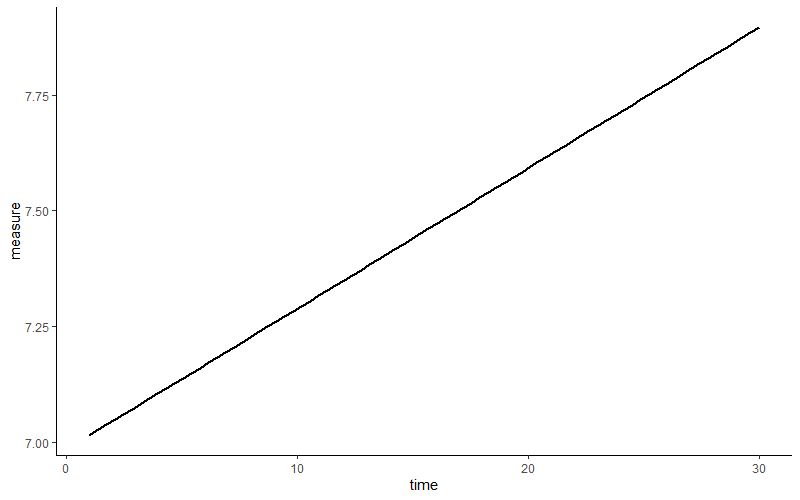
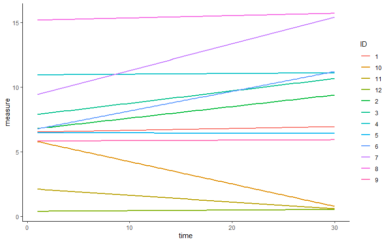

# Regression analysis
This part continues the data analysis spirit with one of the most common analysis models, regression. Does x relate to y (or even predict given sufficient methodological rigor)? Is there indication of a linear relation? Is this relation associated with the level of another variable (moderation)?

There exists a wide variety of regression techniques. 
  1. **Starting off with a brief overview of "regression language", how to reshape datasets from wide to long (and vice versa), and things to consider prior to fitting regression models**
  2. **We move on to the "classic" (frequentist) linear regression.** We briefly explore general linear models versus generalized linear models. Then we **explore moderation** and how to plot it **simple slopes, heyman-nuyens**
  3. **I then discuss other regression models: repeated measures, multivariate regression, and mixed-effects regression models.** 
  4. **I won't ignore model assumptions and provide you some ways on how to inspect these in classic linear regression and mixed-effects regression models**
  5. **We end off with a brief discussion of effect sizes**

## Regression models and things to consider

### The language of regression models
In regression models we regress the outcome or outcomes (dependent) variable(s) on one or more predictors (independent variables). Similar to dplyr and ggplot2, regression have their own preferred notations and "symbol" use. A brief overview:
1. Y ~ variable1 + variable2 will output the "main effect"
2. Y ~ variable1 : variable2 will output **only** the interaction/moderation estimate between them
3. Y ~ variable1 x variable2 will output **both** main effects and interactions

### Long to wide format and vice versa
Generally you can distinguish two types of data formats: a wide data format in which every repeated measure is put in separate column and the long format where repeated measures are put in the same column. Knowing how to transform your data between wide and long data formats is crucial, as different regression models require different data structures. For example, regression with multiple outcomes prefers your data to be in wide format, whereas mixed-effects models ask for a long format. 

A variety of functions can transform long formats to wide formats, and back. Personally, I prefer using the **melt() and dcast() functions** from the [reshape2 package](https://cran.r-project.org/web/packages/reshape2/index.html). For the demonstration below, I made a dataset in wide data format  
```{r}

set.seed(123)
mydata = data.frame( 
 ID = factor(1:10),
 age_6_years = runif(10,100,120),
 age_8_years =  runif(10,120,135),
 age_10_years = runif(10,135,150),
 age_12_years = runif(10,150,180)  
  )
```

Now I will reshape the data from wide to long so that the ages are "glued" to each individual (4 ages per individual). With the melt() function we specify the variable that identifies individuals using "id.var" (here ID). 
```{r}
library(reshape2)
mydata_long = melt(mydata, id.var ="ID", variable_name ="age")
head(mydata_long)
```

I'm aware that the reshape2 package is quite old now, so I will also provide you an alternative from the more modern [tidyr package](https://cran.r-project.org/web/packages/tidyr/index.html). To mimic the melt() function, tidyr has its own **pivot_longer() function**.
```{r}
library(tidyr)
mydata_long =pivot_longer(mydata, cols = -ID, names_to = "age", values_to = "value")
head(mydata_long)
```

Now we go back from long format to wide format.
```{r}
data_wide = dcast(data = mydata_long , ID ~ age, value.var = "value")
head(data_wide)
```

If you prefer tidyr, you can instead use the the **pivot_wider() function**.

```{r}
mydata_wide = pivot_wider(mydata_long, names_from = "age", values_from = "value")
head(data_wide)
```

This was a fairly simple example with *age* as main variable. What if we had multiple variables? Take for example the next dataset in long format.
```{r}
set.seed(123)
mydata = data.frame(
  subject = factor( rep(  rep(c(1:100), times = 2), times = 3 ) ),
  condition =  factor( rep(  rep(c(1:2), each = 100   ), times = 3 )  ),
  wave = factor(  rep(c(1:3), each = 200)  ),
  score = runif(600, 1, 100)
)
head(mydata)
```

We could transform this dataset to wide format by combining both the variable *wave* and *condition*. When *combining* multiple variable to wide format, we cannot use the raw score anymore (otherwise it stays long), so a function will need to be applied that will transform the *score* variable. Here we can simply aggregate the score variable per wave and condition. 
```{r}
mydata_wide = dcast(mydata, subject ~ wave + condition, value.var = "score", fun.aggregate =  mean)
names(mydata_wide)[2:ncol(mydata_wide)] = c("Wave1_Condition1", "Wave2_Condition1", "Wave3_Condition1", "Wave1_Condition2", "Wave2_Condition2", "Wave3_Condition2")
head(mydata_wide)
```
Unfortunately, we can't go back to long format as we would not know what the original not-aggregated scores were (various combinations can lead to the same average score).

## (Simple) linear regression using a general linear model
We start our demonstration of fitting linear lines with the **lm()** function to compute a "relatively simple" general linear regression model. However, I will quickly note that the classic regression may show its age as more recommended modern alternatives are available and problems such as the specificity problem (in repeated measures context, **see the next part about MANOVA**) could arise. The data this time is an online free-to-use [dataset about the quality of red wine based on physicochemical tests](https://github.com/jtsou/Red-Wine-Analysis-with-R)
```{r}
mydata = read.csv("data_files/wineQualityReds.csv")   
head(mydata)
```

Now before you regress X with Y, always check your data (e.g., outliers, "strange occurrences", unwanted duplicates, etc.), run descriptive statistics, check correlations, and visualize the distribution and relations/patterns between variables. Let's assume we did all this and that we want to compute the main effect of alcohol content on the potential of Hydrogen (pH) scale.
```{r}
mylm = lm(pH~ alcohol, data = mydata)
summary(mylm)
```

Inspecting the summary output, it never hurts to glance over the residuals as it can have a first quick look at how the residuals are distributed. **Of note, general linear models assume a normal distribution of the residuals of the model (see the upcoming parts), not the variables themselves**. That being said, this is not an excuse to not check the distribution of your variables**. Moving on, we have the coefficients with a statistically significant (*p* value) positive main effect. 

We can just ask directly for these coefficients using *coef(mylm)* and their confidence interval using *confint(mylm)*. Next to coefficients, we can ask for the predicted values (that make up the predicted linear line) using *predict(mylm)*, the confidence interval around the predicted values using *predict(mylm,interval="confidence")*, and the residuals using *residuals(mylm)*.

Note that the regression coefficients are not standardized. If we want standardized versions (that could ease the interpretation and more easily allow comparison) we can either standardize both the predictor and outcome or we can use the **lm.beta() function** from the [QuantPsyc package](https://cran.r-project.org/web/packages/QuantPsyc/index.html) or **standardize_parameters() function** from the [effectsize package](https://cran.r-project.org/web/packages/effectsize/index.html). 
```{r}
# Not using the lm.beta() function. Here I standardized outcome and predictor within the lm() but feel free to compute and add standardized variables to your dataset and use these in the lm() function
coef(
  lm( scale(mydata$pH) ~ scale(mydata$alcohol), data = mydata)
    )[2]

# Using the lm.beta() function from QuantPsyc package
library(QuantPsyc)
lm.beta( lm(pH~ alcohol, data = mydata) )

# Or using the standardize_parameters() from the effectsize package
library(effectsize)
standardize_parameters(mylm)
```

In case of binary predictors, we can standardize the outcome leading to partially standardized coefficients.


### Interaction terms, Johnson-Neyman intervals, and simple slopes
#### two-way interaction with continuous variable
You suspect that the (linear) relation between pH and alcohol content changes by the level of chlorides (a continuous variable). In other words, we expect a moderation "effect" of chlorides. We add the main effect of *chlorides* and the interaction term between *alcohol* and *chlorides* to the model.
```{r}
mylm = lm(pH ~ alcohol * chlorides, data = mydata)
summary(mylm)
```

In our example the interaction term is negative. What does this mean? Well, what helps is to visualize interaction effects. Before we plot anything  I want to briefly stand still for a moment. Procedures to visualize interactions could potentially be misleading if you are not careful. **Simple slopes** are often used when plotting interaction "effects". Simple slopes simply represent the relation of the predictor's effect on the outcome at different levels of the moderator. 

The important thing with these slopes is that you need to select some values of the moderator. More specifically, the link between outcome and predictor (i.e., their slope) is plotted against these values. Often people select three values that represent "low" levels of the moderator (often one standard deviation below the mean), "moderate" levels (often the mean), and "high" levels (often one standard deviation above the mean). Question is, do these values truly represent "low", "moderate", and "high"? This is likely not the case if e.g. the distribution of the moderation variable is "notably" skewed.  

**In case of an interaction with two continuous variables**, I would recommend to plot **Johnson-Neyman intervals** using the **johnson_neyman() function** from the [interactions package](https://cran.r-project.org/web/packages/interactions/index.html). This function computes and plots the Johnson-Neyman intervals along series of values of the moderator. In one glance, you can spot at what values of the moderator, the main effect of the predictor on outcome is statistically significant based on *p value*. Even better in my humble opinion, the size of the relation at each point is displayed in full view.  
```{r}
library(interactions)
johnson_neyman(model=mylm, pred=alcohol, modx=chlorides)
```

If you dislike the plot, you can also make your own version. Luckily, all elements that I need to plot are provided by the package itself. Recall my **"store as an object and click"** strategy from the previous part? If I store my Johnson Neyman plot in a variable, click on the variable under (Environment), and inspect every element, then I could extract all information that I need.
```{r}
myplot = johnson_neyman(model=mylm, pred=alcohol, modx=chlorides)

myjohnson_neyman = data.frame(
  ci_lower = myplot[["cbands"]][["Lower"]], # Lower bound of the 95%
  ci_upper = myplot[["cbands"]][["Upper"]], # Upper bound
  slope = myplot[["cbands"]][["Slope of alcohol"]], # the slope
  significance = myplot[["cbands"]][["Significance"]], # indicates when the slope is significant or not
  bound_start = min(mydata$chlorides), # To make the range of observed data for the chlorides variable, the lowest value
  bound_end = max(mydata$chlorides), # The highest value
  chlorides_x_axis = myplot[["cbands"]][["chlorides"]] # Needed for the x-axis
)
```

Now we can load the ggplot2 package and create the figure ourselves. Below, I will approximately recreate the original figure but in grayscale.
```{r}
library(ggplot2)

myjohnson_neyman  %>% # Only the full range of "chlorides"
  ggplot(aes(x=chlorides_x_axis)) +
  scale_fill_manual(values=c("grey50","grey30"), labels=c("p < .05","n.s."), name="" ) + # I had to set the labels since it otherwise switches them up. Also I omitted the legend title
  geom_ribbon( aes(ymin = ci_lower, ymax = ci_upper, fill = significance), alpha = 0.40 ) +
  geom_line( aes(y = ci_upper), size=1) + # I add this line otherwise the contours of the "ribbon" will be transparant (since apha = 0.40)
  geom_line( aes(y = ci_lower),  size=1) + # See above
  geom_hline(aes(yintercept=0), linetype = "dashed") + # Horizontal line at zero (helps to look when the confidence interval crosses zero)
  geom_segment(aes(x = bound_start , xend = bound_end), y = 0, yend=0, size=2 ) + # To create the thick line depicting the range of chlorides
  scale_color_manual(values="black", labels="Range of Chlorides", name="" ) + # for the additional legend 
  geom_line(aes(y = slope), size = 1) + # The slope line 
  xlab("Chlorides") + ylab("Slope of alcohol") + ggtitle("Johnson-Neyman plot") +
  theme_classic() 
```

#### two-way interaction with a continuous and factor variable
Forget the *chlorides* variable for a second. Now we want to see whether the link between pH and alcohol content is moderated by quality (a categorical/factor variable). To visualize this interaction, we could still use the Johnson-Neyman technique which will note statistical significance by category. However, since the values of the categorical/factor moderator are determined, we can plot **simple slopes**.

For the simple slopes I will use the **effect() function** from the [effects package(https://cran.r-project.org/web/packages/effects/index.html)**. Let's start with fitting the regression model. For simplicity, I will only include two values of "quality". In addition, I will transform this variable to 0 to 1 to potentially ease interpretability.
```{r}
mydata_simpleslopes = mydata %>% filter(quality %in% c(4,8)) %>%
  mutate(quality = factor(recode(quality,'4' = '0' , '8' = '1')  )  ) 

mylm = lm(pH ~ alcohol * quality, data = mydata_simpleslopes)
summary(mylm)
```

To the effect, I will add the interaction part (which you can copy-paste), then I define from where to where the slope should be drawn. Specifically, to cover the full range of the continuous predictor, I could use the minimum and maximum value of this variable. The confidence interval and the slope per category. The slope is a straight line  
```{r}
library(effects)
data_slope = as.data.frame(
  effect(mod=mylm, term = "alcohol * quality",
                  xlevels=list(alcohol = c(min(mydata_simpleslopes$alcohol),
                                             max(mydata_simpleslopes$alcohol)),se=TRUE, confidence.level=.95) )
)

# Create the plot
library(ggplot2)
data_slope  %>% ggplot(aes(x = alcohol, y = fit, color = quality)) +
  geom_ribbon(aes(ymin = lower, ymax = upper, fill = quality), alpha = 0.2) +
  geom_line() 
```

Always handy would be some indication of the distribution of the variables to show where most data points lie. Here I show the data points of the outcome (pH) and their distribution (as a separate histograms to be put above the simple slopes).
```{r}
library(ggplot2)
my_simple_slopes = data_slope  %>% ggplot(aes(x = alcohol, y = fit, color = quality)) +
  geom_point(data = mydata_simpleslopes, aes(y = pH), alpha = 0.5  ) +
  geom_ribbon(aes(ymin = lower, ymax = upper, fill = quality), alpha = 0.2) +
  geom_line() + facet_wrap(~ quality) +
  ylab("Slope") + xlab("Alcohol content") +
  theme_classic() +
  theme(
   legend.position = "None" 
  )

my_histograms = mydata_simpleslopes %>% ggplot(aes(x = alcohol, fill = quality)) + 
  geom_histogram(color="black", alpha = 0.75, bins = 18) + 
  facet_wrap(~quality) +
  theme_minimal() 
  
library(cowplot)
plot_grid(my_histograms, my_simple_slopes, ncol=1, nrow=2, align="v", rel_heights = c(0.25, 1))
```

## Simple generalIZED linear models
There may exist numerous instances in which your outcomes (and the residuals of the models) are "notably" deviating from the normal distribution. Think binary outcomes, counts (Poisson), categories, and so on. General**ized** linear regression models allow to modify how the distribution of the model's residuals is handled. This allows to do (**binary logistic regression**) and **(logistic regression)**. **As these models can soften the assumption of a normal distribution** of the model's residual terms, they can also be considered in case of **model assumption violations.**

Within the R environment, generalized linear models resemble the general ones but they introduce (at least) two additional parameters: the **family** and the **link**. The link can be used to, if wished for, transform the model predicted outcome (e.g., logarithms). By default, the link is "identity" (no transformation). The family determines how the distribution or residuals is handled. By default the family is *gaussian* (normal distribution just like general linear models) but can be modified *poison*, *binomial*, *gamma*, and more. Several examples below.

Starting off with an example of a poisson linear regression. 
```{r}
  set.seed(123)
  poisson_data = data.frame(
    counts = c( round(runif(30,15,35),0), round(runif(30,15,28),0), round(runif(30,1,18),0) ),
    altitude = 1:90
    )
  
  # Note family poisson will by default take the log from the outcome
  poisson_fit = glm(counts ~ altitude, data = poisson_data, family = poisson(link ="log"))
  summary(poisson_fit)
  
  poisson_data$counts_log = log(poisson_data$counts)
  
  # link identity will apply no transformation (but since we took the log ourselves...)
  poisson_fit = glm(counts_log ~ altitude, data = poisson_data, family = poisson(link ="identity"))
  summary(poisson_fit)
  
  # Note, that the regression coefficients will be on the log scale, so you could compute the exponent to ease interpretability 
  exp(coef(poisson_fit))
```

Next, in case of a binary outcome.
```{r}
# Data used 
set.seed(123)
binary_data = data.frame(
  on_or_off = c( round(runif(100,0,1),0) ),
  distance = 1:100
)

# Note family binomial will by default take the logit (log of the odds ratio) from the outcome
binary_fit = glm(on_or_off ~ distance, data = binary_data, family = binomial(link ="logit"))
summary(binary_fit)
```

For the final example, we could also fit a general model using the glm() function if we use a gaussian link.
```{r}
mydata = read.csv("data_files/wineQualityReds.csv")   

summary(
  lm( pH ~ alcohol    , data = mydata        )
)

summary(
    glm( pH ~ alcohol, data = mydata, family = gaussian(link ="identity"))
)
```

## Mixed effects model
### Fixed and random effects
Suppose you have repeated measurements from the same subject. You are interested in whether a linear regression slope can be fitted with your measurement and time (change across time). Before you consider to run a fancy regression model, you quickly plot how linear relation would look like.


Looks like a first indication of higher levels of the measurement across time. You realize that you have thirty measures per subject. So you wonder... would every subject also show this pattern? Does this average across subject positive slope fits all? We draw a regression slope of the same relation per subject.

Some subjects show an increase, others a decrease or little  change. In other words, **on average** across subjects, we may expect a positive linear relation. Nevertheless, there is some variety, some variance in this relation across subjects. 

Just now I winked at two concepts, fixed and random effects than can be modelled in **mixed-effects regression models**.

Fixed effects can be considered your typical "dependent variable gets predicted by independent variable" part. Random effects refer to the variation in regression parameters across subjects or other "clusters. For example, one can attempt to study the influence of a medicine on reaction time. Here, we could "acknowledge" that some participants are naturally faster to react and their "starting point on reaction time" is lower (thus they're faster) irrespective of medicine intake. In other words, you can acknowledge that there may be some variance in the natural/base/trait state of the outcome per person, and this depicted by random variance in the **intercept**. Moving on, we're already familiar with the occurrence of random variance in the slope. Regression slopes depicting a given relation may differ per person. I will scratch the surface in my review below, but note that various points can be considered in these kind of analyses.

I will generate a dataset that has 40 repetitions of measures across the 100 participants (our "cluster").

```{r}
set.seed(123)  
n_participants = 100  
n_repetitions = 40    
icc_target = 0.45     

# Generate participant IDs
participant_id = rep(1:n_participants, each = n_repetitions)

# Variance components (solving for within-person variance)
between_var = 1  # Arbitrary choice
within_var = between_var * (1 - icc_target) / icc_target  # Ensures ICC = 0.45

# Generate random intercepts (participant-level effects)
random_intercepts = rnorm(n_participants, mean = 50, sd = sqrt(between_var))
random_intercepts_expanded = rep(random_intercepts, each = n_repetitions)

# Generate within-person residuals
residuals = rnorm(n_participants * n_repetitions, mean = 0, sd = sqrt(within_var))

# Compute the outcome variable
outcome = random_intercepts_expanded + residuals

# Create the data frame
mydata = data.frame(
  participant_id = factor(participant_id),
  measurement = rep(1:n_repetitions, times = n_participants),
  outcome = outcome,
  predictor = runif(4000, 10,100)
)
```

As before, let's quickly check how the outcome changes across time (indicated by "simple" regression slopes from the geom_smooth function). 
```{r}
library(plotly)
ggplotly(
mydata %>% ggplot(aes(y = outcome, x = measurement, color=participant_id, group=participant_id))  +
  geom_smooth(method="lm", se=FALSE) +
  geom_smooth(aes(group=0),method="lm",se=FALSE, linetype="dashed",color="black") +
  theme_classic()
)
```

Visually, we may not expect a general (fixed) relation. However, it could likely that there is a "notable" bit of variance in this slope per participant, at least based on vision. Looking at the start point (measurement 1), some participants have a lower or higher outcome compared to one another.  Based on vision, you might expect that participants' "baseline/natural/trait state" of the outcome may be different. In more technical terms you might expect some variance in the intercepts per schools.

Alright, let's fit a mixed-effect model. There are several packages in R that allow to fit mixed-effects models. I will use the **lmer() function** from the [lmerTest package](https://cran.r-project.org/web/packages/lmerTest/index.html). Let's start with the most transformation from your everyday general linear regression to general linear mixed regression, the introduction of a random intercept. 
```{r}
library(lmerTest)
myfit = lmer(outcome ~ measurement + (1|participant_id), REML = TRUE, data = mydata)
# Note. REML = Restricted likelihood. If "TRUE" then MaximumLikelihood would be used
summary(myfit)
```

Of note, I used Restricted likelihood **(REML) which is recommended when estimating random effects variances but not when you are interested in comparing models with different fixed effects**. If you are interested To compare fixed effects, could consider Maximum Likelihood instead (*REML = FALSE*).

Glancing over the summary, you might have the impression that it looks similar to output of classic linear models. What's new is that we have a separation of random and fixed effects. Notice that the random effects part consists of variance so it could be more appropriate to call it random effect variance. The first parameter here is the random intercept variance (variations in the intercept when participants are compared). The second, the residual random variance, is variance . Essentially,it is variance that is left and this could be referred to as within-cluster variance (here within-participant variance). The sum of these variances forms the total variance. 

Similar to summary output from more "classic" linear regression we can call the regression coefficients using *coef()*. However, note that we now get the coefficients per cluster-unit (participants here). Have a look at the coefficients for the first seven participants.
```{r}
  coef(myfit)[["participant_id"]][1:7,]
```

The intercept is different per participant, "measurement" is the same per participant, which is as expected since we have modeled both a fixed and random effect for the intercept, whereas we estimated "measurement" as a sole fixed variable without a random part. To show the fixed effect (the fixed slope) you can call *fixef()*, while we can call for th random effect (the variation per cluster-unit) using *ranef()*. Good to know, the coefficient for the random intercept per participant is the sum of the fixed effect of the intercept (shared across participants) and the random effect of the intercept (unique per participant). Have a look at participant one.
```{r}
coef(myfit)[["participant_id"]][1,1]
  # -> 49.22585

fixef(myfit)[1] + ranef(myfit)[["participant_id"]][1,]
  # -> 49.22585 
```

### Intraclass correlation/variance partition
Now that we familiarized with the summary output. One parameter to compute in context of repeated measures is the intraclasscorrelation (ICC) (sometimes named variance partition coefficient) which shows the proportion of the **between-cluster (between-participant) variance** as compared to the **total variance**.To compute the ICC, fit a mixed-effects model where the outcome variable is regressed on only a fixed and random intercept (a null model). In our case:
```{r}
lmer(outcome ~ 1 + (1|participant_id), REML = TRUE, data = mydata)
```

To obtain the ICC we could use the **icc()** function from the [performance package](https://cran.r-project.org/web/packages/performance/index.html). This function will output both the adjusted ICC and the unadjusted ICC. Without fancy packages we could also compute it easily ourselves. From the summary output, **take the between-cluster variance (here the random intercept variance; 0.8271) and divide it by the sum of the random variances (0.8271 + 1.2156)**. The outcome is 0.4049053.

### Random slopes
Let's add the "predictor" variable as both a fixed and random effect. We now introduce both random intercept variance and random slope variance to the model. Let's look again at the summary output
```{r}
myfit = lmer(outcome ~  measurement + predictor + (1 + predictor |participant_id), REML = TRUE, data = mydata)
summary(myfit)
```

In the section "Random effects" we now get a correlation of .13. This is the correlation between random intercepts and the random slopes, indicating that participants with higher intercepts ("baselines") tend to have (slightly) higher slopes. Moving on, we also see correlations between the fixed effects. The fixed effect of "measurement" and "predictor" (the "average across participants" slopes so to speak) have a negative correlation with the fixed intercept ("average across participants"). Participants, in general, with a lower intercept ("baseline" levels of the outcome) may show higher levels of "measurement" and "predictor". Furthermore, the fixed-effects between "measurement" and "predictor" is near-zero, which can be a good thing as a high correlation may indicate multicollinearity. 

#### Extraction and plotting the random slopes
Now that we have both a random intercept and a random slope, we could extract and plot the specific slope of a cluster-unit (here a participant). This process is relatively simple: extract the necessary ingredients from the fitted mixed-effect model (i.e., the participant, their intercept, and their slope) and glue it to the original dataset (mydata). In this example I stored the result in a separate dataset.
```{r}
extracted_data = data.frame(
  rownames (  coef(myfit)[["participant_id"]]  ), # coef(myfit)... does contain the participant but only as rownames so I call rownames of this object to get my participants
  coef(myfit)[["participant_id"]] # Note. I added the [["participant_id"]] part  as data.frame( coef(myfit)   ) would prompt an error
)
names(extracted_data) = c("participant_id","intercept","slope_measurement","slope_predictor")

mydata_plus_extracted = left_join(mydata,extracted_data)
```

And plot it. For visual clarity, I included only participants 1 to 30.
```{r}
library(ggplot2)
library(plotly)
library(dplyr)

ggplotly(

mydata_plus_extracted %>% filter(participant_id<=30) %>%
  ggplot(aes(y=outcome,x= predictor,color=participant_id)) +
  geom_point(alpha = 0.10) + # To avoid visual overload I make the points fully transparant
  geom_abline(aes(intercept = intercept, slope = slope_predictor, color = participant_id) ) +
  geom_abline(intercept = 50.08, slope =  -0.0002826, color = "black",linetype="dashed" ) +  # Based on the summary output, the fixed slope
  theme_classic()

)
```

## Model assumptions
By now you have seen the output of a few regression models. Have you ever wondered how the model the *"sees"* your data? The models receives our instruction to "forcefully" draw a (linear) line but while computing parameter estimations, the model will likely have some assumptions of its own to ease the computations. The assumptions of the model can relate to how accuracy you can interpret the output of the model, so violations of assumptions should not be overlooked. We have already seen some model assumptions when discussing exploratory factor analysis. In this part, I'll focus on linear regression models and provide you some easy ways to inspect certain model assumptions.

### Assumptions: Linear regression (not multilevel)
Unsurprisingly, **linear** regression models assumes linear relations between outcomes and predictors, something you can visually inspect using scatter plots. Other assumptions include:

1. The assumption of normally distributed residuals
2. The assumption of homoscedasticity/homogeneity of residuals
3. The assumption of multicollinearity (brief repetition from previous part)
4. The assumption of no autocorrelation of residuals/independence (time-series data!)
5. One function that does most of the above in one go

#### Normal distributed residuals of the regression model
Various regression models expect that the residuals from the fitted regression model follow **a normal (gaussian) distribution**. Let me repeat: the **error terms of the model are expected to resemble a normal distribution**, this assumption **does not** say that the outcome should resemble a normal distribution. Rather unsurprising, a histogram of the model's residuals will suffice. Let's take again [the data about the quality of red wine](https://github.com/jtsou/Red-Wine-Analysis-with-R), fit a linear regression model, extract the model its residuals, and plot a histogram.
```{r}
mydata = read.csv("data_files/wineQualityReds.csv")   

mymodel = lm(pH ~ chlorides, data = mydata)
summary(mymodel) # Recall that the summary output can give a quick at how the residuals are distributed

library(ggplot2)

data.frame(
  myresiduals=mymodel$residuals) %>%
  ggplot(aes(x = myresiduals)) + 
  geom_histogram(fill="white",color="black")
```

#### homoscedasticity/homogeneity of the residuals
An unique sounding word, the homoscedasticity of the residuals refer to the extent to which residuals are constant along the predicted values of the models' linear regression. If we want to check whether the residuals are homoscedastic or rather heteroskedastic, we will need to extract and plot the residuals (y-axis) along the predicted values (x-axis). 

Now, you could use the "raw" residuals using the residuals() function. However, you could also use standardized residuals. Here I will use studentized residuals as an example. To get studentized residuals, you can use the **rstudent() function**.

Below, I will plot both the raw and studentized residuals.
```{r}

mymodel = lm(pH ~ chlorides, data = mydata)

library(ggplot2)

data.frame(myresiduals=residuals(mymodel),
           mypredictedvalues = predict(mymodel) ) %>% 
  ggplot(aes(x = mypredictedvalues, y = myresiduals)) + geom_point() +
  geom_hline(yintercept = 0, linetype = "dashed", color = "blue") +
  ylab(" raw residuals") +
  theme_classic()


data.frame(myresiduals=rstudent(mymodel),
           mypredictedvalues = predict(mymodel) ) %>% 
  ggplot(aes(x = mypredictedvalues, y = myresiduals)) + geom_point() +
  geom_hline(yintercept = 0, linetype = "dashed", color = "blue") +
  ylab("studentized residuals") +
  theme_classic()
```

Now for a visual inspection of the extent of homoscedasticity, look at the most left side of the plot. Mind the distance between the upper and lower points. What I always do is to put my index finger on the "upper residuals" and my thumb on the "lower ones". Now move along from left to right (if you follow my method, slide your hand from left to right). Did the distance change notably at some or multiple points? Do you see a funnel shape? If so, this may indicate that the residuals are not (that) homoscedastic.

Next to visual inspection, you could also consider the Breusch-Pagan test for heteroskedasticity in which a *p* value below .05 suggests heteroskedasticity. For this purpose you can use e.g., the **bptest() function** from the [lmtest package](https://cran.r-project.org/web/packages/lmtest/index.html)
```{r}
library(lmtest)
bptest(mymodel, studentize = TRUE)
```

#### No multicollinearity
As discussed in the previous part about exploratory factor analysis, we can use the **vif() function** from the **car package**. **Of course, this assumption applies to regression models with more than one predictor**. As I mentioned before, pay extra attention to vif scores above five, which could suggest "high" multicollinearity.
```{r}
mymodel = lm(pH ~ chlorides + alcohol + residual.sugar,data = mydata)
library(car)
vif(mymodel)
```

#### No autocorrelation of residuals
An assumption in case you have multiple measurements over time (e.g., time-series), autocorrelation implies that the **residuals** relate to one another over time. Specifically, the correlation between a variable (here the residuals) and a copy of itself at one or more previous time points (commonly referred to as *lags*)

First, I will generate data in which I predetermine a fixed autocorrelation of .55.
```{r}
example_autocor = data.frame(
  predictor = runif(9999,1,10) 
)

error = arima.sim(n = 9999, list(ar = 0.55))  # AR(1) process, to create autocorrelated residuals
example_autocor$outcome = 3 + 1 * example_autocor$predictor + error  
```

Autocorrelations can be generated and visualized using the **acf() function** from the **car package**. The function will correlate the inserted value with its past values (commonly called "lags") and these autocorrelations are depicted as bars (unless you instruct not to plot the autocorrelations). A "low" autocorrelation is indicated by bars that drop immediately to (approximately) zero. Bars that instead gradually or barely decline are indicative of autocorrelation. 

Below I will use the acf() function but I'll tell the function to not plot the autocorrelations, I will do that myself.
```{r}

mymodel = lm(outcome ~ predictor  ,data = example_autocor)

my_autocor = acf(residuals(mymodel), lag.max = 5, plot = FALSE)
plotly::ggplotly(
  data.frame(autocorrelations = my_autocor$acf[-1], # The first value is the correlation with itself at the current time, hence a perfect correlation of 1 (so I will exclude this value),
             lagged = my_autocor$lag[-1]
  ) %>%
    ggplot(aes(y=autocorrelations, x = lagged)) +
    coord_cartesian(ylim=c(-0.5,0.5)) + 
    geom_bar(stat="identity", fill="green",color="black",alpha=0.75) +
    geom_point() + geom_line(alpha = 0.5, linetype="dashed") +
    geom_hline(aes(yintercept = 0), color="red") +
    geom_hline(aes(yintercept = 0.2), color="blue") +
    geom_hline(aes(yintercept = -0.2), color="blue") # Note that negative autocorrelations are also possible.
)

```

If you want to statistically test the absence of autocorrelation, the Durbin-Watson test can be of service. This tests checks the correlation between the values of a variable (including residuals) with itself at a previous time (i.e., a time lag of one), and comes with a test statistic and a *p*.Value (**below .05 suggests autocorrelation**). The test statistic ranges from zero to four with values below two suggesting positive autocorrelation, above two negative autocorrelation, and close to two no autocorrelation. 

Multiple functions can perform the Durbin-Watson test. Here I will use the **durbinWatsonTest() function** from the **car() package** as it implements a bootstrap resampling procedure which can be convenient, especially when you would have "smaller" samples.
```{r}
library(car)
durbinWatsonTest(mymodel, reps=500)
```

#### (cheat) all-in-one to test a lot of 

The performance package with the check_model() function providing a visual check of the assumptions including the normal distribution of the residuals, homoscedasticity of residuals, and multicollinearity.

```{r}
mydata = read.csv("data_files/wineQualityReds.csv")   
mymodel = lm(pH ~ chlorides, data = mydata)

library(performance)
check_model(mymodel)
```

### Assumptions: Multilevel linear regression
Alright let's take one step further and Move on to assumptions of multilevel (mixed-effects, hierarchical) linear regression models. These models rely on assumption that are similar to those we've seen earlier but they also their own assumptions. Like before we have the assumptions of:

1. linear relation between predictor and outcome
2. Normal distribution of residuals
3. Homoscedasticity of residuals
4. No autocorrelations of residuals
5. No multicollinearity

And the more unique ones including:

6.Normal distribution of the random effects
7. An appropriate Covariance structure

The first five points can be tested like before, so nothing new.
**To inspect whether or not the random effects resemble a normal distribution**, you can extract the random effects (i.e., the random intercepts and slopes) using the **ranef() function** and then use these to plot a histogram or quantile-quantile plot.

Then the last one, an appropriate covariance structure. We could test whether models with a more complex covariance structure (e.g., models with random slopes) are preferred over simple ones (e.g., models with only a random intercept). We can compare simple and more complex models in an analysis of variance (conveniently the topic of the upcoming part). In the example below I compare a model with a random intercept with one including both random intercept and slope

```{r}
model1 = lmer(Reaction ~ Days + (1 | Subject), data = sleepstudy)
model2 = lmer(Reaction ~ Days + (1 + Days | Subject), data = sleepstudy)
anova(model1, model2)
```

A significant test suggests that the more complex model is preferable, but I would advise to not base all decisions solely on *p* value significance. A more complex model could affect your statistical power and how results are interpret so consider this as well.

## Effect sizes
One aspect where *p* values fail is that these do not quantify the strength of relations. Therefore, it is handy to also report effect sizes that do give indications about the strength of associations. Here I will give a brief overview of effect sizes in the context of linear regression with continuous predictors. In the next part concerning the analysis of variance, I will briefly cover effect sizes appropriate in that context (e.g., eta-squared).

### Standardized beta coefficients and R²
Alright, we actually already discussed one type of effect size, the standardized beta coefficient. These coefficients allow to **compare your predictors if these were measured on different scales**. Moreover, they can help in interpreting your model outcomes.

Suppose you have a standardized beta coefficient of 0.5 - this would mean that if your predictor increases by 1 standard deviation, the outcome would increase by 0.5 of a standard deviation. Remember that you can obtain these coefficients by including standardized variables in your regression models or by using functions such as the **lm.beta() from the [QuantPsyc package](https://cran.r-project.org/web/packages/QuantPsyc/index.html)** or **standardize_parameters() [effectsize package](https://cran.r-project.org/web/packages/effectsize/index.html). Just a quick reminder:
```{r}
# Load dataset
mydata = mtcars

# Fit a regression model
mylm = lm(wt ~ hp + mpg, data = mydata)

library(effectsize)
standardize_parameters(mylm)
```

There is actually an effect size that we did not discuss yet in our summary output, the R².
The R² reflects the **proportion of variance in your outcome/dependent variable explained by the model** (i.e., all the predictors in your model). As it turns out, it equates or approximates the square of the correlation between the predicted outcome (through linear regression) and the raw observed outcome from your dataset, hence the name. You can find R² in your summary output.
```{r}
summary(mylm)

# Or call it directly from the output
summary(mylm)$r.squared 

# Which equates/resembles the square of the correlation between the predicted outcome and the raw outcome
cor(predict(mylm), mydata$wt, use = "complete.obs")^2 
```

However, **the basic R² may be biased** if you decide to **include many predictors** for whatever reason (i.e., it could overestimate the explained variance). In such case, you might want to shift your attention more towards **the adjusted R²** which can be also retrieved from the summary output.
```{r}
summary(mylm)$adj.r.squared  # Adjusted
```

the R² and its adjusted version concerns the **joint contribution** of each predictor. Now, what if we want to focus on the contribution of each individual predictor? For this purpose we can use squared semi-partial correlations (sr²) which reflects the **proportion of variance in your outcome/dependent variable explained by a specific predictor.** In other words, sr² shows the percentage of unique variance in the outcome by the predictor.    
```{r}
library(effectsize)
r2_semipartial(mylm,alternative = "two.sided")
```

### In case of mixed-effects models

What about mixed-effects models (multilevel)?

Here I will use the built-in sleepstudy dataset (from the lme4 package).
```{r}
library(lmerTest)
set.seed(531)
mydata = sleepstudy
mydata$Predictor = rnorm(180, 100,25) # I also added an extra predictor

mymixed =  lmer(Reaction ~ Days + Predictor + (1  | Subject), data = mydata)
```

Remember that in mixed-effects models we have a fixed and random part. Intercepts and slopes can be specified to vary for each cluster unit. Given this situation, effect sizes of fixed effects should also control or adjust for the random effects. 

Like before, we could opt for (partially) standardized beta coefficients to compare predictors. One detail here, your variables will be standardized using the standard deviation from the sample of each variable. Therefore, standard deviations can differ to some extent between variables.

What about R²? Its computation is less straightforward given there are two residual terms. However, the r2() function from the performance package allows to compute it easily.
```{r}
library(performance)
r2(mymixed)
```

We receive the conditional R² and the marginal R². The conditional R² reflects the explained variance from **both the fixed and random effects**. The marginal R² reflects how much variance of the conditional R² is attributed to **the fixed effects**.

Moving on from the joint-contribution from all of our predictors to individual contribution. Semi-partial R² can be provided by the **partR2() function** from the [partR2 package](https://cran.r-project.org/web/packages/partR2/index.html). Note that this function also computes bootstrapped confidence intervals. For demonstration purpose I ask for 5 bootstraps but in practice consider to set this much higher (e.g., over 500).
```{r}
library(partR2)

options(scipen=999) # 

part_r_squared = partR2(mymixed,
       partvars = c("Days","Predictor"),
       nboot = 5 # Just for demonstration purpose, set this to a higher value in practice.
       )
summary(part_r_squared)
```

A lot of output. Let's start At the top, first we have the marginal R² with the 95% and the number of predictors plus the intercept. Then we have **our semi-partial R²**. In our example, the unique variance of the *days* variable almost equates the full model. Third, we have **the inclusive R²** which shows the strength between the predictors and the model's predicted values. If this value approximates that of the semi-partial R², then this indicates that it has mainly unique variance. If it is notably higher, the predictor shares some variance with other predictors. Fourth we have the **structure coefficients**. You may have predictors that show a "low" regression coefficient or semi-partial R², but these could be (statistically) relevant. A predictor showing a "high" structure coefficient with "low" semi-partial R², likely contributes indirectly through shared variance. In case the structure coefficient is "low" as well, then the predictor is likely not (strongly) related to the outcome. 

As a summary of the above. If the semi-partial R², inclusive semi-partial R², and structure coefficients are "high", you have a predictor that shows a unique (direct) contribution to the total variance. If all but the semi-partial R² are "high", the predictor shows little unique contribution but does nonetheless explains variance through shared correlations with others. If only the semi-partial R² is "high", you have a predictor that uniquely contributes but is not correlated with others. 

Finally the last part of the output shows the standardized beta coefficients.