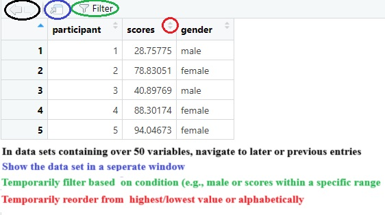
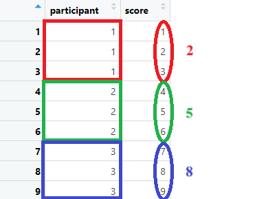
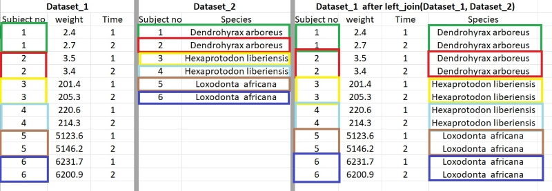

# Data cleaning and descriptive statistics
Opening data files is one thing, preprocessing ("cleaning") them is something else entirely. You may need to restructure your data, change variable values, compute new ones, **merge datasets**, and more. 

Fortunately, the data is fluid. It can be changed. reshaped. remade.

This all requires some understanding of how to access different parts of your dataset, how to perform mathematical calculations in R, how to recode variables, and so on. After a brief overview, I will introduce you to [dplyr package](https://dplyr.tidyverse.org/authors.html) - a personal favorite of mine - which simplifies preprocessing/cleaning.

In this part I will be covering: 

 1. **How to access the different parts of dataset in R**. This includes how to navigate and extract certain rows or columns from a dataset.
 2. **How to do mathematical computations in R including the standard deviation and the kurtosis**. In addition, I will show **how to get multiple descriptive statistics of multiple variables** in one code line. I will also show **how to easily make a correlation matrix**.
 3. **Important functions of the dplyr package**. I will explain and demonstrate a variety of functions that I commonly use in my data processing toolbox such as mutate and left_join.
 4. **Ending with a demonstration of data preprocessing/cleaning a raw dataset from scratch**.

## Access different parts of a dataset
Let's start with the demonstration or a refresher of the basics. For the examples below, I will generate my own dataset using the **data.frame()** function. As the values of this dataset will be generated at random, I will *set a seed* so that in each run, the generated data will be identical.

```r
set.seed(123) # Note, the number can be anything (but the results will be different )

mydata = data.frame(
  participant = c(1:5), # generate the values 1 to 5 (1,2,3,4,5)
  scores = runif(5, 0,100), # generate 5 values (from a uniform distribution) between 0 and 100
  gender = c("male","female","male","female","female")
)
```

### Viewing the data
Now that I have made a dataset, I'll briefly show you how to view your data as RStudio allows different ways to do so. With code:

```r
  mydata
  head(mydata) # shows the first 10 entries of a dataset
  View(mydata) # Prompts the dataset in a separate window
# TEMPORARILY filter values, TEMPORARILY rearrange values, see changes in real-time, ... 
```
**Next to writing code**, you can also click on your datasets (under Environment, top right corner). The dataset will be shown in a separate window (similar to the *View()* code). 

<br>
<br>

As shown in the image above, the "view window" allows to **quickly track any changes**. If you want you can use the view window outside of R**. Also practical, you can check specific entries in your dataset using the filter option and (temporarily) rearrange the data in an ascending or descending order to quickly check who or what has the highest or lowest score. 

### Several examples
A dataset consists of rows and columns. In referring to these, R will **first look at the rows** and **then at the columns**. For example, *dataset*[1,2] will output the value at the cross point of the first row and second column (28.75775). Let's learn through example.

```r
  # If I want to see the first row of all columns:
  mydata[1,] # Again rows are on the left of the comma (columns on the right)

  # If I want to see rows 1 to 3 of all columns:
  mydata[1:3,]

  # If I want to see rows 1,2, and 5 of all columns:
  mydata[c(1:2, 5),] # Here I have to use a "c" vector 

# Same goes for the columns. I can mention the column number (in my example 1= participant, 2= scores, 3=gender) 
  
  # I want to see column 1 and 3 but by calling them by name instead their column number
  mydata[,c("participant", "gender")]

  # If you want to see one column. In R you can also ask it like this:
  mydata$gender

  # If I want to see the value at column 2, row 3:
  mydata[3,2]

  # If I want to change the above value and add the value of row 5 and column 2
  mydata[3,2] = mydata[3,2] + mydata[5,2]

```


```r
 # Suppose I want to look at certain values. For example, I want to look at scores but only from females:
  mydata$scores[mydata$gender=="female"] # Within the column scores, search for scores that "row-wise"   corresponds with "female"
  
  # Suppose I want to look at scores from females who have a score of at least 85
  # In other words: look to scores with condition "female" who have a "score>=85"
  mydata$scores[mydata$gender=="female" & mydata$scores>=85]

  # I want to look at scores from females and from participant 1 (a male)
  # "female" OR "participant == 1"
  mydata$scores[mydata$gender=="female" | mydata$participant==1]
  
  
  # One final example, I want to look at scores from females with a score of above 90, males with a score below 30, and participant 3
  # "female AND score>90", "male AND score<30"
  mydata$scores[c(mydata$gender=="female" & mydata$scores>90) |
              c(mydata$gender=="male" & mydata$scores<30) |
                mydata$participant ==3
              ]
```

Insight in the above was required to compute novel variables and filter data. **However**, as I mentioned earlier, packages such as **dplyr** ease the majority of this work. There remains one obstacle before I move on to dplyr. While preprocessing/cleaning your data, you might have to transform your variables or compute new ones. Thus, knowledge concerning math calculations is essential.

I will briefly show how to do different (basic) math calculations and how to make a correlation matrix in R. Although I have to note that there are different ways to do so.

## Mathematical calculations in R

```r
# Defining a new dataset (with the same name)
set.seed(0209)
mydata = data.frame(v1 = runif(10,1,10),
                     v2 = runif(10,1,10),
                     v3 = runif(10,1,10))
```

### Sum

```r
  # Take the sum across all values of column v1
  sum(mydata$v1)
  
  # Take the sum row-wise (from v1 to v2) of each row
  rowSums(mydata)
    # Note, as expected, you get 10 outcomes.
  
  # Do the same but OUTPUT only the results of rows 1 to 3, 5, and 9 to 10
  rowSums(mydata)[c(1:3,5,9:10)]
  
  # Do the same but now CALCULATE and OUTPUT the "row wise sum" of v1 and 3
  rowSums(mydata[,c("v1","v3")])[c(1:3,5,9:10)]
  
  # Compute the sum of values in column v2 and then do the same in column v3 
  colSums(mydata[,c("v2","v3")])
  
  # Do the same but use only rows 5 and 7
  colSums(mydata[c(5,7),
               c("v2","v3")]
          )
    # Quick note, I don't need to stay on the same line. To my knowledge, you can start a "new line" with "," "+/- etc." and brackets so that you provide R some expected "continuation" of the code.
  
```

### Average

```r
  # Take the mean of column v1
  mean(mydata$v1)
  
  # take the mean rowwise
  rowMeans(mydata)
  
  # Take the mean column wise but only using odd rows from v1 and v2 
  colMeans(mydata)
```

### Variance, standard deviation, and correlations

```r
  # variance
  var(mydata$v1)

  # standard deviation
  sd(mydata$v1)
  
  # (bivariate) correlations
  cor(mydata$v1, mydata$v3)
  cor(mydata$v1, mydata$v3, method="spearman")  
  cor(mydata$v1, mydata$v3, method="kendall")  
```

### Other calculations and the describe function(!)

```r
  # range
  range(mydata$v1)
  
  # min/max (value)
  min(mydata$v1)
  max(mydata$v1)
  
  # Centering and standardizing
  scale(mydata$v1, center=TRUE, scale=FALSE) # will mean center variables
  scale(mydata$v1, center=TRUE, scale=TRUE) # will standardize variables
  
  # skewness and kurtosis (using the e1071 package)
  e1071::skewness(mydata$v1)
  e1071::kurtosis(mydata$v1)
```

**Or use the describe function from the [psych package](https://cran.r-project.org/web/packages/psych/index.html) to have a quick overview**

```r
library(psych)
describe(mydata)
describe(mydata[,c("v1","v3")]) # If you want to use it for specific variables
```

### What if there are missing values?
As it turns out, taking the sum, mean, correlation, among other things, will output NA if I would apply the above methods. Therefore, I will both illustrate and correct this issue:

```r
  mini_data = data.frame(a = round(runif(30,1,10)),
                         b = round(runif(30,1,10))
  )
  mini_data[1:2,1]=NA
  mini_data[2:3,2]=NA
  
  sum(mini_data$a) # NA
  rowSums(mini_data) # Only the last value is not NA
  cor(mini_data$a, mini_data$b) # NA
  
# To let the above functions ignore NA's (but proceed with caution, do the outcomes make sense in your individual specific case?)
  sum(mini_data$a, na.rm=TRUE) # remove the NA ("ignore it")
  rowSums(mini_data, na.rm=TRUE) 
  
  # With correlations we have to use different code:
  cor(mini_data$a, mini_data$b, use = "complete.obs") # Will apply listwise deletion (delete rows containing NA's)
  cor(mini_data$a, mini_data$b, use = "pairwise.complete.obs") # Will apply pairwise deletion (delete cases/cells containing NA's)
    # In this example the result will remain the same irrespective from listwise or pairwise deletion
```

## Correlation matrices and visualisation

It is often appreciated to show the correlations between all relevant variables in your dataset (personalliy, I frequently spot them in papers from social and behavioral disciplines). For this purpose I will create a new dataset in which variables are "taken from" a multivariate normal distribution and in which the correlations between variables are prespecified. For transparency I show how I made this dataset (in case you're interested).


```r
# OPTIONAL, just if your interested in how to create a correlated dataset
  library(MASS)  

# Using the MASS package I will create a dataset based on a multivariate normal distribution. To create one I need the following ingredients: the mean of the variables I want to generate and their variance covariance matrix
  
  # the mean (determined by me)
  set.seed(123)
  a_mean = 6
  b_mean = 8
  c_mean = 3
  d_mean = 5

  # the standard deviation for the variance covariance matrix (determined by me)
  a_sd = 0.8 
  b_sd = 3
  c_sd = 0.4
  d_sd = 1.5
  
  # Correlations between variables (determined by me)
  cor_ab = -0.2
  cor_ac = 0.3
  cor_ad = 0.5
  cor_bc = 0.7
  cor_bd = -0.25
  cor_cd = 0.15

  # Variance-covariance matrix
  sigma=matrix(
    c(a_sd^2, a_sd*b_sd*cor_ab, a_sd*c_sd*cor_ac, a_sd*d_sd*cor_ad,
      b_sd*a_sd*cor_ab, b_sd^2, b_sd*c_sd*cor_bc, b_sd*d_sd*cor_bd,
      c_sd*a_sd*cor_ac, c_sd*b_sd*cor_bc, c_sd^2, c_sd*d_sd*cor_cd,
      d_sd*a_sd*cor_ad, d_sd*b_sd*cor_bd, d_sd*c_sd*cor_cd, d_sd^2),
    4,4
  )
  
  # The above variance-covariance matrix can also be made using the lazyCov() function from the rockchalk package
  library(rockchalk)
  sigma = lazyCov(Rho = c(cor_ab, cor_ac, cor_ad, cor_bc, cor_bd, cor_cd),
          Sd = c(a_sd, b_sd, c_sd, d_sd)
  )
  
  # Our correlations can be retrieved from our "sigma" object:
  round(cov2cor(sigma),2)
#>      [,1]  [,2] [,3]  [,4]
#> [1,]  1.0 -0.20 0.30  0.50
#> [2,] -0.2  1.00 0.70 -0.25
#> [3,]  0.3  0.70 1.00  0.15
#> [4,]  0.5 -0.25 0.15  1.00
  
  
  # Now we can create the dataset, I want 100 values per variable
  n = 100
  
  corr_data = as.data.frame(
    mvrnorm(n=n, mu=c(a_mean,b_mean,c_mean,d_mean), Sigma = sigma, empirical = TRUE)
  )
  names(corr_data) = c("a","b","c","d")
```

Now, there are plethora of packages available to visualize correlations. I'll point you to a relatively recent one [corrtable](https://cran.r-project.org/web/packages/corrtable/index.html). This package makes it easy to create and save a correlation matrix provided with frequentist p-value significance indications ("the significance stars"). In this dataset, I want to have the correlations between all variables. **However**, if you want to do this with a smaller subset of variables, then extract those variables first in a separate dataset and use this smaller dataset to create your correlation matrix.

```r

  new_correlation_matrix = corrtable::correlation_matrix(corr_data) # your correlations accompanied with the significance stars
  new_correlation_matrix[upper.tri(new_correlation_matrix)]="" # Remove the upper part, so we get the typical triangle shape
  new_correlation_matrix = as.data.frame(new_correlation_matrix)
  
  # Or we can do the above in one step and save it to a csv file (to copy-paste it in Words)
  corrtable::save_correlation_matrix(df=corr_data,file="data_files/corr_matrix.csv",digits=3,use="lower")
```

Note that you only get the significance stars. If you want the specific p-values from the above matrix you can use e.g., the cor_pmat() function from the [ggcorrplot package](https://cran.r-project.org/web/packages/ggcorrplot/index.html).

```r
  library(ggcorrplot)
  mycorr_pvalues = round(cor_pmat(corr_data),3) 
```

## Dplyr, a more modern approach to shape data (!).
We finally arrive at the **dplyr package**. This package contains a variety of functions to ease data preprocessing/cleaning. For the purpose of this guide, I will go through some functions that I frequently use on my adventures in data analysis. If you are hungry for more, **I highly recommend** to have a look at the [following cheat sheet (click here)](https://nyu-cdsc.github.io/learningr/assets/data-transformation.pdf). 

In the various examples below, I will use a **fabricated dataset**. Next to the dplyr package, I will use the [stringr package](https://cran.r-project.org/web/packages/stringr/index.html) (simplifying operations with strings/"text" variables) and the [readxl package](https://cran.r-project.org/web/packages/readxl/index.html) (to load this fabricated dataset)

```r
pacman::p_load(dplyr,stringr,readxl)
mydata = read_xlsx("data_files/mydata.xlsx")
```

### Dplyr: Filter
Let's start with **filter** which "filters" entries (row-wise). The question here is what data (row-wise) you want to keep or what data you want to exclude. Off-note, in dplyr, we can do something called "pipelining" noted by adding **%>%** in the code. Pipelining allows to do various calculations and functions on the same code line. So instead of
do this
do that
do this...
You can keep all of your code on the same line, *chaining your functions/calculations together* (**as shown in later examples and my demonstration at the end**). 

```r

  # Suppose you want to only SHOW/KEEP rows that have a "1" in the variable "cond" (filtering out the rest)
  mydata %>% filter(cond==1) 
  # Notice the "%>%" to start pipelining. Here I tell R in the dataset "mydata" to filter... 

  # Show rows containing condition 1 and from participant 5
  mydata %>% filter(cond==1, participant==5) 
  
  # Keep rows from participants 1 to 5
  
  mydata %>% filter(participant %in% c(1:5)) 
    # I recommend using %in% instead of only c(1:5) 
    # As the name suggests %in% implies "in range of ...". Here, in (range of) values of 1 to 5.
  
  # Keep all rows EXCEPT THOSE CONTAINING participant 4
  mydata %>% filter(!participant ==4) 
    # Notice the "!" this mean NOT or in this context DO NOT KEEP/KICK OUT ...
  
  # Keep rows from participants 1, 3, and 5 EXCEPT THOSE containing a rt of 0.245
  mydata %>% filter(participant %in% c(1,3,5), !rt=="0.245" ) 
    # Note that rt is written as a character (hence "")
  
  # Exclude rows containing NA's (Not Administered, empty cells) in q_2
  mydata %>% filter(!is.na(q_2))
  
  # Keep rows that contain the characters: "sagree" (to get "disagree" & "heavily disagree") in q_1.
  mydata %>% filter(str_detect(q_1,"sagree"))
    # For this you can use the stringr package 
```

### Dplyr: Select
Similar to filter, but here we will select or exclude columns/variables so we go "column-wise" instead of row-wise.

```r
  # Select (KEEP) columns q_1 and r_2
  mydata %>% select(q_1, r_2 )
  
  # Select the columns whose name has/contains a "q" character (we can't use stringr here)
  mydata %>% select(contains("q"))
  
  # DO NOT select (EXCLUDE) column names ending with "ge", beginning with an "r", and containing the characters "ond".
  # Exlude rows containing participant 3
  mydata %>% select(-ends_with("ge"), -starts_with("r"), -contains("ond")) %>% filter(!participant ==3)
    # Note the beauty of PIPELINING '%>%', I chain SELECT and FILTER on the same code line
    # Note that I use "-" in SELECT instead of the "!" that I use in FILTER
    # Why? From personal experience, using "!" in SELECT does not always yield the intended results
    
  # Alternatively, we could also use only one "-" in the above code:
    mydata %>% select(-c(  ends_with("ge"), starts_with("r"), contains("ond")  )) %>%
      filter(!participant ==3)
    # Note that I add some unnecessary "spaces" in the c() part. This is just for clarity, you can add as much of these spaces as you want without repercussion

```

### Dplyr: Mutate
Now that we can include or exclude certain columns and rows, we want to start transforming our variables. in dplyr language we will **mutate** them. The beauty with mutate, is that we can do multiple *mutations* in one go. 

```r
  
  # Suppose I want to create a novel variable containing the natural logarithm of the variable "rt". I do NOT want to overwrite the original "rt" variable
  # Since rt is a character (and not a number) I will FIRST transform/mutate it from character to numeric and THEN compute the natural logarithm
  mydata %>% mutate(rt_log = as.numeric(rt), rt_log = log(rt) ) 
  
  
  # I will now permanently (because mydata = mydata %>% ...) set rt to be a number (all code up til now were temporarily)
  mydata = mydata %>% mutate(rt = as.numeric(rt))
  
  # You can also transform all variables into a specific type, here transform all numeric variables to "factor"
  mydata %>% mutate_if(is.numeric,as.factor)

  
  # For the next example, suppose you questionnaire items (noted by a "q" in the variable name). Suppose you want to add 2 to each of these items (but temporarily). Here we can use "across" as will be explained below
  mydata %>% mutate(across(starts_with("q"),
                                    ~. + 2 ) )
    
    # In this context, "across" can be translated as "in each". For each variable starting with "q", we add "~" to indicate that the following function should be applied. Next, The dot represents the variable itself (which starts with "q"). In summary. Across (in each) variable starting with "q", do the following: add 2 to each variable (starting with "q").
  
  # Important detail, across tends to "apply the following", one variable at a time, and not simultaneously. So pay attention with certain function (such as rowMeans), as explained below.
```

**Watch out if you use *across* in combination with another function that uses variables simultaneously (such as rowMeans or rowSums)!** Again, *across* works with variables "one at a time". Luckily, this can be easily fixed by knowing where to place *across*.

```r
# Lets take the row-wise average score of all variables starting with "q" (ignoring empty variables)
# HOWEVER, doing it wrong first (so expect an error)
  mydata %>% mutate(average_score=across(starts_with("q")), ~ rowMeans(., na.rm=TRUE)) 
    
    # Why this error in the case of rowMeans? Well, rowMeans is function that works with all variables SIMULTANEOUSLY (since it is an average). This can be fixed by putting "across" within rowMeans. So pay attention were you put across and all will be fine.
      mydata = mydata %>% mutate(average_score=rowMeans(across(starts_with("q")),na.rm=TRUE))
```
A final example


```r
    # Similar example but a "bit more advanced". Say we want to have a sum score across variables starting with "q". However, now we want to set this sum score to NA (empty/not administered) if at least ONE value is NA/missing (row-wise).
  mydata %>% mutate(na_count=rowSums(is.na(across(starts_with("q")))),
                             average_score=ifelse(na_count>=1, NA, average_score)
  )
```

#### (Re)coding (questionnaire) items
In surveys there is often a need to (re)code responses (like *agree* and *totally disagree*), giving these a numerical value. Fortunately, the mutate function is a versatile in this regard as well. One way is to use the versatile *ifelse* function within mutate (**but see a more straightforward approach afterwards**). In short, you first need to specify a condition (e.g., if the item is scored as *"agree"*), then you specify what should be done if so (the item should be given a value of...), and finally you indicate what value should be given if not. Lets give an *"easy"* example

```r
  # If the variable q_1 is scored as "heavily disagree", give it value a 1, else give it a value of 0
  mydata %>% mutate(q_1 = ifelse(q_1=="heavily disagree", 1, 0)       )
```

Looks straightforward right? However, suppose you have five response categories:

```r
  mydata %>% mutate(q_1 = ifelse(
    q_1=="heavily disagree", 1, ifelse(
      q_1== "disagree", 2, ifelse(
        q_1=="neutral", 3, ifelse(
          q_1=="agree", 4, 5
        )
      )
    )
  )
)
```

The above follows the same logic (if..., do ..., else do...) but a lot of brackets... and unnecessary in this case. Not to speak ill about about the ifelse() function, it is very flexible in numerous situations. Fortunately in this context, there exist a more straightforward alternative: **recode**. With recode I can give text ("agree") a numerical value, and a value (2) a textual value. Let us redo the above example and change text to numbers, and back.

```r
 # Take again the example with five response categories. 
 # Lets recode text to numbers:
  
  mydata = mydata %>% mutate(
    q_1 = recode(q_1,
      'heavily disagree' = 1,
      'disagree' = 2,
      'neutral' = 3,
      'agree' = 4,
      'heavily agree' = 5
    ))

  # Lets change it back from numbers to text
  mydata %>% mutate(
  q_1 = recode(q_1,
  '1'  = "heavily disagree",
  '2' = "disagree",
  '3'  = "neutral",
  '4'  = "agree",
  '5'  = "heavily agree"
  ))
  
  # Lets recode from text to numbers in all variables starting with "q".
  # I will apply these changes permanently to my dataset (mydata = mydata %>% ...)
  mydata = mydata %>% mutate(across(starts_with("q"),
                             ~ recode(.,
                                      'heavily disagree' = 1,
                                      'disagree' = 2,
                                      'neutral' = 3,
                                      'agree' =  4,
                                      'heavily agree' = 5)
                             ))
```

### Dplyr: Arrange
Arrange data in ascending or descending order based on value or alphabetical order. 

```r

  # Arrange reaction time (rt) from lowest value ascending to highest
  mydata %>% arrange(rt)
  
  # Arrange rt from highest value descending to lowest
  mydata %>% arrange(desc(rt))
  
  # Arrange on both age and rt
  mydata %>% arrange(age,rt)
```

### Dplyr: Group_by and Summarize
Suppose we want to compute something like the sum or mean, per *"cluster variable"* such as per each participant, per each condition, per each plant or animal species... We can do so by grouping and then summarizing it, which will create **a tinier dataset including the desired computation(s)**. First we will need to define our "grouping/cluster" variables. Then we need to indicate what we want to do per this cluster variable. As an illustration, suppose you want to have an average per participant. 

```r

tempdata = data.frame(
  participant = rep(c(1:3), each = 3),
  score = c(1,2,3, 4,5,6, 7,8,9)
)

group_by(participant) %>% summarize(average_per_participant = mean(score) )
```
You may "visualize" the above procedure as:

Note that you can group by multiple variables (e.g., participants within countries). Below, some examples with group by and summarize.

```r
  
  # Suppose we want to compute the mean and sd for rt per participant.
  mydata %>% group_by(participant) %>% summarize(aggr_rt=mean(rt), sd_rt=sd(rt)) 
    # Again, note that the output is a seperate dataset
    # If you want, we can "glue" our freshly computed mean and standard deviation to each corresponding participant
    # Below, a sneak peak on how to do the above (WITHOUT SAVING THE "NEW SMALLER DATASET" FIRST).  
  mydata %>% group_by(participant) %>%
    summarize(aggr_rt=mean(rt), sd_rt=sd(rt)) %>%
   left_join(mydata)
```

### Dplyr: Join
As I demonstrated above, the obtained smaller dataset can be *glued* to the original one if desired. This glueing of datasets often can come in handy. For example, suppose you ran an experiment and you obtain two separate data files: one from the experiment itself and one on the demographics from the participant. Say you want to *test* how the main effect of some variable is moderated by some demographic, you will need to merge both data files into one dataset. 

There exist different types of join() such as inner_join, right_join. Personally, I mainly use left_join() since it is straightforward. The idea is that I put two datasets into this function so e.g., left_join(dataset_1, dataset_2). What it will do is to **find variables that both datasets share, variables that share the same name and the same type (numeric or character)**. After identifying these shared so called "key variables", it will then glue all "non-shared" variables. In our example with left_join(), it will glue data_set 2 to data_set 1 (so the second argument "dataset_2" **to the left** of argument "dataset_1). A visual example:


My advice, after joining, **always check whether the amount of variables in your original dataset stayed the same**. Sometimes it could be that (unbeknownst to you) there are **duplicates** or **empty values (coded as NA)** in your variables. This may lead to left_join returning more values. So check for these if you would encounter this problem. What also could help is to make sure that your second dataset (the one to glued on the main one) is as small as possible (while withholding necessary information) and here group_by and summarize could help. Below, a small example of left_join, the last one before we move to a "live" demonstration of data preprocessing. 


```r

  # Say we want to "join/glue" the aggregated rt and sd from the previous code exaple to the main dataset 
  data_aggr = mydata %>% group_by(participant) %>% summarize(aggr_rt=mean(rt), sd_rt=sd(rt)) 
  left_join(mydata, data_aggr)
```

### Practical example data shaping/cleaning
If this was your first encounter with dplyr, all these different functions might be overwhelming. I understand.

For me personally, what I find most appealing about dplyr is that by "chaining" different functions (pipelining) and by allowing to do multiple things at once, it made data preproccesing and my R scripts in general, less chaotic for myself. Yes, *%>% this and %>% that*... can lead to *behemoths of code* that may seem intimidating at first. As with everything new, the beginning can feel akward. Perhaps by further example, things become clearer.

To conclude this section, I will demonstrate a complete example from scratch, integrating what we have learned about dplyr so far (plus some new elements added along the way). I made two raw datasets: a *main* dataset (*mydata_prac.xlsx*) and a smaller one (*mydata_prac_add.csv*). In a nutshell I will have to do the following preprocessing steps:
  1. Check my data
  2. Recode/rename/transform/create variables
  3. Join datasets
  4. Create the preprocessed dataset


```r
############################
# Preprocessing example    #
############################  
library(pacman)
p_load(dplyr,stringr,corrtable,readxl, haven)
options(scipen=999)
set.seed(54321)  

##
# Load data file and inspect data
##  
  
  mydata = read_xlsx("data_files/mydata_prac.xlsx")
  View(mydata)
  
  # -> So far so good. However, one participant shows no data so here I decide to delete this one (filter it out)
  mydata = mydata %>% filter(!participant==11)
  
  # -> Ok so now I should have 10 partipants, let's quickly check. 
  length(unique(mydata$participant)) 
  
##
#  Recode variables
##
  
  # Items "q" need to be recoded to values (heavily disagree = 1 ; heavily agree = 5)
  mydata = mydata %>% mutate(across(starts_with("q_"),
                                   ~ recode(.,'heavily disagree' = 1,
                                             'disagree' = 2,
                                             'neutral' = 3,
                                             'agree' = 4,
                                             'heavily agree' = 5)
                                    ))
  
  # Turns out question q_1 and q_2 need to be REVERSED code
  mydata = mydata %>% mutate(across(starts_with("q_") & !ends_with("3"),
                                    ~ abs(.-6)))
    # -> note !ends_with = does NOT end with; abs take the absolute value otherwise I end up with negative values.                              
                                    
  View(mydata) # Check your data                            

###  
#   Rename and transform variables  
###
  
  # First off the "age" variable was misnamed and should be called "date_of_birth"
  # Similarly, "q_3" is actually "r_4"
  # rt is not a character but should be coded as a numerical value. Participant should be coded as a factor
  mydata = mydata %>% rename(birth_date=age, r_4 = q_3) %>%
    mutate(rt = as.numeric(rt), participant = as.factor(participant))

    # -> Note that the dataset reads as r_4; r_1; r_2; r_3
    # -> This may trigger someone so lets quickly change the order
    # The current column number 7 ("r_4") needs to placed last:
  mydata = mydata[,c(1:6,8:10,7)] # from "participant" to "q_2", from "r_1" to "r_3", "r_4" 
  
###  
#   Compute new variables
###  
  
  # Moving on, I will create a variable "participant_age" which is the difference in time between the variable "birth_date" and a certain date (say the first of April 2023)
  # I will use the packages anytime and lubridate 
  pacman::p_load(anytime,lubridate)
  mydata = mydata %>% mutate(age =time_length(
    interval(
      as.Date(anytime(birth_date)),
      as.Date("2023-04-01")  # Note, has to be in YYYY/MM/DD format.
    ),
    unit ="year" # To get the difference in years
  )
  )
  
  # Next, I wish to compute the row-wise averages of the "q_" variables as well ass the "r_" variables. BUT I don't want to have the average (set to an empty value) if only one item was filled in (row-wise)
  # Essentially, we have to base whether or not to average based on the sum of NA (a.k.a. empty values) per row
  # In other technical words: if our the condition is met (the sum of NA's per row is 1 or lower), compute the mean (ignore NA's)
  mydata = mydata %>% mutate(
    q_scale = ifelse(rowSums(across(starts_with("q_"), ~is.na(.)))<=1,
                     rowMeans(across(starts_with("q_")),na.rm=TRUE),NA
    ),
    r_scale = ifelse(rowSums(across(starts_with("r_"), ~is.na(.)))<=1,
                     rowMeans(across(starts_with("r_")),na.rm=TRUE),NA
    )
  )
    # Again be mindfull of where to put across.
    # Check your data
    View(mydata) 
    
      # It worked... but some ages are set to zero. Transform 'em to NA
      mydata = mydata %>% mutate(age = ifelse( age==0,NA, age))
      
      # It is a good thing we frequently check our data :-)

  # Next, PER PARTICIPANT, I want the average rt and the average of the freshly created "q_scale" and the "r_scale" (ignore NA).
  # In addition, I want to grand-mean center the average rt per participant.
  # For the first part, we can use the group_by() and summarize() combo. We could join the created miniature dataset with the main one to grand-mean center.
  # I could glue datasets using left_join()... but in this example, I will "pipeline" all functions without "breaking the chain"
  # To keep the chain intact, I will have to use right_join()
  # You see, after "summarizing" the dataset, a miniature dataset will be created. From that moment, if you pipeline further, you will be using that miniature dataset. Now, with right_join(), you tell R: "use the first dataset (i.e., the miniature dataset) to glue it to the second one (i.e., our original dataset), which is exactly what we want to preserve the chain
  
  mydata = mydata %>% mutate(rt = as.numeric(rt)) %>% group_by(participant) %>% summarize(  rt_average_part = mean(rt,na.rm = TRUE),
                                                                                        q_average_part = mean(q_scale,na.rm = TRUE),
                                                                                        r_average_part = mean(r_scale,na.rm = TRUE)  ) %>%
  right_join(mydata) %>% 
  mutate(rt_grand_mean = scale(mydata$rt, center = TRUE, scale = FALSE) )

  # Check. your. data.
  View(mydata)

###  
#   Merge datasets
###    
  
  # Let's wrap it up. Glue the "mydata_prac_add.csv" to the main one and recode gender into words (1 = female, 2 = male)
  mydata = left_join(mydata, read.csv("data_files/mydata_prac_add.csv") %>% mutate(gender = ifelse(gender == 1,"female","male")) )
  
  # You know what to do
  View(mydata)
  
  # Everything looks fine, save the "clean" dataset in a "clean" datafile.
  write.csv(mydata,"data_files/mydata_prac_finished.csv") 
  
  # Done.
```
