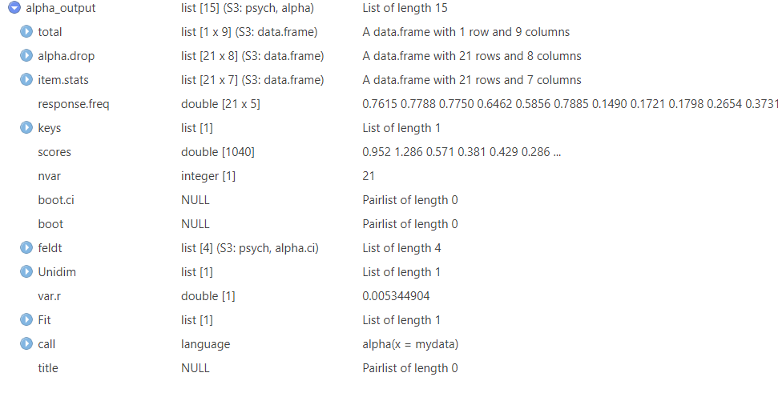
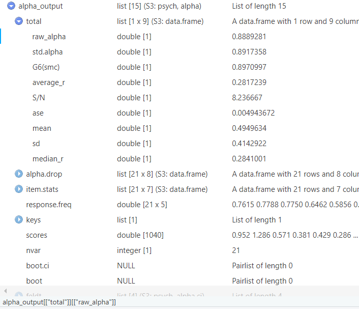
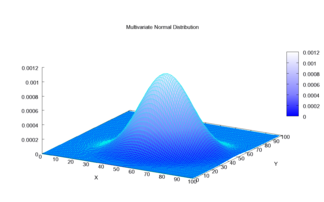
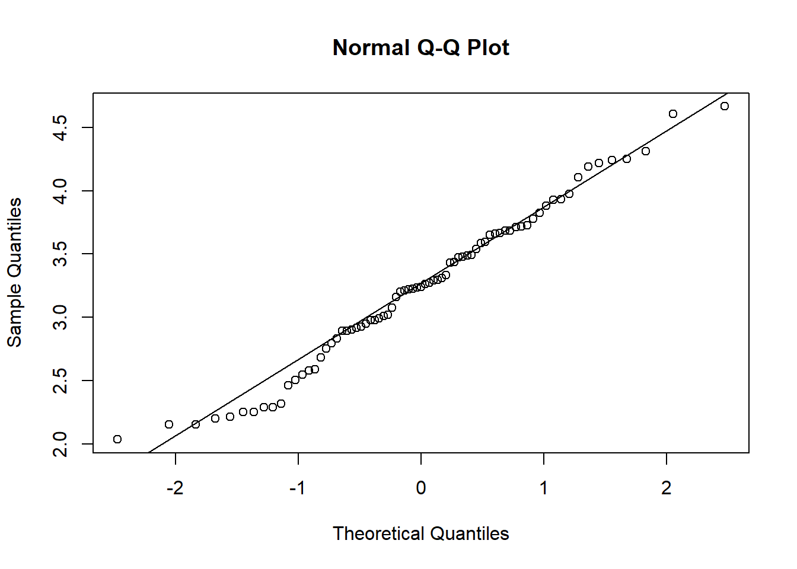
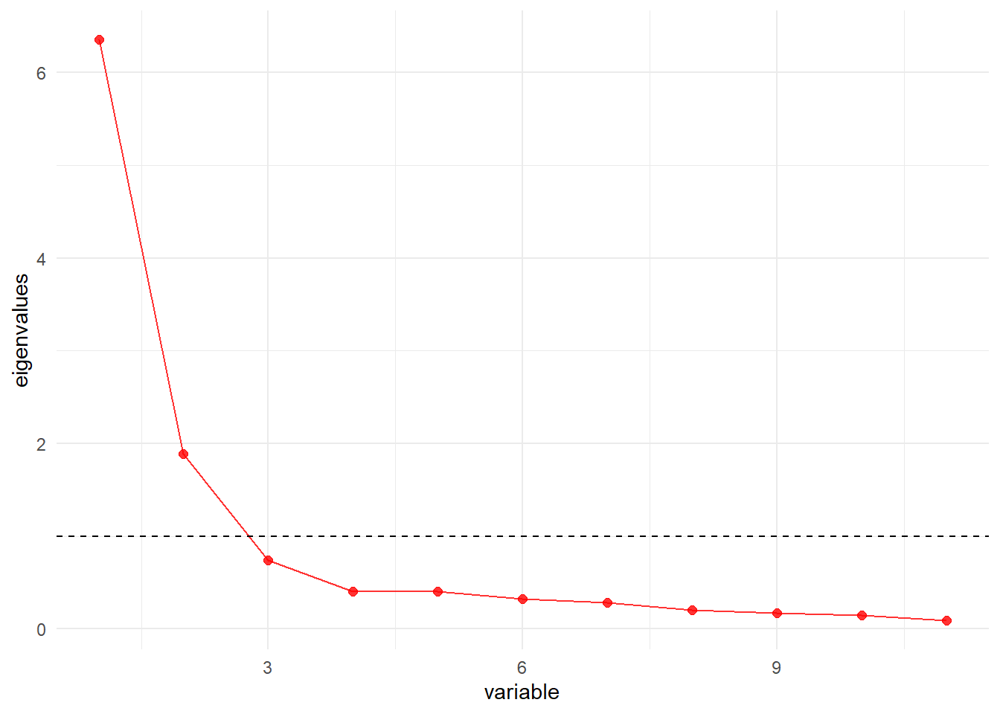
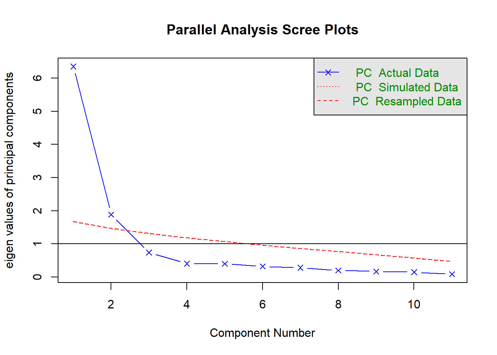
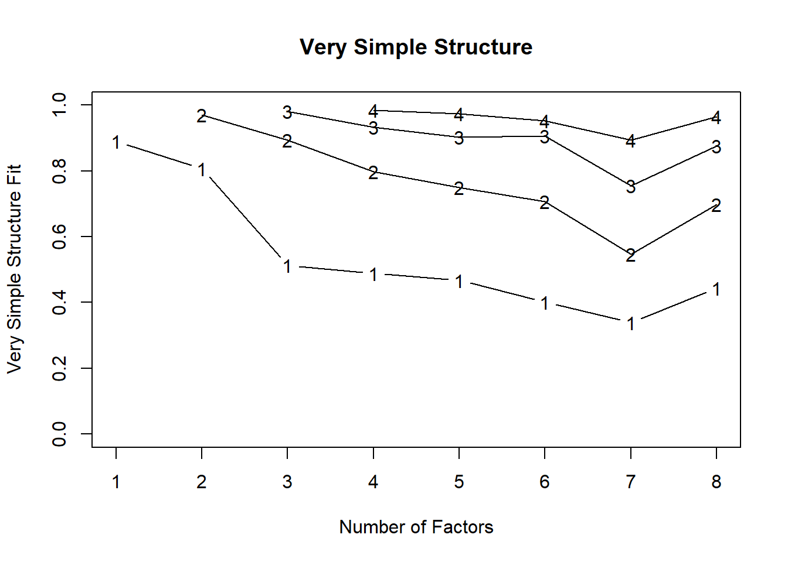

# Reliability indicators, Confirmatory Factor Analysis, and Exploratory Factor Analysis
By now you have some useful skills under your belt: data preprocessing/cleaning, calculations, data visualization... For the remaining parts, I shift the focus more into data analysis, and this mainly from a "investigation/research/testing" view. 

This particular part may interest you, in particular if you are affiliated with fields such as Psychology. In those fields, you may be confronted with questionnaires that are presumed to measure something... often an abstract construct. Questionnaires often include multiple items that are presumed to represent the constructs the questionnaire are presumed to measure. For example, items like "happy", "energized", "relaxed", "calm", could be presumed to reflect the construct "positive affect". 

The question arises, do you have some indications for the consistency of these questionnaires? Do the questionnaire items **reliably** tap onto the assumed construct? Can our questionnaire items be summarized in factors ("more latent constructs") and in how may? 

In this part I'll go over **reliability, confirmatory factor analysis, and exploratory factor analysis**. Specifically:

  1. **Starting with a classic (but debated) indicator of reliability, Cronbach's alpha.**. We will compute this indicator using the [psych package](https://cran.r-project.org/web/packages/psych/index.html) and I'll show you how to compute it by hand. 
  2. **We explore McDonald's Omega reliability indicator as an alternative to Cronbach's alpha**. During this part I will use the [lavaan package](https://lavaan.ugent.be/) and the [semTools package](https://cran.r-project.org/web/packages/semTools/index.html) to introduce you to **Confirmatory Factor Analysis**, **factor loadings (checking tau equivalence)**, **CFA fit indicators and how we could improve them**.
  3. **How to conduct an Exploratory Factor Analysis to unveil the underlying structure of the data**. We will briefly discuss **some** considerations concerning this kind of analysis including **multicollinearity (variance inflation factors), multivariate normallity (Mardia's skewness and kurtosis)**, and **univariate/multivariate outliers (mahalanobis distance)**. I'll also briefly discuss some methods that gives us suggestions regarding the number of factors we could restrain (**scree plots, parallel analysis, Minimal Average Potential**). We end with a small demonstration using the fa() function from the psych package.  

## Cronbach's alpha
Starting off with one of the most popular indicators of internal consistency (reliability). Over the years, this indicator was not spared of criticism [click here for an example](https://www.doi.org/10.1037/met0000144). Nevertheless, I will show you how to compute it. I will use the **psych package** and a [free online dataset, click here](https://journals.plos.org/plosone/article?id=10.1371/journal.pone.0199750). This dataset contains items that "belong" to the same presumed construct. 

```r
library(pacman)
pacman::p_load(psych, dplyr, haven) 

mydata = read_sav("data_files/pone.0199750.s001.sav") 

alpha(mydata)
#> 
#> Reliability analysis   
#> Call: alpha(x = mydata)
#> 
#>   raw_alpha std.alpha G6(smc) average_r S/N   ase mean   sd
#>       0.28      0.88    0.89      0.24 7.4 0.022  1.8 0.79
#>  median_r
#>      0.26
#> 
#>     95% confidence boundaries 
#>          lower alpha upper
#> Feldt     0.21  0.28  0.34
#> Duhachek  0.23  0.28  0.32
#> 
#>  Reliability if an item is dropped:
#>                    raw_alpha std.alpha G6(smc) average_r
#> age                     0.89      0.89    0.89      0.25
#> sex                     0.27      0.88    0.89      0.25
#> BDI1                    0.26      0.87    0.88      0.23
#> BDI2                    0.26      0.87    0.89      0.23
#> BDI3                    0.26      0.87    0.88      0.23
#> BDI4                    0.25      0.87    0.88      0.23
#> BDI5                    0.27      0.88    0.89      0.24
#> BDI6                    0.27      0.88    0.89      0.24
#> BDI7                    0.26      0.87    0.88      0.23
#> BDI8                    0.26      0.87    0.89      0.23
#> BDI9                    0.27      0.88    0.89      0.24
#> BDI10                   0.25      0.87    0.88      0.23
#> BDI11                   0.26      0.88    0.89      0.23
#> BDI12                   0.26      0.87    0.89      0.23
#> BDI13                   0.26      0.87    0.89      0.23
#> BDI14                   0.26      0.88    0.89      0.23
#> BDI15                   0.25      0.87    0.88      0.23
#> BDI16                   0.27      0.88    0.89      0.24
#> BDI17                   0.26      0.87    0.89      0.23
#> BDI18                   0.26      0.88    0.89      0.24
#> BDI19                   0.26      0.87    0.89      0.23
#> BDI20                   0.25      0.87    0.88      0.23
#> BDI21                   0.25      0.88    0.89      0.24
#> clinicalandgeneral      0.27      0.88    0.89      0.25
#>                    S/N alpha se  var.r med.r
#> age                7.8   0.0049 0.0091  0.26
#> sex                7.6   0.0215 0.0111  0.26
#> BDI1               6.8   0.0214 0.0121  0.25
#> BDI2               7.0   0.0215 0.0126  0.25
#> BDI3               6.9   0.0213 0.0122  0.25
#> BDI4               6.9   0.0216 0.0125  0.25
#> BDI5               7.1   0.0212 0.0125  0.26
#> BDI6               7.1   0.0212 0.0125  0.26
#> BDI7               6.8   0.0212 0.0116  0.25
#> BDI8               7.0   0.0211 0.0124  0.25
#> BDI9               7.2   0.0215 0.0128  0.26
#> BDI10              6.9   0.0215 0.0128  0.25
#> BDI11              7.1   0.0214 0.0131  0.26
#> BDI12              7.0   0.0212 0.0124  0.25
#> BDI13              7.0   0.0212 0.0126  0.25
#> BDI14              7.0   0.0215 0.0126  0.25
#> BDI15              6.9   0.0218 0.0125  0.25
#> BDI16              7.3   0.0213 0.0126  0.26
#> BDI17              7.0   0.0214 0.0129  0.25
#> BDI18              7.2   0.0213 0.0131  0.26
#> BDI19              7.0   0.0211 0.0127  0.25
#> BDI20              7.0   0.0218 0.0126  0.25
#> BDI21              7.1   0.0221 0.0131  0.26
#> clinicalandgeneral 7.5   0.0216 0.0118  0.26
#> 
#>  Item statistics 
#>                       n raw.r std.r r.cor r.drop  mean
#> age                1038 0.884  0.17  0.11  0.097 31.44
#> sex                1040 0.102  0.24  0.18  0.073  0.55
#> BDI1               1040 0.352  0.65  0.64  0.319  0.35
#> BDI2               1040 0.319  0.59  0.56  0.288  0.30
#> BDI3               1040 0.266  0.59  0.57  0.236  0.29
#> BDI4               1040 0.409  0.62  0.60  0.376  0.47
#> BDI5               1040 0.205  0.53  0.50  0.170  0.47
#> BDI6               1040 0.220  0.51  0.48  0.181  0.33
#> BDI7               1040 0.295  0.67  0.66  0.259  0.39
#> BDI8               1040 0.246  0.57  0.55  0.205  0.66
#> BDI9               1040 0.182  0.45  0.41  0.159  0.13
#> BDI10              1040 0.381  0.60  0.58  0.343  0.50
#> BDI11              1040 0.307  0.53  0.50  0.266  0.56
#> BDI12              1040 0.281  0.59  0.56  0.247  0.59
#> BDI13              1040 0.282  0.57  0.55  0.244  0.49
#> BDI14              1040 0.320  0.55  0.53  0.288  0.28
#> BDI15              1040 0.462  0.59  0.57  0.429  0.68
#> BDI16              1040 0.192  0.42  0.38  0.146  0.92
#> BDI17              1040 0.298  0.56  0.53  0.261  0.44
#> BDI18              1040 0.257  0.47  0.43  0.210  0.79
#> BDI19              1040 0.254  0.57  0.55  0.209  0.71
#> BDI20              1040 0.458  0.58  0.56  0.426  0.69
#> BDI21              1040 0.497  0.50  0.47  0.466  0.38
#> clinicalandgeneral 1040 0.096  0.30  0.25  0.081  1.08
#>                       sd
#> age                15.81
#> sex                 0.50
#> BDI1                0.69
#> BDI2                0.64
#> BDI3                0.60
#> BDI4                0.73
#> BDI5                0.64
#> BDI6                0.74
#> BDI7                0.71
#> BDI8                0.78
#> BDI9                0.43
#> BDI10               0.90
#> BDI11               0.81
#> BDI12               0.74
#> BDI13               0.82
#> BDI14               0.66
#> BDI15               0.74
#> BDI16               0.82
#> BDI17               0.72
#> BDI18               0.89
#> BDI19               0.85
#> BDI20               0.76
#> BDI21               0.78
#> clinicalandgeneral  0.28
#> 
#> Non missing response frequency for each item
#>                       0    1    2    3 miss
#> sex                0.45 0.55 0.00 0.00    0
#> BDI1               0.76 0.15 0.07 0.02    0
#> BDI2               0.78 0.17 0.02 0.03    0
#> BDI3               0.78 0.18 0.03 0.02    0
#> BDI4               0.65 0.27 0.06 0.03    0
#> BDI5               0.59 0.37 0.02 0.02    0
#> BDI6               0.79 0.14 0.02 0.05    0
#> BDI7               0.72 0.19 0.07 0.02    0
#> BDI8               0.49 0.40 0.07 0.04    0
#> BDI9               0.89 0.09 0.01 0.01    0
#> BDI10              0.72 0.12 0.10 0.06    0
#> BDI11              0.60 0.30 0.05 0.05    0
#> BDI12              0.53 0.37 0.07 0.03    0
#> BDI13              0.68 0.21 0.07 0.05    0
#> BDI14              0.82 0.10 0.06 0.02    0
#> BDI15              0.46 0.43 0.09 0.03    0
#> BDI16              0.34 0.43 0.19 0.04    0
#> BDI17              0.67 0.25 0.05 0.03    0
#> BDI18              0.46 0.36 0.12 0.06    0
#> BDI19              0.52 0.30 0.15 0.04    0
#> BDI20              0.47 0.41 0.09 0.03    0
#> BDI21              0.76 0.15 0.04 0.05    0
#> clinicalandgeneral 0.00 0.92 0.08 0.00    0
```

Note that you receive a lot of output. The (raw) alpha is printed at the top of the output. You could also skip most of it and ask for what you want. For example:

```r
alpha(mydata)[["total"]][["raw_alpha"]]
#> [1] 0.2751774
alpha(mydata)[["total"]][["std.alpha"]]
#> [1] 0.8808157
```

The above looks a bit complicated with all those brackets. here is a trick to it.
Suppose I ran the following code:

```r
alpha_output = alpha(mydata)
```
Now I click on the freshly created alpha_output object (Environment window, top right). It looks something like this:

<br>
<br>

Click on total, then click on raw_alpha. On the bottom you should see: *"alpha_output[["total"]][["raw_alpha"]]"*. Nnow you can copy-paste the *[["total"]][["raw_alpha"]]* part into R. "This store as an object and click" strategy works in variety of contexts such as with regression models.   

<br>
<br>

### Alpha by hand
If desired we could also compute the Cronbach's alpha ourselves without fancy packages. Just for fun and educational purposes, I will demonstrate how.

```r
# Formula Cronbach's alpha: (N)/(N-1) * ( (VARIANCE SUM SCORE ACROSS ITEMS - VARIANCE SUM SCORE PER ITEM)/VARIANCE SUM SCORE ACROSS ITEMS )
  
  # ingredients:
    N = ncol(mydata) # N
    variance_sum_across_items = var( rowSums(mydata) ) # VARIANCE SUM SCORE ACROSS ITEMS
    variance_sum_per_item = sum(  diag(var(mydata, na.rm = TRUE))  ) # VARIANCE SUM SCORE PER ITEM
    
  # Put the above in the formula:
    (N)/(N-1) * ( (variance_sum_across_items - variance_sum_per_item)/variance_sum_across_items )
#> [1] NA
```

## Omega 
As I told you earlier, there is a bit of commotion surrounding whether or not it is appropriate to use Cronbach's alpha. It has been put forward that alpha holds several strong assumptions, some that likely do not apply to the majority of data. A classic example, Cronbach's alpha assumes **(essential) tau equivalence**, meaning that all items contribute equally to the construct being measured (i.e., similar factor loadings, a similar "weight" so to speak).. 

What can we use instead? 

One popular alternative, McDonald's omega, relaxes the assumption of (essential) tau equivalence. A variety of packages allow to compute this indicator, even the psych package. For simplicity, I will use the **lavaan and semtools packages** to use the **reliability() function** which can compute both Cronbach's alpha and McDonald's omega. To do so, we will have to walk into **C**onfirmatory **F**actor **A**nalysis territory. 

First things first, the **psych package may interfere with certain functions from semTools** so I will unload it. Yes, packages in R may sometimes interfere with one another. If this occurs, you typically receive a message in the Console (bottom left) telling you that some function is masked from a given package.

```r
detach("package:psych", unload = TRUE)
```

To use the reliability() function from semTools, we have to "define" a model, tell R to run a CFA using the "defined" model. When "defining" a model for a CFA or structural equation model, we need to tell R which variables we want to include, what variables are so called manifest or latent (see later parts), how variables relate to one another (regressions), and so on. In context of CFA, I will need to tell that there is a **(latent) construct/factor** (the thing that the questionnaire is presumed to tap into) and that all my items, the **(manifest) observed** item scores/factors, reflect/**load on** this latent construct/factor. To define our model:


```r
  p_load(lavaan, semTools)
  mymodel = '
  
  # Here I defined a latent factor (which I arbitrarily named "DEP") and told R that the following manifest factors (here the variables from my dataset) load on this latent factor.
  # The names of the manifest factors must match those in your dataset !
  # the "=~" sign denotes a "latent construct reflected by manifest factors relation"
  
  DEP =~ BDI1 + BDI2 +  BDI3 +  BDI4 +  BDI5 +  BDI6 +  BDI7 +  
  BDI8 +  BDI9 +  BDI10 +  BDI11 +  BDI12 +  BDI13 +  BDI14 + 
  BDI15 +  BDI16 +  BDI17 +  BDI18 +  BDI19 +  BDI20 +  BDI21
  '
```

Now I will have to enter this model in a CFA (using the lavaan package). In the code below I specify certain options. I enable standardized output (discussed later on), use listwise deletion of empty values, and use the Maximum Likelihood with Robust Estimations method. If all goes well, we can compute the omega by putting this CFA object in the reliability() function. **Importantly, for now I will temporarily ignore the output of my CFA object (i.e., it's summary). However, I highly recommend to always look at the output first (as I do later on)**

```r
  mycfa=cfa(mymodel, data = mydata, std.lv=TRUE, missing = "direct", estimator = "MLR")
  reliability(mycfa)
#>              DEP
#> alpha  0.8889281
#> omega  0.8899104
#> omega2 0.8899104
#> omega3 0.8872431
#> avevar 0.2844963
```

Glance over the output of reliability(), you see alpha, omega, omega2, omega3, and avevar. Avevar is the average variance extracted, not a reliability measure but an indication of how much variance is attributable to the common factor. Notice that we have three omega's. In short, The first one (**omega**) "controls" for other (latent) factors, the second one (**omega2**) does not, the third one (**omega3**) has a denuminator that equals the sum of all elements in the variance-covariance matrix of item scores. **Omega and omega2 likely differ** when you define **more than one latent factor and** there is **multi-dimensionality** in the manifest factors/items(e.g., items loading notably on more latent factors). 

You can also request a spread (e.g., confidence intervals) surrounding our omega using the [MBESS package](https://cran.r-project.org/web/packages/MBESS/index.html). In the example below I will use a bootstrap of **5 (purely for demonstration purposes) but in practice consider to go for a higher number (e.g., 500 or more)**.

```r
  library(MBESS)
  ci.reliability(data = mydata, type = "omega", interval.type = "perc", B=5, conf.level = 0.95)
#> $est
#> [1] 0.2725901
#> 
#> $se
#> [1] 0.0191108
#> 
#> $ci.lower
#> [1] 0.267691
#> 
#> $ci.upper
#> [1] 0.3061892
#> 
#> $conf.level
#> [1] 0.95
#> 
#> $type
#> [1] "omega"
#> 
#> $interval.type
#> [1] "percentile bootstrap"
    # applying a bootstrap of 5 bootstrap runs (consider 500+) and a percental CI type
```

**It is very important to note that we used a fairly simple model with continuous variables and only one latent construct (i.e., a unidimensional model).** Other types of models exist such as those including categorical variables, multiple factors, and hierarchical factor models. Covering all of these would be exhaustive for the purposis of this guide. However, I will direct to the work [Flora, 2020](https://doi.org/10.1177/2515245920951747) who provides a detailed background and examples in R. The reference to this article is provided at the end of this part.

### Fit indices and how to potentially improve model fit
As I said before, I ignored the output from my CFA object, but you really should not. For starters, we should check the model fit. The model fit refers to how closely your data matches the model you defined (the relations of the model). **important to realize, a "good fitting model" does not prove that your defined model is a "good", "realistic" or proven model**. 

To see how well your model fits your data we start by requesting model fit indicators. Sometimes you may want to improve these fit indicators. After all, they could affect the value of your omega. While we're at it we can also inspect the factor loadings. This way we can also check cronbach's alpha assumption of (essential) tau equivalence. 


```r
  summary(mycfa, fit.measures=TRUE, standardized=TRUE) 
#> lavaan 0.6.16 ended normally after 27 iterations
#> 
#>   Estimator                                         ML
#>   Optimization method                           NLMINB
#>   Number of model parameters                        63
#> 
#>   Number of observations                          1040
#>   Number of missing patterns                         1
#> 
#> Model Test User Model:
#>                                               Standard      Scaled
#>   Test Statistic                               969.539     590.608
#>   Degrees of freedom                               189         189
#>   P-value (Chi-square)                           0.000       0.000
#>   Scaling correction factor                                  1.642
#>     Yuan-Bentler correction (Mplus variant)                       
#> 
#> Model Test Baseline Model:
#> 
#>   Test statistic                              6110.882    3716.183
#>   Degrees of freedom                               210         210
#>   P-value                                        0.000       0.000
#>   Scaling correction factor                                  1.644
#> 
#> User Model versus Baseline Model:
#> 
#>   Comparative Fit Index (CFI)                    0.868       0.885
#>   Tucker-Lewis Index (TLI)                       0.853       0.873
#>                                                                   
#>   Robust Comparative Fit Index (CFI)                         0.886
#>   Robust Tucker-Lewis Index (TLI)                            0.873
#> 
#> Loglikelihood and Information Criteria:
#> 
#>   Loglikelihood user model (H0)             -21461.330  -21461.330
#>   Scaling correction factor                                  1.772
#>       for the MLR correction                                      
#>   Loglikelihood unrestricted model (H1)             NA          NA
#>   Scaling correction factor                                  1.674
#>       for the MLR correction                                      
#>                                                                   
#>   Akaike (AIC)                               43048.660   43048.660
#>   Bayesian (BIC)                             43360.319   43360.319
#>   Sample-size adjusted Bayesian (SABIC)      43160.223   43160.223
#> 
#> Root Mean Square Error of Approximation:
#> 
#>   RMSEA                                          0.063       0.045
#>   90 Percent confidence interval - lower         0.059       0.042
#>   90 Percent confidence interval - upper         0.067       0.048
#>   P-value H_0: RMSEA <= 0.050                    0.000       0.993
#>   P-value H_0: RMSEA >= 0.080                    0.000       0.000
#>                                                                   
#>   Robust RMSEA                                               0.058
#>   90 Percent confidence interval - lower                     0.053
#>   90 Percent confidence interval - upper                     0.063
#>   P-value H_0: Robust RMSEA <= 0.050                         0.007
#>   P-value H_0: Robust RMSEA >= 0.080                         0.000
#> 
#> Standardized Root Mean Square Residual:
#> 
#>   SRMR                                           0.046       0.046
#> 
#> Parameter Estimates:
#> 
#>   Standard errors                             Sandwich
#>   Information bread                           Observed
#>   Observed information based on                Hessian
#> 
#> Latent Variables:
#>                    Estimate  Std.Err  z-value  P(>|z|)
#>   DEP =~                                              
#>     BDI1              0.438    0.028   15.417    0.000
#>     BDI2              0.356    0.031   11.445    0.000
#>     BDI3              0.353    0.030   11.726    0.000
#>     BDI4              0.433    0.028   15.285    0.000
#>     BDI5              0.327    0.029   11.381    0.000
#>     BDI6              0.372    0.034   10.901    0.000
#>     BDI7              0.479    0.028   17.166    0.000
#>     BDI8              0.445    0.031   14.474    0.000
#>     BDI9              0.175    0.022    7.993    0.000
#>     BDI10             0.505    0.033   15.353    0.000
#>     BDI11             0.397    0.033   11.984    0.000
#>     BDI12             0.429    0.027   16.104    0.000
#>     BDI13             0.459    0.033   13.925    0.000
#>     BDI14             0.361    0.029   12.354    0.000
#>     BDI15             0.404    0.029   14.049    0.000
#>     BDI16             0.307    0.028   11.115    0.000
#>     BDI17             0.379    0.029   13.112    0.000
#>     BDI18             0.370    0.032   11.611    0.000
#>     BDI19             0.467    0.031   15.232    0.000
#>     BDI20             0.402    0.029   13.925    0.000
#>     BDI21             0.333    0.036    9.268    0.000
#>    Std.lv  Std.all
#>                   
#>     0.438    0.633
#>     0.356    0.559
#>     0.353    0.588
#>     0.433    0.597
#>     0.327    0.512
#>     0.372    0.500
#>     0.479    0.678
#>     0.445    0.568
#>     0.175    0.412
#>     0.505    0.562
#>     0.397    0.488
#>     0.429    0.582
#>     0.459    0.557
#>     0.361    0.544
#>     0.404    0.549
#>     0.307    0.374
#>     0.379    0.526
#>     0.370    0.418
#>     0.467    0.547
#>     0.402    0.526
#>     0.333    0.427
#> 
#> Intercepts:
#>                    Estimate  Std.Err  z-value  P(>|z|)
#>    .BDI1              0.346    0.021   16.142    0.000
#>    .BDI2              0.295    0.020   14.938    0.000
#>    .BDI3              0.287    0.019   15.397    0.000
#>    .BDI4              0.467    0.022   20.782    0.000
#>    .BDI5              0.475    0.020   23.953    0.000
#>    .BDI6              0.329    0.023   14.281    0.000
#>    .BDI7              0.391    0.022   17.853    0.000
#>    .BDI8              0.663    0.024   27.270    0.000
#>    .BDI9              0.134    0.013   10.126    0.000
#>    .BDI10             0.496    0.028   17.804    0.000
#>    .BDI11             0.560    0.025   22.184    0.000
#>    .BDI12             0.591    0.023   25.866    0.000
#>    .BDI13             0.487    0.026   19.083    0.000
#>    .BDI14             0.278    0.021   13.494    0.000
#>    .BDI15             0.676    0.023   29.607    0.000
#>    .BDI16             0.921    0.025   36.169    0.000
#>    .BDI17             0.436    0.022   19.500    0.000
#>    .BDI18             0.788    0.027   28.680    0.000
#>    .BDI19             0.708    0.026   26.713    0.000
#>    .BDI20             0.688    0.024   29.058    0.000
#>    .BDI21             0.378    0.024   15.651    0.000
#>     DEP               0.000                           
#>    Std.lv  Std.all
#>     0.346    0.501
#>     0.295    0.463
#>     0.287    0.477
#>     0.467    0.644
#>     0.475    0.743
#>     0.329    0.443
#>     0.391    0.554
#>     0.663    0.846
#>     0.134    0.314
#>     0.496    0.552
#>     0.560    0.688
#>     0.591    0.802
#>     0.487    0.592
#>     0.278    0.418
#>     0.676    0.918
#>     0.921    1.122
#>     0.436    0.605
#>     0.788    0.889
#>     0.708    0.828
#>     0.688    0.901
#>     0.378    0.485
#>     0.000    0.000
#> 
#> Variances:
#>                    Estimate  Std.Err  z-value  P(>|z|)
#>    .BDI1              0.287    0.021   13.687    0.000
#>    .BDI2              0.279    0.023   11.888    0.000
#>    .BDI3              0.236    0.018   13.273    0.000
#>    .BDI4              0.339    0.024   13.925    0.000
#>    .BDI5              0.302    0.017   17.306    0.000
#>    .BDI6              0.413    0.037   11.232    0.000
#>    .BDI7              0.270    0.019   13.971    0.000
#>    .BDI8              0.417    0.023   18.342    0.000
#>    .BDI9              0.150    0.019    7.732    0.000
#>    .BDI10             0.553    0.036   15.323    0.000
#>    .BDI11             0.504    0.034   14.943    0.000
#>    .BDI12             0.359    0.023   15.813    0.000
#>    .BDI13             0.468    0.032   14.807    0.000
#>    .BDI14             0.311    0.028   10.907    0.000
#>    .BDI15             0.379    0.021   17.842    0.000
#>    .BDI16             0.580    0.025   23.143    0.000
#>    .BDI17             0.375    0.028   13.486    0.000
#>    .BDI18             0.649    0.031   20.872    0.000
#>    .BDI19             0.512    0.024   21.019    0.000
#>    .BDI20             0.421    0.024   17.796    0.000
#>    .BDI21             0.496    0.037   13.346    0.000
#>     DEP               1.000                           
#>    Std.lv  Std.all
#>     0.287    0.599
#>     0.279    0.687
#>     0.236    0.654
#>     0.339    0.644
#>     0.302    0.738
#>     0.413    0.750
#>     0.270    0.541
#>     0.417    0.678
#>     0.150    0.831
#>     0.553    0.685
#>     0.504    0.762
#>     0.359    0.661
#>     0.468    0.690
#>     0.311    0.704
#>     0.379    0.699
#>     0.580    0.860
#>     0.375    0.723
#>     0.649    0.826
#>     0.512    0.701
#>     0.421    0.723
#>     0.496    0.818
#>     1.000    1.000
  # fit.measures will show the model fit indicators such as RMSSEA and CFI
```

Alright, a lot of output. Recall that output interpretation is beyond the scope of this guide but I note two things:
  1. you could argue that there is room for improvement based on multiple fit indicators. Some would argue that the **CFI and TLI should preferably be above .90, perhaps even above .950.** Further, The RMSEA looks "ok" but **some would prefer this value below 0.05.** Of course there is not really a real cut-off, only conventions.
  2. The factor loadings (see "Latent Variables" in the output) are not equal. This can be taken as a violation of the tau equivalence assumption, so Cronbach's alpha may not be that appropriate to report. 
  
Next to the above two points, notice that the current values of alpha and omega are very similar. However, sometimes it could be that notable differences emerge upon improving your model fit.

How do we do that?

**Well a straightforward way is to can inspect the residual correlations in the CFA object** and "adjust/account" for (manifest) variables show a... "notable" correlation. High residual correlations may indicate to some items sare unique variance, that is, variance that is not explained by the latent construct (extra variance beyond the latent construct so to speak). Let's have a look at the residual correlations and note correlations of at least say .075 (**arbitrary example**).

```r
  options(scipen=999) # Disables the scientific notation
  residuals(mycfa, type = "cor")$cor # For visual inspection of 
#> NULL
  
  # TIP, since I have a lot of correlations visual inspection of correlations >.075 becomes cumbersome
  # Below a code that will prompt a window showing the variables with correlations above .075
View(
  data.frame(  as.table(residuals(mycfa, type = "cor")$cov)  )
  %>% filter(Freq>0.075) %>% # with Freq being the correlations. Unfortunately this will output duplicates so I will filter them out
    mutate(is_duplicated = ifelse(duplicated(Freq)==TRUE , "yes","no"    )) %>% # i.e., yes to duplicate correlations
  filter(!is_duplicated =="yes") # get rid of duplicates
)
```
My code tells me yhat there are 13 (unique) correlations above .075. Remember the step where we defined a model for the CFA (I called this "mymodel")? Within this model definition, I will also add that the correlations between the *13 (manifest) factors* are correlated. Then I'll check my CFA model output again.


```r
mymodel = '
  DEP =~ BDI1 + BDI2 +  BDI3 +  BDI4 +  BDI5 +  BDI6 +  BDI7 +  
  BDI8 +  BDI9 +  BDI10 +  BDI11 +  BDI12 +  BDI13 +  BDI14 + 
  BDI15 +  BDI16 +  BDI17 +  BDI18 +  BDI19 +  BDI20 +  BDI21
  
  # the ~~ stands for correlation. So I tell R to consider their correlations these (and to not set them to 0 by default)
  
  BDI10 ~~ BDI1
  BDI4 ~~  BDI2
  BDI5 ~~  BDI3
  BDI7 ~~  BDI3
  BDI9 ~~  BDI3
  BDI6 ~~  BDI5
  BDI8 ~~  BDI5
  BDI17 ~~ BDI11
  BDI19 ~~ BDI3
  BDI16 ~~ BDI15
  BDI20 ~~ BDI15
  BDI18 ~~ BDI16
  BDI20 ~~ BDI16
  '

mycfa=cfa(mymodel, data = mydata, std.lv=TRUE, missing = "direct", estimator = "MLR")
summary(mycfa, fit.measures=TRUE, standardized=TRUE)
#> lavaan 0.6.16 ended normally after 34 iterations
#> 
#>   Estimator                                         ML
#>   Optimization method                           NLMINB
#>   Number of model parameters                        76
#> 
#>   Number of observations                          1040
#>   Number of missing patterns                         1
#> 
#> Model Test User Model:
#>                                               Standard      Scaled
#>   Test Statistic                               551.368     340.106
#>   Degrees of freedom                               176         176
#>   P-value (Chi-square)                           0.000       0.000
#>   Scaling correction factor                                  1.621
#>     Yuan-Bentler correction (Mplus variant)                       
#> 
#> Model Test Baseline Model:
#> 
#>   Test statistic                              6110.882    3716.183
#>   Degrees of freedom                               210         210
#>   P-value                                        0.000       0.000
#>   Scaling correction factor                                  1.644
#> 
#> User Model versus Baseline Model:
#> 
#>   Comparative Fit Index (CFI)                    0.936       0.953
#>   Tucker-Lewis Index (TLI)                       0.924       0.944
#>                                                                   
#>   Robust Comparative Fit Index (CFI)                         0.954
#>   Robust Tucker-Lewis Index (TLI)                            0.945
#> 
#> Loglikelihood and Information Criteria:
#> 
#>   Loglikelihood user model (H0)             -21252.244  -21252.244
#>   Scaling correction factor                                  1.797
#>       for the MLR correction                                      
#>   Loglikelihood unrestricted model (H1)             NA          NA
#>   Scaling correction factor                                  1.674
#>       for the MLR correction                                      
#>                                                                   
#>   Akaike (AIC)                               42656.489   42656.489
#>   Bayesian (BIC)                             43032.459   43032.459
#>   Sample-size adjusted Bayesian (SABIC)      42791.073   42791.073
#> 
#> Root Mean Square Error of Approximation:
#> 
#>   RMSEA                                          0.045       0.030
#>   90 Percent confidence interval - lower         0.041       0.026
#>   90 Percent confidence interval - upper         0.050       0.034
#>   P-value H_0: RMSEA <= 0.050                    0.965       1.000
#>   P-value H_0: RMSEA >= 0.080                    0.000       0.000
#>                                                                   
#>   Robust RMSEA                                               0.038
#>   90 Percent confidence interval - lower                     0.032
#>   90 Percent confidence interval - upper                     0.044
#>   P-value H_0: Robust RMSEA <= 0.050                         1.000
#>   P-value H_0: Robust RMSEA >= 0.080                         0.000
#> 
#> Standardized Root Mean Square Residual:
#> 
#>   SRMR                                           0.036       0.036
#> 
#> Parameter Estimates:
#> 
#>   Standard errors                             Sandwich
#>   Information bread                           Observed
#>   Observed information based on                Hessian
#> 
#> Latent Variables:
#>                    Estimate  Std.Err  z-value  P(>|z|)
#>   DEP =~                                              
#>     BDI1              0.429    0.029   15.002    0.000
#>     BDI2              0.354    0.031   11.324    0.000
#>     BDI3              0.343    0.031   11.097    0.000
#>     BDI4              0.431    0.028   15.126    0.000
#>     BDI5              0.312    0.029   10.685    0.000
#>     BDI6              0.368    0.034   10.800    0.000
#>     BDI7              0.479    0.028   17.150    0.000
#>     BDI8              0.445    0.031   14.244    0.000
#>     BDI9              0.174    0.022    8.005    0.000
#>     BDI10             0.492    0.033   14.712    0.000
#>     BDI11             0.393    0.034   11.617    0.000
#>     BDI12             0.436    0.027   16.044    0.000
#>     BDI13             0.466    0.033   13.926    0.000
#>     BDI14             0.365    0.029   12.384    0.000
#>     BDI15             0.388    0.029   13.333    0.000
#>     BDI16             0.284    0.028   10.096    0.000
#>     BDI17             0.373    0.029   12.718    0.000
#>     BDI18             0.365    0.032   11.255    0.000
#>     BDI19             0.473    0.031   15.250    0.000
#>     BDI20             0.383    0.029   13.411    0.000
#>     BDI21             0.337    0.036    9.244    0.000
#>    Std.lv  Std.all
#>                   
#>     0.429    0.621
#>     0.354    0.556
#>     0.343    0.572
#>     0.431    0.594
#>     0.312    0.489
#>     0.368    0.496
#>     0.479    0.678
#>     0.445    0.568
#>     0.174    0.410
#>     0.492    0.547
#>     0.393    0.483
#>     0.436    0.592
#>     0.466    0.565
#>     0.365    0.550
#>     0.388    0.527
#>     0.284    0.347
#>     0.373    0.517
#>     0.365    0.411
#>     0.473    0.554
#>     0.383    0.502
#>     0.337    0.433
#> 
#> Covariances:
#>                    Estimate  Std.Err  z-value  P(>|z|)
#>  .BDI1 ~~                                             
#>    .BDI10             0.096    0.020    4.901    0.000
#>  .BDI2 ~~                                             
#>    .BDI4              0.038    0.017    2.294    0.022
#>  .BDI3 ~~                                             
#>    .BDI5              0.037    0.012    3.041    0.002
#>    .BDI7              0.041    0.015    2.763    0.006
#>    .BDI9              0.021    0.010    2.138    0.033
#>  .BDI5 ~~                                             
#>    .BDI6              0.059    0.016    3.719    0.000
#>    .BDI8              0.046    0.014    3.294    0.001
#>  .BDI11 ~~                                            
#>    .BDI17             0.050    0.018    2.824    0.005
#>  .BDI3 ~~                                             
#>    .BDI19            -0.008    0.016   -0.478    0.633
#>  .BDI15 ~~                                            
#>    .BDI16             0.065    0.017    3.916    0.000
#>    .BDI20             0.165    0.020    8.371    0.000
#>  .BDI16 ~~                                            
#>    .BDI18             0.100    0.022    4.631    0.000
#>    .BDI20             0.091    0.018    5.144    0.000
#>    Std.lv  Std.all
#>                   
#>     0.096    0.235
#>                   
#>     0.038    0.124
#>                   
#>     0.037    0.135
#>     0.041    0.160
#>     0.021    0.111
#>                   
#>     0.059    0.163
#>     0.046    0.129
#>                   
#>     0.050    0.114
#>                   
#>    -0.008   -0.021
#>                   
#>     0.065    0.136
#>     0.165    0.399
#>                   
#>     0.100    0.162
#>     0.091    0.180
#> 
#> Intercepts:
#>                    Estimate  Std.Err  z-value  P(>|z|)
#>    .BDI1              0.346    0.021   16.142    0.000
#>    .BDI2              0.295    0.020   14.938    0.000
#>    .BDI3              0.287    0.019   15.397    0.000
#>    .BDI4              0.467    0.022   20.782    0.000
#>    .BDI5              0.475    0.020   23.953    0.000
#>    .BDI6              0.329    0.023   14.281    0.000
#>    .BDI7              0.391    0.022   17.853    0.000
#>    .BDI8              0.663    0.024   27.270    0.000
#>    .BDI9              0.134    0.013   10.126    0.000
#>    .BDI10             0.496    0.028   17.804    0.000
#>    .BDI11             0.560    0.025   22.184    0.000
#>    .BDI12             0.591    0.023   25.866    0.000
#>    .BDI13             0.487    0.026   19.083    0.000
#>    .BDI14             0.278    0.021   13.494    0.000
#>    .BDI15             0.676    0.023   29.607    0.000
#>    .BDI16             0.921    0.025   36.169    0.000
#>    .BDI17             0.436    0.022   19.500    0.000
#>    .BDI18             0.788    0.027   28.680    0.000
#>    .BDI19             0.708    0.026   26.713    0.000
#>    .BDI20             0.688    0.024   29.058    0.000
#>    .BDI21             0.378    0.024   15.651    0.000
#>     DEP               0.000                           
#>    Std.lv  Std.all
#>     0.346    0.501
#>     0.295    0.463
#>     0.287    0.478
#>     0.467    0.644
#>     0.475    0.744
#>     0.329    0.443
#>     0.391    0.554
#>     0.663    0.846
#>     0.134    0.314
#>     0.496    0.552
#>     0.560    0.688
#>     0.591    0.802
#>     0.487    0.592
#>     0.278    0.418
#>     0.676    0.918
#>     0.921    1.123
#>     0.436    0.605
#>     0.788    0.889
#>     0.708    0.828
#>     0.688    0.901
#>     0.378    0.485
#>     0.000    0.000
#> 
#> Variances:
#>                    Estimate  Std.Err  z-value  P(>|z|)
#>    .BDI1              0.294    0.022   13.545    0.000
#>    .BDI2              0.281    0.024   11.752    0.000
#>    .BDI3              0.242    0.019   13.038    0.000
#>    .BDI4              0.340    0.025   13.644    0.000
#>    .BDI5              0.310    0.018   17.449    0.000
#>    .BDI6              0.416    0.037   11.200    0.000
#>    .BDI7              0.270    0.020   13.588    0.000
#>    .BDI8              0.417    0.023   18.242    0.000
#>    .BDI9              0.151    0.019    7.734    0.000
#>    .BDI10             0.566    0.037   15.313    0.000
#>    .BDI11             0.507    0.034   14.969    0.000
#>    .BDI12             0.353    0.023   15.557    0.000
#>    .BDI13             0.462    0.032   14.528    0.000
#>    .BDI14             0.308    0.028   10.829    0.000
#>    .BDI15             0.392    0.022   18.068    0.000
#>    .BDI16             0.592    0.025   23.500    0.000
#>    .BDI17             0.380    0.028   13.398    0.000
#>    .BDI18             0.653    0.031   20.910    0.000
#>    .BDI19             0.506    0.025   20.483    0.000
#>    .BDI20             0.436    0.024   18.173    0.000
#>    .BDI21             0.492    0.037   13.289    0.000
#>     DEP               1.000                           
#>    Std.lv  Std.all
#>     0.294    0.615
#>     0.281    0.691
#>     0.242    0.673
#>     0.340    0.647
#>     0.310    0.761
#>     0.416    0.754
#>     0.270    0.540
#>     0.417    0.678
#>     0.151    0.832
#>     0.566    0.700
#>     0.507    0.766
#>     0.353    0.650
#>     0.462    0.680
#>     0.308    0.698
#>     0.392    0.722
#>     0.592    0.880
#>     0.380    0.732
#>     0.653    0.831
#>     0.506    0.693
#>     0.436    0.748
#>     0.492    0.812
#>     1.000    1.000
```

Ok, the model fit indicators did improve a bit. Did the omega change? 

```r
reliability(mycfa)
#>              DEP
#> alpha  0.8889281
#> omega  0.8677875
#> omega2 0.8677875
#> omega3 0.8657039
#> avevar 0.2784132
```

There is bigger difference between alpha and omega but it is not that... "notable". Of course, what is small or large (there is a reason you often see me put "" around certain words)? From my own experience, the omega sometimes changes "a little", sometimes more "notably". Various factors likely play a role in this, e.g., in how far Cronbach's alpha held assumptions are violated.


## Exploratory factor analysis
Until now, we assumed that we knew the number of factors and constructs that could explain our data. This is especially clear in CFA where we define our models and say how many (latent) factors there are and what loads on them (**but again, a model that fit does not mean a confirmed true model**). Still, what if you don't know? You receive a couple of questionnaire items **and**, for whatever reason, you want to try to identify what variables/factors could explain patterns of (co)relations between your variables. For this purpose we could conduct an **e**xploratory **f**actor **a**nalysis (EFA). In the following parts I will use the PoliticalDemocracy dataset which is a built-in dataset from the lavaan package. Note that I renamed the last variables.

```r
mydata = PoliticalDemocracy
names(mydata)[9:ncol(mydata)] = c("y9", "y10", "y11")
```

Alright, now before you plan to conduct an EFA, **always check your data**. Several points need to be considered before conducting an EFA. For example, the sample size (sometimes debated), missing data, **multicollinearity**, skewness and kurtosis (whether our variables resemble a **univariate/multivariate normal distribution**), (univariate/multivariate) outliers, and so on. 

Here I want to quickly inspect the last three points: multicollinearity, the distribution of the data, and outliers. These may help us determine what methods to consider when conducting our EFA later on.  

### EFA check: multicollinearity
How would you inspect multicollinearity between your variables? Did you spontaneously think about a correlation matrix? **Well, you might miss out on multicollinearity** as correlation matrices might miss complex interactions among multiple variables. **Correlations could be "low" but that does not necessarily imply the absence of multicollinearity**.

As an extra indicator, we can use the **variance inflation factor (VIF)** using the **vif()** function from the [car package](https://cran.r-project.org/web/packages/car/index.html). In short, the VIF indicates whether the variance of a **regression coefficient** is inflated due to inter-correlations between predictors in a regression model. A VIF around 1 suggests "no" multicollinearity, a VIF between 1-5 suggests "moderate" multicollinearity. However, a VIF of **5 and above** as suggests "high" multicollinearity. For example, a VIF of 5 suggests that the variance of that predictor is 5 times the value it would be without multicollinearity. 

I admit that VIF is more typically used in regression analysis rather than factor analysis. Still it can provide useful if you use it before you conduct your EFA. Spoilers for the upcoming part about linear regression but to compute the VIF, I will fit a linear model in which one variable of my dataset is regressed on all remaining ones. To regress one variable on all others, I will create a text that shows the formula for the linear regression model. That text object is then restyled to not be read as a text but as a formula so it can be used in the lm() function to fit a simple linear model.

```r
mylm = lm(
as.formula(
  # A text that will look like y1 ~ y1 + y2 + ... y11. This text will be "restyled" as a formula (basicially dropping the "" signs)
paste( colnames(mydata)[1], "~",
  paste(colnames(mydata)[2:(ncol(mydata))], collapse ="+"),
  sep = ""
      )
      )
, data = mydata)
```

Now we can put our linear model in the vif() function, as simple as that.

```r
library(car)
#> Loading required package: carData
#> 
#> Attaching package: 'car'
#> The following object is masked from 'package:dplyr':
#> 
#>     recode
vif(mylm)
#>       y2       y3       y4       y5       y6       y7 
#> 2.875379 2.005594 3.669274 2.669889 3.070501 2.984355 
#>       y8       y9      y10      y11 
#> 3.619843 6.045630 6.930182 3.907849
```

### EFA check: univariate/multivariate normal distribution
Skewness and kurtosis affect correlations (**especially Pearson correlations**), and therefore EFA. If you detect "notable" skewness and/or kurtosis, you might want to consider looking into e.g., Spearman or polychoric correlations instead of Pearson ones. Important to know, **both** the univariate distribution of your individual variables and the multivariate distribution of your data, can play a role. Think of a multivariate distribution as multidimensional overview of combinations (cross-points of the values of multiple variables). Univariate distributions can be plotted on a (2D) histogram that only has one axis, multivariate distributions have multiple axes (one per variable) so it looks multidimensional. Here an example of a bivariate normal distribution [from Wikipedia](https://en.wikipedia.org/wiki/Multivariate_normal_distribution)


Univariate distributions can be inspected by histograms or by calculation of the skew and kurtosis. Multivariate distributions - and whether they resemble a "normal gaussian distribution" - can be checked with the **mardia()** function from the **psych package**.

```r
library(psych)
#> 
#> Attaching package: 'psych'
#> The following object is masked from 'package:car':
#> 
#>     logit
#> The following object is masked from 'package:MBESS':
#> 
#>     cor2cov
#> The following objects are masked from 'package:semTools':
#> 
#>     reliability, skew
#> The following object is masked from 'package:lavaan':
#> 
#>     cor2cov
mardia(mydata)
```



```
#> Call: mardia(x = mydata)
#> 
#> Mardia tests of multivariate skew and kurtosis
#> Use describe(x) the to get univariate tests
#> n.obs = 75   num.vars =  11 
#> b1p =  26.47   skew =  330.9  with probability  <=  0.035
#>  small sample skew =  346.41  with probability <=  0.0083
#> b2p =  134.57   kurtosis =  -2.16  with probability <=  0.031
```

The output shows the multivariate kurtosis, skewness, and corresponding *p* values. If you want to follow convention, then *p* values above .05 on kurtosis and/or skewness are deemed to suggest a multivariate normal distribution.

### EFA check: univariate/multivariate outliers
Correlations are sensitive to "notable" data values that are much "larger" or "smaller" in value, as compared to others. Consequently, EFA can be affected by outliers as well. You can spot univariate outliers (i.e., "extreme values" in one variable) using **e.g., box plots**. 

Then you have multivariate outliers which are "extremities" in the combinations of two or more variables. A simple example, suppose you measure height and weight in a human adult population. Some people are 1.98 meters tall, some people weight 53 kilograms. Now imagine a person who is both 1.98 meters tall and (only) weights 53 kilograms. This could be considered as an "outlying" combination. 

Multivariate outliers can be checked by the **Mahalanobis distance** using the mahalanobis() function. We'll feed this function the mean per variable and the covariance between all variables. Afterwards, we can test whether a given distance score is "statistically significantly different" compared to others. Commonly, a chi-square test with k-1 degrees of freedom (here our number of variables -1) is used to test the Mahalanobis distance, with statistically significant differences noted by *p* values below or equal to .001. In the example below I will put these distances in a dataframe object, add p-values, and an indicator of whether these are significant (thus "outliers").

```r
mydistances = data.frame(
  distance = mahalanobis(mydata, center = colMeans(mydata), cov = cov(mydata))
)
mydistances$pvalues = pchisq(q = mydistances$distance, df = ncol(mydata)-1, lower.tail = FALSE) 
mydistances = mydistances %>% mutate(outlier = ifelse(  pvalues<=0.001,"outlier","not outlier"))
```

### EFA: how many factors?
Asking the big questions: what is the number of factors that "sufficiently" explain our data? Several indications can give use an idea including the on **scree plots depicting eigenvalues** and **parallel analysis**. 

#### EFA: scree plots with eigenvalues
Scree plots are line  plots showing and connecting eigenvalues. Eigenvalues represent the amount of variance explained by each factor. You can compute the eigenvalues using the **eigenComputes() function** from the [nFactors package](https://cran.r-project.org/web/packages/nFactors/index.html). To this function I will enter my dataset and specify to use the (Pearson) correlation matrix from that dataset (the function will automatically compute it for me) instead of a covariance matrix.

```r
library(nFactors)
myeigenvalues = eigenComputes(mydata, cor = TRUE)
```

**In case you deem your variables not sufficiently univariate/multivariate normal distributed**, you could e.g. compute the polychoric correlations using the **polychoric()** function from the **psych package**, store these correlations in a separate variable, and enter that variable in eigenComputes(). We could also use e.g., Spearman correlations which already have a built-in option within eigenComputes(): *eigenComputes(mydata, cor = TRUE, method="spearman")*.  

Ok, let's create the scree plot. Commonly, the number of factors to be retained is conventionally deemed to be the number of eigenvalues above the value 1. I will be use the ggplot2 package (see also the previous part) to make the plot.


```r
  # First I make a dataset containing the eigenvalues and the amount of variables (to create the x- and y-axis)
library(ggplot2)
#> 
#> Attaching package: 'ggplot2'
#> The following objects are masked from 'package:psych':
#> 
#>     %+%, alpha
  data.frame( 
  variable = 1:ncol(mydata),
  eigenvalues = myeigenvalues) %>% # From I create the scree plot
  ggplot(aes(x=variable, y=eigenvalues)) +
  geom_point(size = 2, color="red",alpha=0.8) +
  geom_line(color="red", alpha=0.8) +
  geom_hline(aes(yintercept=1), linetype="dashed") +
  theme_minimal()
```



#### EFA: parallel analysis
Parallel analysis simultaneously simulates the eigenvalues based on both our own observed data (like we did above) and by those based on a simulated dataset that is parallel to our own observed data. To determine the number of factors to retain, we have to look at the number of factors above those of the simulated data. We can use the **fa.parallel()** function from the **psych package** to run this function with principal components analysis, common factor analysis, or both.  

```r
fa.parallel(mydata, fa = "pc", cor = "cor", n.iter=500) 
```



```
#> Parallel analysis suggests that the number of factors =  NA  and the number of components =  2
  # Pearson correlations by default but this can be modified
  # fa both will output both principal components and principal factor analysis
```

#### EFA: Minimum Average Partial (correlations)
The last technique that I want to discuss, **the M**inimum **A**verage **P**artial, is used to select the number of factors with the smallest mean partial correlation. Partial correlations measure the relation between variables, while adjusting for the influence of other variables. These partial correlations progress to 0 with a more *optimal* number of factors. We can use the **VSS()function** from the **psych package**

```r
VSS(cor(mydata))
#> n.obs was not specified and was arbitrarily set to 1000.  This only affects the chi square values.
```



```
#> 
#> Very Simple Structure
#> Call: vss(x = x, n = n, rotate = rotate, diagonal = diagonal, fm = fm, 
#>     n.obs = n.obs, plot = plot, title = title, use = use, cor = cor)
#> VSS complexity 1 achieves a maximimum of 0.89  with  1  factors
#> VSS complexity 2 achieves a maximimum of 0.97  with  2  factors
#> 
#> The Velicer MAP achieves a minimum of 0.05  with  2  factors 
#> BIC achieves a minimum of  38.92  with  6  factors
#> Sample Size adjusted BIC achieves a minimum of  51.63  with  6  factors
#> 
#> Statistics by number of factors 
#>   vss1 vss2   map dof        chisq
#> 1 0.89 0.00 0.096  44 3431.3938136
#> 2 0.81 0.97 0.046  34  831.5327108
#> 3 0.51 0.89 0.054  25  434.9763651
#> 4 0.49 0.80 0.076  17  259.3664968
#> 5 0.47 0.75 0.100  10  135.9475999
#> 6 0.40 0.71 0.145   4   66.5522974
#> 7 0.34 0.55 0.216  -1   13.9568471
#> 8 0.44 0.70 0.345  -5    0.0000057
#>                                                                                                                                                          prob
#> 1 0.000000000000000000000000000000000000000000000000000000000000000000000000000000000000000000000000000000000000000000000000000000000000000000000000000000000
#> 2 0.000000000000000000000000000000000000000000000000000000000000000000000000000000000000000000000000000000000000000000000000000000000000000000000000000000011
#> 3 0.000000000000000000000000000000000000000000000000000000000000000000000000000205989781877151495567863925817420067687635309994220733642578125000000000000000
#> 4 0.000000000000000000000000000000000000000000002537310578025230469682155254318445258832070976495742797851562500000000000000000000000000000000000000000000000
#> 5 0.000000000000000000000002847326567079168220270740663480069088109303265810012817382812500000000000000000000000000000000000000000000000000000000000000000000
#> 6 0.000000000000121155814533981051996439082252265961869852617383003234863281250000000000000000000000000000000000000000000000000000000000000000000000000000000
#> 7                                                                                                                                                          NA
#> 8                                                                                                                                                          NA
#>   sqresid  fit RMSEA  BIC SABIC complex        eChisq
#> 1    4.93 0.89  0.28 3127  3267     1.0 2375.35970442
#> 2    1.33 0.97  0.15  597   705     1.2  199.31215851
#> 3    0.83 0.98  0.13  262   342     1.7   55.44789599
#> 4    0.67 0.99  0.12  142   196     1.8   31.78593735
#> 5    0.53 0.99  0.11   67    99     2.1   11.62641311
#> 6    0.46 0.99  0.13   39    52     2.1    3.90783385
#> 7    0.34 0.99    NA   NA    NA     2.5    0.63731046
#> 8    0.30 0.99    NA   NA    NA     2.3    0.00000029
#>        SRMR eCRMS eBIC
#> 1 0.1469496 0.164 2071
#> 2 0.0425668 0.054  -36
#> 3 0.0224515 0.033 -117
#> 4 0.0169989 0.031  -86
#> 5 0.0102808 0.024  -57
#> 6 0.0059603 0.022  -24
#> 7 0.0024070    NA   NA
#> 8 0.0000016    NA   NA
```

You will receive a plot and plenty of output. The Velicer MAP achieved a minimum (partial correlation) with 2 factors. Note that you also get the **B**ayesian **I**nformation **C**riterium (BIC) as well as the sample adjusted version (SABIC). These suggests 2 (Velicer MAP), and 6 (BIC and SABIC) factors. Of course, six factors maybe a bit too much with our dataset of 11 variables. 

### EFA example
Finally, we arrive at running the EFA. Before we can run it we need to consider two additional points (almost there). On one hand, we will need to choose what factor extraction method to use. This includes principal components, maximum likelihood (which some recommend when data is "suficiently" normal distributed), principal axis factoring (which some recommend if the data is not), and more. One another hand, we need to decide what factor rotation methods to use to enhance the factor interpret ability. We have orthogonal rotation which assumes that factors are not correlated. We also have oblique factor rotation which assumes inter-factor correlations. The psych packages includes various rotation methods. Popular ones include the "oblimin" (oblique factor rotation) and "varimax" (orthogonal). Just as an example I will go with Maximumlikelihood and varimax factor rotation, and enter 2 factors.


```r
fa(mydata, nfactors=2,fm="ML", rotate="varimax")
#> Factor Analysis using method =  ml
#> Call: fa(r = mydata, nfactors = 2, rotate = "varimax", fm = "ML")
#> Standardized loadings (pattern matrix) based upon correlation matrix
#>      ML2  ML1   h2    u2 com
#> y1  0.83 0.15 0.71 0.286 1.1
#> y2  0.77 0.07 0.59 0.407 1.0
#> y3  0.68 0.17 0.49 0.512 1.1
#> y4  0.81 0.28 0.74 0.264 1.2
#> y5  0.71 0.39 0.66 0.342 1.6
#> y6  0.77 0.19 0.62 0.378 1.1
#> y7  0.78 0.24 0.67 0.334 1.2
#> y8  0.79 0.29 0.71 0.292 1.3
#> y9  0.26 0.89 0.85 0.147 1.2
#> y10 0.22 0.94 0.94 0.058 1.1
#> y11 0.17 0.86 0.76 0.236 1.1
#> 
#>                        ML2  ML1
#> SS loadings           4.87 2.88
#> Proportion Var        0.44 0.26
#> Cumulative Var        0.44 0.70
#> Proportion Explained  0.63 0.37
#> Cumulative Proportion 0.63 1.00
#> 
#> Mean item complexity =  1.2
#> Test of the hypothesis that 2 factors are sufficient.
#> 
#> df null model =  55  with the objective function =  9.74 with Chi Square =  677.07
#> df of  the model are 34  and the objective function was  0.83 
#> 
#> The root mean square of the residuals (RMSR) is  0.04 
#> The df corrected root mean square of the residuals is  0.05 
#> 
#> The harmonic n.obs is  75 with the empirical chi square  15.11  with prob <  1 
#> The total n.obs was  75  with Likelihood Chi Square =  56.66  with prob <  0.0087 
#> 
#> Tucker Lewis Index of factoring reliability =  0.94
#> RMSEA index =  0.093  and the 90 % confidence intervals are  0.048 0.137
#> BIC =  -90.14
#> Fit based upon off diagonal values = 0.99
#> Measures of factor score adequacy             
#>                                                    ML2  ML1
#> Correlation of (regression) scores with factors   0.96 0.98
#> Multiple R square of scores with factors          0.92 0.95
#> Minimum correlation of possible factor scores     0.84 0.90
```
Lots of output. From to the top you see the factor loadings (PA1-PA2), communalities (h2), uniqueness values (u2), and complexity (com). Scroll down, the "Proportion var" indicates that the first factor "explains" 44% of the total variance, the second factor 26%.

## Referred article

(McDonald's omega reliability index)
Flora, D. B. (2020). Your coefficient alpha is probably wrong, but which coefficient omega is right? A tutorial on using R to obtain better reliability estimates. *Advances in Methods and Practices in Psychological Science, 3*(4), 484–501. [https://doi.org/10.1177/2515245920951747](https://doi.org/10.1177/2515245920951747)


