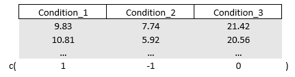
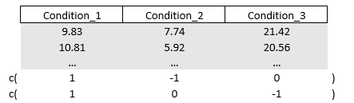
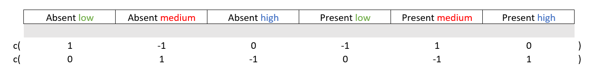

# Anova
In linear regression the goal is to "forcefully" draw a straight line (the slope) by using the full range of your continuous predictor (your whole x-axis). But what if our predictor is a categorical variable, a variable that offers only a few discrete values, two, three, or a few categories? Instead of estimating a slope, the focus shifts to comparing group means, corresponding to the levels of your categorical predictors.

This part will tackle a special case of linear regression, the analysis of variance, or ANOVA for short. ANOVA tests if the group means per categorical variable (e.g., the experimental vs control condition) differ statistically from one another. ANOVA does this by comparing the variance between each group to the variance within groups, hence the name. 

you can consider using ANOVA when all of your predictors are categorical and you want to see whether there exist statistically significant differences (based on *p* value) in the mean of the outcome per category. This part will all be about making contrasts, comparing groups to one another.

  1. **We start with how contrasts are created to allow comparing groups.** Two common ones, **sum and treatment contrasts**, will be discussed. Along the lines, I will tell you the story of **dummy-coding**
  2. **Then we finally conduct our first ANOVA with one factor and multiple factors**. From the **omnibus test** I will show some **post-hoc group comparisons techniques**, how to **create your own contrasts** using the **linearhypothesis() function**, and how to calculate some **effect sizes**.
  3. **Finally, I will discuss multivariate ANOVA (MANOVA)**. You will learn how to create your own **outcome contrast matrix** to test specific "effects" and hypotheses.

## Sum and Treatment Contrasts
As I mentioned earlier, ANOVA is all about comparing groups by e.g., making contrasts between them. Knowledge about how R contrasts groups is important if we want to properly interpret the output of ANOVA and if we want to flexibly create our own contrasts and restrictions (as part of *hypothesis testing*). Before conducting a series of ANOVAs (and special types), I will first discuss two common types of contrasts: **treatment contrasts** and **sum contrasts**. **When treatment contrasts are applied to your factor or categorical variables**, **the default in R**, all of your categories will be **compared to a reference category** (i.e., shown as the intercept of your model).

Say I have a dataset containing a factor variable with three categories The mean scores of these factors are 20,60, and 10, respectively. When you fit a regression model with the factor as the predictor, and you do not change the default treatment contrasts, R will take a reference category to which all other categories are contrasted to. 

```r
set.seed(999)
mydata = data.frame(
  
  score = c( rnorm(20,20,0.001), rnorm(20,60,0.001), rnorm(20,10,0.001) ),
  factor_variable = factor( rep(c(" A"," B", " C"   ),  each = 20 ) )

  )

mymodel = lm(score ~ factor_variable, data=mydata)
```

What category will be the reference? By default, R will select the reference category alphabetically or based on the lowest value **if you have unordered factors**, so it will choose category "A" here. If you want another reference category like "B", you can use the relevel() function.

```r
mymodel = lm(score ~ relevel(factor_variable, ref=" B"), data = mydata)
# Disclaimer. I will NOT run the above code. The reference category will still be "A" in the parts below
```

Now, with treatment contrasts, category "B" (with an average score of 60) will be contrasted with the reference category "A" (20). Similarly, category "C" (10) will be contrasted with factor "A". If I were to call for the coefficients, I can expect the values 20 (the reference), 40 (since factor B is, on average, 40 units higher than the reference), and - 10 (same reasoning). Let's check.

```r
round( coef(mymodel), 0)
#>       (Intercept) factor_variable B factor_variable C 
#>                20                40               -10
```

You can also check how treatment contrasts handles our factor variable by running the **contrasts() function**. This can come in handy when I'll later reveal how you can create your own contrasts and restrictions to test specific group comparisons. For clarity purposes, I will discuss the output of the contrasts() function in the section: *Making your own specific hypotheses and contrasts*. 

```r
contrasts(mydata$factor_variable)
#>     B  C
#>  A  0  0
#>  B  1  0
#>  C  0  1
```

Moving on to **sum contrasts**, these will **compare (contrast) each category to the overall mean**. If you use these type of contrasts then the sum of estimated coefficients will equal zero. As I discuss later on, this type of contrasts is required when conducting **type III ANOVA**. Recall that the means of our factors are 20,60, and 10, therefore the overall mean is 30. Now, the values of our coefficients will be different compared to the (default) threatment contrasts. For starters, the first coefficient will not be the mean of factor "A" but the overall mean (i.e., 30). The second coefficient will be difference between the first category "A" and the overall mean (i.e., 20-30 = -10). The value of the third and last coefficient will be the difference between the second category "B" and the overall mean (60-30 = 30).

What about the coefficient of category "C"? It is hidden but we can easily uncover it. According to sum contrasts, the coefficient for the remaining category ("C") is the value that makes the sum of the estimated coefficients (i.e., -10 and 30), zero. In other words you get the following equation: -10 + 30 + *coefficient for factor "C"* = 0. Just to be clear, the value of coefficient "C" is -20.

All is good and well but how do we set sum contrasts? We can change contrasts both "locally" (per individual variable) and "globally" (for all variables at once). **Note that you set contrasts before you fit your regression models**. 

```r
# "Locally" setting contrasts per variable
contrasts(mydata$factor_variable) = contr.sum(3) # 3 since we this variable has three levels/categories

# "Globally" setting contrasts that will apply to all variables
options(contrasts = c("contr.sum", "contr.sum"))
  # the first "contr.sum" applies it to categorical variables
  # the second "contr.sum" applies it to ordered factor variables (ordered() instead of factor() )
```

Now you may be wondering, what contrasts to use? Without making your own custom contrasts (which is also a possibility), in my experience, the default treatment contrasts are fine and intuitive to interpret. **However**, as I will bring up later, if you want to **test interaction effects**, you might want to consider to set sum contrasts (when thinking about using a type III ANOVA).

### Dummy-coding 
One small thing, you may have heard about dummy coding or that you need to dummy-code your variables. There might a bit of confusing surrounding this topic, so let me clarify. **Dummy coding** is often deemed synonymous with the aforementioned **treatment contrasts**. **Technically, however, dummy coding can refer to any contrasts that use non-negative binary values**. Other contrasts such as sum contrasts (with negative binary values) are not dummy coded. Personally, to avoid confusing, I prefer to use the terms treatment, sum, or "custom" coded and I would say something like "you should contrast code your variables" (then you still can decide how to).

However, when you fit regression models using lm(), lmer(), or aov() (I will demonstrate this function later on), **R will automatically create contrasts (i.e., contrast code your factors)**. In regression models and ANOVA, this will be the treatment contrasts by default. 

So **within R** you typically do not need to add contrast coded variables to your dataset for use in your ANOVAs. However, it still doesn't hurt to do so if you want to share analysis scripts across software (Stata, SPSS, Mplus, and so on) and if you want to create your own special contrasts.

I will quickly show you how to add contrast coded variables to your datasets. First, contrast coding identical to treatment contrasts (or "dummy-coding" as many people would call it).

```r
library(dplyr)
#> 
#> Attaching package: 'dplyr'
#> The following objects are masked from 'package:stats':
#> 
#>     filter, lag
#> The following objects are masked from 'package:base':
#> 
#>     intersect, setdiff, setequal, union

set.seed(999)
mydata = data.frame(
  score = c( rnorm(20,20,0.001), rnorm(20,60,0.001), rnorm(20,10,0.001) ),
  factor_variable = factor( rep(c(" A"," B", " C"   ),  each = 20 )  )
) %>%
  mutate(
         treatment_B = ifelse(factor_variable==" B",1,0),
         treatment_C = ifelse(factor_variable==" C",1,0)
           )

mymodel = lm(score ~ factor_variable, data = mydata) # To show that R automatically (by default) use treatment contrast coding
mymodel_dummy = lm(score ~ treatment_B + treatment_C, data = mydata) # treatment_A is the reference so I can leave that out

round( coef(mymodel), 0)
#>      (Intercept) factor_variable1 factor_variable2 
#>               30              -10               30
round( coef(mymodel_dummy), 0)
#> (Intercept) treatment_B treatment_C 
#>          20          40         -10
```

Sum coding.

```r
set.seed(999)
library(dplyr)
mydata = data.frame(
  score = c(rnorm(20,20,0.001), 
            rnorm(20,60,0.001), 
            rnorm(20,10,0.001)),
  factor_variable = factor(rep(c("A", "B", "C"), each = 20))
) %>%
  mutate(
    sum_A = ifelse(factor_variable == "A", 1, 
                   ifelse(factor_variable == "C", -1, 0)),
    sum_B = ifelse(factor_variable == "B", 1, 
                   ifelse(factor_variable == "C", -1, 0))
  )

contrasts(mydata$factor_variable) = contr.sum(3)

mymodel = lm(score ~ factor_variable, data = mydata)
mymodel_contrast = lm(score ~ sum_A + sum_B, data = mydata)

round(coef(mymodel), 0)
#>      (Intercept) factor_variable1 factor_variable2 
#>               30              -10               30
round(coef(mymodel_contrast), 0)
#> (Intercept)       sum_A       sum_B 
#>          30         -10          30
```

## One-way ANOVA
For now let's leave the contrasts for a bit. They will come back later if I demonstrate how you can flexible compare groups. Moving on to actually conducting an ANOVA, starting off with the classic example of one categorical variable in a simple linear regression. 

I will use the build in iris dataset to test whether the average sepal length differs per species, per group so to speak. Before we conduct the ANOVA it never hurts to plot the outcome per group. For this purpose, I personally like to create violin plots

```r
library(pacman)
p_load(dplyr, ggplot2)  

mydata = iris

mydata %>% ggplot(aes(x = Species, y = Sepal.Length, fill = Species)) +
  geom_violin(alpha=0.6) + geom_boxplot(alpha = 0.8) + stat_summary(fun = "mean")  +
  theme_classic() + theme(legend.position = "none")
```


To conduct the ANOVA, we can use the **aov() function** and enter a regression formula just like we've done before to compute regression models. Here you can choose whether you want to directly conduct an ANOVA or make a linear regression model first. One important detail, make sure that your predictor variables are factors as the aov() function requires this.

```r
# Feeding the regression formula directly to aov()
myanova = aov(Sepal.Length ~ Species, data = mydata)
summary(myanova)
#>              Df Sum Sq Mean Sq F value Pr(>F)    
#> Species       2  63.21  31.606   119.3 <2e-16 ***
#> Residuals   147  38.96   0.265                   
#> ---
#> Signif. codes:  
#> 0 '***' 0.001 '**' 0.01 '*' 0.05 '.' 0.1 ' ' 1

# Or compute a separate regression model first
mymodel = lm(Sepal.Length ~ Species, data = mydata)
myanova = aov(mymodel)  
summary(myanova)
#>              Df Sum Sq Mean Sq F value Pr(>F)    
#> Species       2  63.21  31.606   119.3 <2e-16 ***
#> Residuals   147  38.96   0.265                   
#> ---
#> Signif. codes:  
#> 0 '***' 0.001 '**' 0.01 '*' 0.05 '.' 0.1 ' ' 1
```

Time for summary output. We receive the degrees of freedom, the sum of squares (i.e., total variance between the overall mean and the means per group), the mean of the sum of squares (i.e., the sum of squares divided by the degrees of freedom of each parameter, except for the residuals), *F*- and *p* values. The *p* value suggests that the mean in outcome of **at least** one group is statistically significantly different from the others. Indeed, the aov() function has conducted the omnibus test to test whether at least one group-comparison is different. Nice, but what groups are statistically significant different from each other?

### Post-hoc group-comparisons
There exist a couple of group-comparison methods to determine which pair of groups are statistically significantly different, after you have done the omnibus test (post-hoc). Let's start with a popular one, the **Tukey Honest Significant Differences test** for multiple pairwise-comparisons of our groups (I know, a mouthful). This method is called through the TukeyHSD() function. This test can be recommended if you have **equal sample size per group** (and if e.g., the groups are **sufficiently normal distributed**).

```r
TukeyHSD(myanova)
#>   Tukey multiple comparisons of means
#>     95% family-wise confidence level
#> 
#> Fit: aov(formula = mymodel)
#> 
#> $Species
#>                       diff       lwr       upr p adj
#> versicolor-setosa    0.930 0.6862273 1.1737727     0
#> virginica-setosa     1.582 1.3382273 1.8257727     0
#> virginica-versicolor 0.652 0.4082273 0.8957727     0
```

Conveniently, we receive the difference in sepal length, the *p* value per group comparison, and the corresponding 95% confidence interval. Note that the *p* values are adjusted for multiple comparisons.

Other methods in context of one-way ANOVA include the **Bonferroni correction**(a classic), which could be ok if you have a **small number of group comparisons** (e.g., three) but but may be conservative otherwise. A less conservative post-hoc comparison test is the **Holm correction** and the **Benjamini-Hochberg correction**, which is even less conservative to the Bonferroni and Holm (which could be recommended if you have large sample and a lot of group comparisons). To do the above tests you use **pairwise.t.test() function** and specify the *p* value adjustment method.

```r
options(scipen=999) # prevents the scientific notation
pairwise.t.test(mydata$Sepal.Length, mydata$Species, p.adj = "bonf") # Outcome ; predictor ; adjustment method
pairwise.t.test(mydata$Sepal.Length, mydata$Species, p.adj = "holm")
pairwise.t.test(mydata$Sepal.Length, mydata$Species, p.adj = "BH")
```

### Making your own specific hypotheses and contrasts.
All of the above methods create their own group-comparisons by using contrasts (which I explained in detail at the start of this part). However, if desired, you can flexibly manipulate the contrasts, and make your very own group-comparisons for whatever differences you want to test with any restrictions or *"special rule"* you can imagine.  

In this part we will create combinations of specific group-comparisons that we we want to test separately or simultaneously. This will also yield knowledge relevant for special types of ANOVA (see later on). 
  1. Create a **"contrast matrix"** that will be made up with **"contrast/restriction vectors"**. These contrast matrices will reflect the specific group-comparisons that we want
  2. Conduct the specific (or combinations of) group-comparison(s) using the **linearhypothesis() function** from the **car package**

Before you create your own contrast matrix, it could be handy to have a look at the coefficients of your regression model. Indeed, we will work with **the coefficients of our factors** and specifically the order of coefficients. Let's keep the model from before with the three species of flowers.    

```r
mydata = iris
mymodel = lm(Sepal.Length ~ Species, data = mydata)
coef(mymodel)
#> (Intercept)    Species1    Species2 
#>  5.84333333 -0.83733333  0.09266667
```

Note that the regression model used treatment contrasts as by default. I got three coefficients/categories: Setosa (the intercept, hence the "reference category" when using treatment contrasts), versicolor, and virginica. These categories/groups can be represented as a vector, a "contrast/restriction vector" so to speak, that looks like: c(*category 1*, *category 2*,*categoy 3*). Importantly, I can easily manipulate the categories within the matrix/restriction vector. You can "activate" and "deactivate" a category by asigning a "0" or "1" to it.

For example, the vector (0,1,0) will "activate" "category 2" (i.e., the coefficient will be multiplied by 1) while "category 3" will be "deactivated" (since this coefficient will be multiplied with 0). The linearHypothesis() function will take this contrast/restriction matrix made up from contrast/restriction vectors (in our example binded by the rbind function) and read it as: test whether the coefficient/ the average of "category 2" (versicolor) is different from zero. **Remember, we work with coefficients** (differences with the reference category) so *different from zero* actually means **different from the average of the reference category** (setosa flowers).

```r
restriction = rbind(
           c(0,1,0)
)

library(car)
#> Loading required package: carData
#> 
#> Attaching package: 'car'
#> The following object is masked from 'package:dplyr':
#> 
#>     recode
linearHypothesis(mymodel, hypothesis.matrix = restriction, test="F")
#> Linear hypothesis test
#> 
#> Hypothesis:
#> Species1 = 0
#> 
#> Model 1: restricted model
#> Model 2: Sepal.Length ~ Species
#> 
#>   Res.Df    RSS Df Sum of Sq      F    Pr(>F)    
#> 1    148 91.541                                  
#> 2    147 38.956  1    52.585 198.43 < 2.2e-16 ***
#> ---
#> Signif. codes:  
#> 0 '***' 0.001 '**' 0.01 '*' 0.05 '.' 0.1 ' ' 1
```

We can also combine multiple "contrast/restriction" vectors to a create a restriction matrix that tests multiple group-comparisons **simultaneously**. For example, we can recreate the omnibus test based on a treatment contrast style .

```r
restriction = rbind(
           c(0,1,0),
           c(0,0,1)
)

library(car)
linearHypothesis(mymodel, hypothesis.matrix = restriction, test="F")
#> Linear hypothesis test
#> 
#> Hypothesis:
#> Species1 = 0
#> Species2 = 0
#> 
#> Model 1: restricted model
#> Model 2: Sepal.Length ~ Species
#> 
#>   Res.Df     RSS Df Sum of Sq      F    Pr(>F)    
#> 1    149 102.168                                  
#> 2    147  38.956  2    63.212 119.26 < 2.2e-16 ***
#> ---
#> Signif. codes:  
#> 0 '***' 0.001 '**' 0.01 '*' 0.05 '.' 0.1 ' ' 1
```

Another thing that we can do is to make contrasts between groups (similar to sum contrasts). Have a look at this vector: (0,1,-1). We "activate category 2" but now we asign a negative value to "category 3". This can be interpret as a contrast between "category 2" and "category 3, so does the average of versicolor differ from virginica? Let's find out:

```r
restriction = rbind(
           c(0,1,-1)
)

linearHypothesis(mymodel, hypothesis.matrix = restriction, test="F")
#> Linear hypothesis test
#> 
#> Hypothesis:
#> Species1 - Species2 = 0
#> 
#> Model 1: restricted model
#> Model 2: Sepal.Length ~ Species
#> 
#>   Res.Df    RSS Df Sum of Sq      F   Pr(>F)    
#> 1    148 60.579                                 
#> 2    147 38.956  1    21.622 81.592 8.77e-16 ***
#> ---
#> Signif. codes:  
#> 0 '***' 0.001 '**' 0.01 '*' 0.05 '.' 0.1 ' ' 1
```

#### Let us get creative with hypothesis testing
Alright, I promised that we can get creative with hypothesis testing did I not? Well, to give a couple of examples, **suppose**, for some reason, that we want to test whether the category "versicolor" is five times larger than the reference category "setosa". 

We already know that by default R uses treatment contrasts and that setosa will be the reference category (since "s" comes first in the alphabet). Now for the restriction/contrast vector, did you thought of using something like:

```r
restriction = rbind( c(0,5,0) )
```

Well, I get why you would think so but this would test whether the coefficient (i.e., the **difference in mean between versicolor and setosa**) of the versicolor group times five is zero. **This is not the same as testing whether the mean for versicolor is five times that of the reference setosa**

**Instead**, to get the *"a specific group (and not a difference score) is five time larger than..."* part, we can use the **rhs** argument. If we set a prespecified value to rhs, it will test whether a linear combination of the coefficients equals your prespecified value. Therefore, if we "activate" versicolor, "deactivate" virginica, and set to rhs to be the coefficient for versicolor times five, we will test whether versicolor is five times larger than the reference. 

```r
restriction = rbind(
  c(0,1,0)
)
library(car)
linearHypothesis(mymodel, hypothesis.matrix = restriction, rhs = coef(mymodel)[1]*5, test="F") # with coef(mymodel)[1] being the versicolor category
#> Linear hypothesis test
#> 
#> Hypothesis:
#> Species1 = 29.2166666666667
#> 
#> Model 1: restricted model
#> Model 2: Sepal.Length ~ Species
#> 
#>   Res.Df   RSS Df Sum of Sq      F    Pr(>F)    
#> 1    148 67782                                  
#> 2    147    39  1     67743 255627 < 2.2e-16 ***
#> ---
#> Signif. codes:  
#> 0 '***' 0.001 '**' 0.01 '*' 0.05 '.' 0.1 ' ' 1
```

**Another example**, suppose I want to test whether the sum of the coefficients of "versicolor" and "virginica" is 10. In this case we need to use both these categories so we will need to activate both of them. Remember that the rhs argument allows to test whether the linear combination equals a value. Therefore, if we activate "versicolor", activate "virginica", and set rhs to 10, we will test whether the sum of these coefficients is 10.

```r
restriction = rbind(
  c(0,1,1)
)
library(car)
linearHypothesis(mymodel, hypothesis.matrix = restriction, test="F", rhs = 10)
#> Linear hypothesis test
#> 
#> Hypothesis:
#> Species1  + Species2 = 10
#> 
#> Model 1: restricted model
#> Model 2: Sepal.Length ~ Species
#> 
#>   Res.Df    RSS Df Sum of Sq     F    Pr(>F)    
#> 1    148 8697.5                                 
#> 2    147   39.0  1    8658.6 32673 < 2.2e-16 ***
#> ---
#> Signif. codes:  
#> 0 '***' 0.001 '**' 0.01 '*' 0.05 '.' 0.1 ' ' 1
```

### Effect sizes
Continuing the spirit from the last part, it is useful to include effect sizes next to the common F statistics obtained from your output. Several effect sizes are appropriate to use in the context of ANOVA. Let's start with perhaps the most known effect size Cohen's d which is the difference between the group means divided by the pooled standard deviations of the groups. We can use the **cohens_d() function** from our old acquaintance, the **effectsize package**, to compute this effect size. Before you use this function, make sure you (temporarily) remove categories until you have two groups as an error is outputted otherwise. 

```r
library(dplyr)
library(effectsize)

mydata = iris
mydata_temp = mydata %>% filter(!Species=="virginica") # the cohens_d functions asks for exactly two groups, hence I temporarily filter out "virginica" as an example

cohens_d(Sepal.Length ~ Species, data = mydata_temp) 
#> Cohen's d |         95% CI
#> --------------------------
#> -2.10     | [-2.59, -1.61]
#> 
#> - Estimated using pooled SD.
```

Moving on. Similar to the discussed semi-partial R² in linear regressions (with continuous predictors), in the ANOVA context, we have **the (partial) eta-squared** and **the omega-squared measure**. The eta-squared measures shows the proportion of total variance explained **by your (one) factor variable** whereas the partial eta-squared shows the proportion of variance explained by **a specific factor** after controlling for others. **However, as (partial) eta-squared is biased and with this bias decreasing the more the size of your groups increases**, you could consider the omega-square measure instead (especially in "small" sample sizes). To compute these effect sizes, you can consider The **eta_squared() and omega_squared() function** from the **effectsize package**.

```r
library(effectsize)

myanova = aov(Sepal.Length ~ Species, data = iris)
eta_squared(myanova)
#> # Effect Size for ANOVA
#> 
#> Parameter | Eta2 |       95% CI
#> -------------------------------
#> Species   | 0.62 | [0.54, 1.00]
#> 
#> - One-sided CIs: upper bound fixed at [1.00].
omega_squared(myanova)  
#> # Effect Size for ANOVA
#> 
#> Parameter | Omega2 |       95% CI
#> ---------------------------------
#> Species   |   0.61 | [0.53, 1.00]
#> 
#> - One-sided CIs: upper bound fixed at [1.00].
```

**One thing I want to notice**. Recently, [the use eta-squared in ANOVA from a mixed-effects model has been criticized (click here)](https://journalofcognition.org/articles/10.5334/joc.409). As discussed in the previous part, effect sizes in mixed-effects models should acknowledge that there is a fixed and random effects part. **If you want to compute the (partial) eta-squared in mixed-effects models that include a 2 x 2 design (i.e., two categorical predictors with two levels)**, It is recommended to use the sum contrast coding and to use the cluster-mean centered outcome variables to obtain **eta-squared within**. Full details are provided in the linked article, the reference to this article is shown at the end of this part.

## Two-way ANOVA
Let's add an extra categorical variable to the equation. Suppose we also included the location of the flower (location "a","b",..."e"). Now we can test the main effect of species and location on sepal length as well the interaction effect between these two predictors.

```r
mydata = iris
mydata$Location = factor(rep(c("a","b","c","d","e"), each = 10))

mydata %>% ggplot(aes(x = Species, y = Sepal.Length, fill = Species)) +
  geom_violin(alpha=0.6) + geom_boxplot(alpha = 0.8) + stat_summary(fun = "mean")  +
  facet_wrap(~Location) +
  theme_classic() + theme(legend.position = "none")
```


```r

mymodel = lm(Sepal.Length ~ Species * Location, data = mydata)
coef(mymodel)
#>        (Intercept)           Species1           Species2 
#>       5.843333e+00      -8.373333e-01       9.266667e-02 
#>          Location1          Location2          Location3 
#>       4.658198e-17       2.666667e-02       1.233333e-01 
#>          Location4 Species1:Location1 Species2:Location1 
#>       3.666667e-02      -1.460000e-01       1.640000e-01 
#> Species1:Location2 Species2:Location2 Species1:Location3 
#>       1.773333e-01      -1.126667e-01      -1.193333e-01 
#> Species2:Location3 Species1:Location4 Species2:Location4 
#>       2.006667e-01       2.733333e-02      -1.426667e-01
```

Since we used the default treatment contrasts, note that our "reference category" consists of two variables: the *setosa* flower measured on location *"a"*. The Coefficient  versicolor shows the difference between itself and the reference flower *setosa* at the reference location *"a"*. Similarly, the coefficient "c" shows the difference between itself and the reference location *"a"* in the reference flower setosa. If we look at the coefficients for interaction terms, say virginica and location d, then it shows how the difference between virginica and setosa, differs at location "c" compared to location *"a"*.

Since we have more factors and an interaction effect, a novel decision will pop up. What type of ANOVA do we want to use? 

### Four different types of ANOVA
Since we introduced an interaction effect to our regression models and ANOVA, it may be a good time to acknowledge the existence of different types of ANOVA. The aov() function we used so far computes the **type I ANOVA** which tests each factor in the order you specified in the model (handy if the order of factors is crucial). Next to type I, you also have type II, III, and IV. The **type II ANOVA** tests each main effect while adjusting for other main effects (**however it ignores all interactions so not suitable when interactions are included**). **Type III** tests each of yours factors accounting for all others, including interactions. If you consider to go for type III (since you want to include interactions), **use sum contrasts instead of the default treatment contrasts**. Finally, **type IV**, could be considered when you have complex models with categories or category combinations that are empty (no data). 

To access type II to IV, you can use the **Anova() function** from the **car package**.

```r
# Type II ANOVA
mymodel = lm(Sepal.Length ~ Species * Location, data = mydata)
Anova(mymodel, type="II") # the type ignoring the interaction
#> Anova Table (Type II tests)
#> 
#> Response: Sepal.Length
#>                  Sum Sq  Df  F value Pr(>F)    
#> Species          63.212   2 120.9107 <2e-16 ***
#> Location          1.563   4   1.4952 0.2071    
#> Species:Location  2.104   8   1.0061 0.4345    
#> Residuals        35.289 135                    
#> ---
#> Signif. codes:  
#> 0 '***' 0.001 '**' 0.01 '*' 0.05 '.' 0.1 ' ' 1

# Type III ANOVA
options(contrasts = c("contr.sum", "contr.sum"))
Anova(mymodel, type="III") # the type you should use with sum  contrasts, see above
#> Anova Table (Type III tests)
#> 
#> Response: Sepal.Length
#>                  Sum Sq  Df    F value Pr(>F)    
#> (Intercept)      5121.7   1 19593.2734 <2e-16 ***
#> Species            63.2   2   120.9107 <2e-16 ***
#> Location            1.6   4     1.4952 0.2071    
#> Species:Location    2.1   8     1.0061 0.4345    
#> Residuals          35.3 135                      
#> ---
#> Signif. codes:  
#> 0 '***' 0.001 '**' 0.01 '*' 0.05 '.' 0.1 ' ' 1
```

The difference between type II and type III ANOVA will depend on how "strong" the interaction effect in your models will be. For the remainder of the examples I will use type III as it is a flexible approach (i.e., it has no strong assumptions or limitations). 

Irrespective of your choice of ANOVA type, the model will conduct an omnibus test. Therefore, once again, we need to dive deeper into individual post-hoc group-comparisons.   

### Two-way ANOVA: Post-hoc comparisons 

Instead of the pairwise t tests that we did with one-way ANOVA, I prefer to use the emmeans() function from the [emmeans package](https://cran.r-project.org/web/packages/emmeans/index.html). This function allows to do comparisons in the main effects: comparing the petal length of species with one another per location and comparing location with one another per species, and interaction effects: compare the difference in petal length of species across different locations. Similar to the pairwise.t.test() function, we can choose how we want to adjust the *p* value (Bonferroni, Benjamini-Hochberg, etc.).

Now you could approach the group-comparisons in different ways. For example, you could check whether the interaction effect is statistically significant in your regression model or ANOVA (or if you deem it yourself sufficiently significant). If so, you can zoom in how the mean of sepal length differs per species but **within** each location, and how it differs per location **within** each species. **That way, when checking the main effects, you involve the other variable**. In addition, you could look more to the interaction effect to **check whether combinations between species and locations differ between all other combinations**


```r
mydata = iris
mydata$Location = factor(rep(c("a","b","c","d","e"), each = 10))
mymodel = lm(Sepal.Length ~ Species * Location, data = mydata)

library(emmeans)

emmeans(mymodel, pairwise ~ Location | Species, adjust = "Tukey") # Main effect: differences between locations WITHIN species
#> $emmeans
#> Species = setosa:
#>  Location emmean    SE  df lower.CL upper.CL
#>  a          4.86 0.162 135     4.54     5.18
#>  b          5.21 0.162 135     4.89     5.53
#>  c          5.01 0.162 135     4.69     5.33
#>  d          5.07 0.162 135     4.75     5.39
#>  e          4.88 0.162 135     4.56     5.20
#> 
#> Species = versicolor:
#>  Location emmean    SE  df lower.CL upper.CL
#>  a          6.10 0.162 135     5.78     6.42
#>  b          5.85 0.162 135     5.53     6.17
#>  c          6.26 0.162 135     5.94     6.58
#>  d          5.83 0.162 135     5.51     6.15
#>  e          5.64 0.162 135     5.32     5.96
#> 
#> Species = virginica:
#>  Location emmean    SE  df lower.CL upper.CL
#>  a          6.57 0.162 135     6.25     6.89
#>  b          6.55 0.162 135     6.23     6.87
#>  c          6.63 0.162 135     6.31     6.95
#>  d          6.74 0.162 135     6.42     7.06
#>  e          6.45 0.162 135     6.13     6.77
#> 
#> Confidence level used: 0.95 
#> 
#> $contrasts
#> Species = setosa:
#>  contrast estimate    SE  df t.ratio p.value
#>  a - b       -0.35 0.229 135  -1.531  0.5444
#>  a - c       -0.15 0.229 135  -0.656  0.9652
#>  a - d       -0.21 0.229 135  -0.918  0.8894
#>  a - e       -0.02 0.229 135  -0.087  1.0000
#>  b - c        0.20 0.229 135   0.875  0.9057
#>  b - d        0.14 0.229 135   0.612  0.9729
#>  b - e        0.33 0.229 135   1.443  0.6009
#>  c - d       -0.06 0.229 135  -0.262  0.9989
#>  c - e        0.13 0.229 135   0.569  0.9794
#>  d - e        0.19 0.229 135   0.831  0.9206
#> 
#> Species = versicolor:
#>  contrast estimate    SE  df t.ratio p.value
#>  a - b        0.25 0.229 135   1.093  0.8097
#>  a - c       -0.16 0.229 135  -0.700  0.9562
#>  a - d        0.27 0.229 135   1.181  0.7623
#>  a - e        0.46 0.229 135   2.012  0.2660
#>  b - c       -0.41 0.229 135  -1.793  0.3818
#>  b - d        0.02 0.229 135   0.087  1.0000
#>  b - e        0.21 0.229 135   0.918  0.8894
#>  c - d        0.43 0.229 135   1.881  0.3328
#>  c - e        0.62 0.229 135   2.712  0.0574
#>  d - e        0.19 0.229 135   0.831  0.9206
#> 
#> Species = virginica:
#>  contrast estimate    SE  df t.ratio p.value
#>  a - b        0.02 0.229 135   0.087  1.0000
#>  a - c       -0.06 0.229 135  -0.262  0.9989
#>  a - d       -0.17 0.229 135  -0.744  0.9458
#>  a - e        0.12 0.229 135   0.525  0.9847
#>  b - c       -0.08 0.229 135  -0.350  0.9968
#>  b - d       -0.19 0.229 135  -0.831  0.9206
#>  b - e        0.10 0.229 135   0.437  0.9923
#>  c - d       -0.11 0.229 135  -0.481  0.9890
#>  c - e        0.18 0.229 135   0.787  0.9339
#>  d - e        0.29 0.229 135   1.268  0.7110
#> 
#> P value adjustment: tukey method for comparing a family of 5 estimates
emmeans(mymodel, pairwise ~ Species | Location, adjust = "Bonferroni") 
#> $emmeans
#> Location = a:
#>  Species    emmean    SE  df lower.CL upper.CL
#>  setosa       4.86 0.162 135     4.54     5.18
#>  versicolor   6.10 0.162 135     5.78     6.42
#>  virginica    6.57 0.162 135     6.25     6.89
#> 
#> Location = b:
#>  Species    emmean    SE  df lower.CL upper.CL
#>  setosa       5.21 0.162 135     4.89     5.53
#>  versicolor   5.85 0.162 135     5.53     6.17
#>  virginica    6.55 0.162 135     6.23     6.87
#> 
#> Location = c:
#>  Species    emmean    SE  df lower.CL upper.CL
#>  setosa       5.01 0.162 135     4.69     5.33
#>  versicolor   6.26 0.162 135     5.94     6.58
#>  virginica    6.63 0.162 135     6.31     6.95
#> 
#> Location = d:
#>  Species    emmean    SE  df lower.CL upper.CL
#>  setosa       5.07 0.162 135     4.75     5.39
#>  versicolor   5.83 0.162 135     5.51     6.15
#>  virginica    6.74 0.162 135     6.42     7.06
#> 
#> Location = e:
#>  Species    emmean    SE  df lower.CL upper.CL
#>  setosa       4.88 0.162 135     4.56     5.20
#>  versicolor   5.64 0.162 135     5.32     5.96
#>  virginica    6.45 0.162 135     6.13     6.77
#> 
#> Confidence level used: 0.95 
#> 
#> $contrasts
#> Location = a:
#>  contrast               estimate    SE  df t.ratio p.value
#>  setosa - versicolor       -1.24 0.229 135  -5.423  <.0001
#>  setosa - virginica        -1.71 0.229 135  -7.479  <.0001
#>  versicolor - virginica    -0.47 0.229 135  -2.056  0.1253
#> 
#> Location = b:
#>  contrast               estimate    SE  df t.ratio p.value
#>  setosa - versicolor       -0.64 0.229 135  -2.799  0.0176
#>  setosa - virginica        -1.34 0.229 135  -5.861  <.0001
#>  versicolor - virginica    -0.70 0.229 135  -3.061  0.0080
#> 
#> Location = c:
#>  contrast               estimate    SE  df t.ratio p.value
#>  setosa - versicolor       -1.25 0.229 135  -5.467  <.0001
#>  setosa - virginica        -1.62 0.229 135  -7.085  <.0001
#>  versicolor - virginica    -0.37 0.229 135  -1.618  0.3239
#> 
#> Location = d:
#>  contrast               estimate    SE  df t.ratio p.value
#>  setosa - versicolor       -0.76 0.229 135  -3.324  0.0034
#>  setosa - virginica        -1.67 0.229 135  -7.304  <.0001
#>  versicolor - virginica    -0.91 0.229 135  -3.980  0.0003
#> 
#> Location = e:
#>  contrast               estimate    SE  df t.ratio p.value
#>  setosa - versicolor       -0.76 0.229 135  -3.324  0.0034
#>  setosa - virginica        -1.57 0.229 135  -6.866  <.0001
#>  versicolor - virginica    -0.81 0.229 135  -3.543  0.0016
#> 
#> P value adjustment: bonferroni method for 3 tests
emmeans(mymodel, pairwise ~ Species * Location, adjust = "BH") # interaction effect: comparing combinations to all other combinations
#> $emmeans
#>  Species    Location emmean    SE  df lower.CL upper.CL
#>  setosa     a          4.86 0.162 135     4.54     5.18
#>  versicolor a          6.10 0.162 135     5.78     6.42
#>  virginica  a          6.57 0.162 135     6.25     6.89
#>  setosa     b          5.21 0.162 135     4.89     5.53
#>  versicolor b          5.85 0.162 135     5.53     6.17
#>  virginica  b          6.55 0.162 135     6.23     6.87
#>  setosa     c          5.01 0.162 135     4.69     5.33
#>  versicolor c          6.26 0.162 135     5.94     6.58
#>  virginica  c          6.63 0.162 135     6.31     6.95
#>  setosa     d          5.07 0.162 135     4.75     5.39
#>  versicolor d          5.83 0.162 135     5.51     6.15
#>  virginica  d          6.74 0.162 135     6.42     7.06
#>  setosa     e          4.88 0.162 135     4.56     5.20
#>  versicolor e          5.64 0.162 135     5.32     5.96
#>  virginica  e          6.45 0.162 135     6.13     6.77
#> 
#> Confidence level used: 0.95 
#> 
#> $contrasts
#>  contrast                    estimate    SE  df t.ratio
#>  setosa a - versicolor a        -1.24 0.229 135  -5.423
#>  setosa a - virginica a         -1.71 0.229 135  -7.479
#>  setosa a - setosa b            -0.35 0.229 135  -1.531
#>  setosa a - versicolor b        -0.99 0.229 135  -4.330
#>  setosa a - virginica b         -1.69 0.229 135  -7.391
#>  setosa a - setosa c            -0.15 0.229 135  -0.656
#>  setosa a - versicolor c        -1.40 0.229 135  -6.123
#>  setosa a - virginica c         -1.77 0.229 135  -7.741
#>  setosa a - setosa d            -0.21 0.229 135  -0.918
#>  setosa a - versicolor d        -0.97 0.229 135  -4.242
#>  setosa a - virginica d         -1.88 0.229 135  -8.222
#>  setosa a - setosa e            -0.02 0.229 135  -0.087
#>  setosa a - versicolor e        -0.78 0.229 135  -3.411
#>  setosa a - virginica e         -1.59 0.229 135  -6.954
#>  versicolor a - virginica a     -0.47 0.229 135  -2.056
#>  versicolor a - setosa b         0.89 0.229 135   3.892
#>  versicolor a - versicolor b     0.25 0.229 135   1.093
#>  versicolor a - virginica b     -0.45 0.229 135  -1.968
#>  versicolor a - setosa c         1.09 0.229 135   4.767
#>  versicolor a - versicolor c    -0.16 0.229 135  -0.700
#>  versicolor a - virginica c     -0.53 0.229 135  -2.318
#>  versicolor a - setosa d         1.03 0.229 135   4.505
#>  versicolor a - versicolor d     0.27 0.229 135   1.181
#>  versicolor a - virginica d     -0.64 0.229 135  -2.799
#>  versicolor a - setosa e         1.22 0.229 135   5.336
#>  versicolor a - versicolor e     0.46 0.229 135   2.012
#>  versicolor a - virginica e     -0.35 0.229 135  -1.531
#>  virginica a - setosa b          1.36 0.229 135   5.948
#>  virginica a - versicolor b      0.72 0.229 135   3.149
#>  virginica a - virginica b       0.02 0.229 135   0.087
#>  virginica a - setosa c          1.56 0.229 135   6.823
#>  virginica a - versicolor c      0.31 0.229 135   1.356
#>  virginica a - virginica c      -0.06 0.229 135  -0.262
#>  virginica a - setosa d          1.50 0.229 135   6.560
#>  virginica a - versicolor d      0.74 0.229 135   3.236
#>  virginica a - virginica d      -0.17 0.229 135  -0.744
#>  virginica a - setosa e          1.69 0.229 135   7.391
#>  virginica a - versicolor e      0.93 0.229 135   4.067
#>  virginica a - virginica e       0.12 0.229 135   0.525
#>  setosa b - versicolor b        -0.64 0.229 135  -2.799
#>  setosa b - virginica b         -1.34 0.229 135  -5.861
#>  setosa b - setosa c             0.20 0.229 135   0.875
#>  setosa b - versicolor c        -1.05 0.229 135  -4.592
#>  setosa b - virginica c         -1.42 0.229 135  -6.210
#>  setosa b - setosa d             0.14 0.229 135   0.612
#>  setosa b - versicolor d        -0.62 0.229 135  -2.712
#>  setosa b - virginica d         -1.53 0.229 135  -6.692
#>  setosa b - setosa e             0.33 0.229 135   1.443
#>  setosa b - versicolor e        -0.43 0.229 135  -1.881
#>  setosa b - virginica e         -1.24 0.229 135  -5.423
#>  versicolor b - virginica b     -0.70 0.229 135  -3.061
#>  versicolor b - setosa c         0.84 0.229 135   3.674
#>  versicolor b - versicolor c    -0.41 0.229 135  -1.793
#>  versicolor b - virginica c     -0.78 0.229 135  -3.411
#>  versicolor b - setosa d         0.78 0.229 135   3.411
#>  versicolor b - versicolor d     0.02 0.229 135   0.087
#>  versicolor b - virginica d     -0.89 0.229 135  -3.892
#>  versicolor b - setosa e         0.97 0.229 135   4.242
#>  versicolor b - versicolor e     0.21 0.229 135   0.918
#>  versicolor b - virginica e     -0.60 0.229 135  -2.624
#>  virginica b - setosa c          1.54 0.229 135   6.735
#>  virginica b - versicolor c      0.29 0.229 135   1.268
#>  virginica b - virginica c      -0.08 0.229 135  -0.350
#>  virginica b - setosa d          1.48 0.229 135   6.473
#>  virginica b - versicolor d      0.72 0.229 135   3.149
#>  virginica b - virginica d      -0.19 0.229 135  -0.831
#>  virginica b - setosa e          1.67 0.229 135   7.304
#>  virginica b - versicolor e      0.91 0.229 135   3.980
#>  virginica b - virginica e       0.10 0.229 135   0.437
#>  setosa c - versicolor c        -1.25 0.229 135  -5.467
#>  setosa c - virginica c         -1.62 0.229 135  -7.085
#>  setosa c - setosa d            -0.06 0.229 135  -0.262
#>  setosa c - versicolor d        -0.82 0.229 135  -3.586
#>  setosa c - virginica d         -1.73 0.229 135  -7.566
#>  setosa c - setosa e             0.13 0.229 135   0.569
#>  setosa c - versicolor e        -0.63 0.229 135  -2.755
#>  setosa c - virginica e         -1.44 0.229 135  -6.298
#>  versicolor c - virginica c     -0.37 0.229 135  -1.618
#>  versicolor c - setosa d         1.19 0.229 135   5.205
#>  versicolor c - versicolor d     0.43 0.229 135   1.881
#>  versicolor c - virginica d     -0.48 0.229 135  -2.099
#>  versicolor c - setosa e         1.38 0.229 135   6.035
#>  versicolor c - versicolor e     0.62 0.229 135   2.712
#>  versicolor c - virginica e     -0.19 0.229 135  -0.831
#>  virginica c - setosa d          1.56 0.229 135   6.823
#>  virginica c - versicolor d      0.80 0.229 135   3.499
#>  virginica c - virginica d      -0.11 0.229 135  -0.481
#>  virginica c - setosa e          1.75 0.229 135   7.654
#>  virginica c - versicolor e      0.99 0.229 135   4.330
#>  virginica c - virginica e       0.18 0.229 135   0.787
#>  setosa d - versicolor d        -0.76 0.229 135  -3.324
#>  setosa d - virginica d         -1.67 0.229 135  -7.304
#>  setosa d - setosa e             0.19 0.229 135   0.831
#>  setosa d - versicolor e        -0.57 0.229 135  -2.493
#>  setosa d - virginica e         -1.38 0.229 135  -6.035
#>  versicolor d - virginica d     -0.91 0.229 135  -3.980
#>  versicolor d - setosa e         0.95 0.229 135   4.155
#>  versicolor d - versicolor e     0.19 0.229 135   0.831
#>  versicolor d - virginica e     -0.62 0.229 135  -2.712
#>  virginica d - setosa e          1.86 0.229 135   8.135
#>  virginica d - versicolor e      1.10 0.229 135   4.811
#>  virginica d - virginica e       0.29 0.229 135   1.268
#>  setosa e - versicolor e        -0.76 0.229 135  -3.324
#>  setosa e - virginica e         -1.57 0.229 135  -6.866
#>  versicolor e - virginica e     -0.81 0.229 135  -3.543
#>  p.value
#>   <.0001
#>   <.0001
#>   0.1748
#>   0.0001
#>   <.0001
#>   0.5729
#>   <.0001
#>   <.0001
#>   0.4447
#>   0.0001
#>   <.0001
#>   0.9304
#>   0.0017
#>   <.0001
#>   0.0635
#>   0.0004
#>   0.3494
#>   0.0756
#>   <.0001
#>   0.5479
#>   0.0344
#>   <.0001
#>   0.3070
#>   0.0103
#>   <.0001
#>   0.0693
#>   0.1748
#>   <.0001
#>   0.0037
#>   0.9304
#>   <.0001
#>   0.2358
#>   0.8167
#>   <.0001
#>   0.0029
#>   0.5233
#>   <.0001
#>   0.0002
#>   0.6501
#>   0.0103
#>   <.0001
#>   0.4680
#>   <.0001
#>   <.0001
#>   0.5984
#>   0.0124
#>   <.0001
#>   0.2036
#>   0.0894
#>   <.0001
#>   0.0048
#>   0.0008
#>   0.1067
#>   0.0017
#>   0.0017
#>   0.9304
#>   0.0004
#>   0.0001
#>   0.4447
#>   0.0156
#>   <.0001
#>   0.2682
#>   0.7633
#>   <.0001
#>   0.0037
#>   0.4754
#>   <.0001
#>   0.0003
#>   0.7027
#>   <.0001
#>   <.0001
#>   0.8167
#>   0.0010
#>   <.0001
#>   0.6241
#>   0.0115
#>   <.0001
#>   0.1511
#>   <.0001
#>   0.0894
#>   0.0581
#>   <.0001
#>   0.0124
#>   0.4754
#>   <.0001
#>   0.0014
#>   0.6763
#>   <.0001
#>   0.0001
#>   0.4991
#>   0.0022
#>   <.0001
#>   0.4754
#>   0.0221
#>   <.0001
#>   0.0003
#>   0.0002
#>   0.4754
#>   0.0124
#>   <.0001
#>   <.0001
#>   0.2682
#>   0.0022
#>   <.0001
#>   0.0012
#> 
#> P value adjustment: BH method for 105 tests
```

Instead, if you deem the interaction effect "not significant", you could also decide to skip the interaction effect and to keep the main effects separate of the other variable that is, you don't look at species within locations or locations within different species but across locations or species.  

```r
emmeans(mymodel, pairwise ~ Species, adjust = "Holm") 
#> $emmeans
#>  Species    emmean     SE  df lower.CL upper.CL
#>  setosa       5.01 0.0723 135     4.86     5.15
#>  versicolor   5.94 0.0723 135     5.79     6.08
#>  virginica    6.59 0.0723 135     6.45     6.73
#> 
#> Results are averaged over the levels of: Location 
#> Confidence level used: 0.95 
#> 
#> $contrasts
#>  contrast               estimate    SE  df t.ratio p.value
#>  setosa - versicolor      -0.930 0.102 135  -9.095  <.0001
#>  setosa - virginica       -1.582 0.102 135 -15.471  <.0001
#>  versicolor - virginica   -0.652 0.102 135  -6.376  <.0001
#> 
#> Results are averaged over the levels of: Location 
#> P value adjustment: holm method for 3 tests
emmeans(mymodel, pairwise ~ Location, adjust = "Holm") 
#> $emmeans
#>  Location emmean     SE  df lower.CL upper.CL
#>  a          5.84 0.0933 135     5.66     6.03
#>  b          5.87 0.0933 135     5.69     6.05
#>  c          5.97 0.0933 135     5.78     6.15
#>  d          5.88 0.0933 135     5.70     6.06
#>  e          5.66 0.0933 135     5.47     5.84
#> 
#> Results are averaged over the levels of: Species 
#> Confidence level used: 0.95 
#> 
#> $contrasts
#>  contrast estimate    SE  df t.ratio p.value
#>  a - b     -0.0267 0.132 135  -0.202  1.0000
#>  a - c     -0.1233 0.132 135  -0.934  1.0000
#>  a - d     -0.0367 0.132 135  -0.278  1.0000
#>  a - e      0.1867 0.132 135   1.414  1.0000
#>  b - c     -0.0967 0.132 135  -0.732  1.0000
#>  b - d     -0.0100 0.132 135  -0.076  1.0000
#>  b - e      0.2133 0.132 135   1.616  0.8674
#>  c - d      0.0867 0.132 135   0.657  1.0000
#>  c - e      0.3100 0.132 135   2.348  0.2031
#>  d - e      0.2233 0.132 135   1.692  0.8369
#> 
#> Results are averaged over the levels of: Species 
#> P value adjustment: holm method for 10 tests
```

So far we've dealth with groups manifesting in our predictors. Depending on our data, what we can also can do is to simultaneously compare different **combinations/groups in our outcome** as well. A special type of ANOVA can be found within the multivariate (i.e., multiple outcomes/dependent variables) regression models. One that is relatively robust against one not to be ignored issue.

## MANOVA
When you consider to use a classic univariate repeated measures design with factors that have over two levels, you may encounter a violation of the assumption of **sphericity**. Violation of sphericity could confer a risk for unreliable *p* values. As an attempt to detect violations herein, you could consider to use e.g., Mauchly's test for sphericity. Unfortunately, like with many other statistical tests, the reliability of these depend on different factors including your sample size, the degree of departure from a normal distribution, and so on. In short, it is a tricky situation.

In context of e.g., experiments with a within-subject design (the same subject goes through all or multiple experimental conditions) and where you would consider to aggregate your data across conditions, the method of multivariate analysis of variance (MANOVA). In a MANOVA multiple outcomes/dependent variables are analyzed simultaneously.

The MANOVA typically yields the following steps.
  1. **Transform the data in wide format with the outcome - commonly a repeated measure from the same subject - aggregated across conditions**
  2. Create contrast matrices for **the outcomes**
  3. Compute multivariate linear regression models and include the contrast matrices from step two. 

For the data I created myself. As the first step I will transform, or rather *reshape*, the data to wide format with the outcome "score" aggregated and spread across the the variable "condition_numbers". As you may recall from the previous part, I prefer to use the **dcast() function** from the **reshape2 package()** to reshape from long to wide.

```r
set.seed(987)
mydata = data.frame(
  participant = rep(c(1:100), times = 30),
  score = round( c(rnorm(100,10,3),  rnorm(100,5,1.5),  rnorm(100, 20,5) ), 2  ),
  condition_numbers = factor( rep( c("1","2","3"), each = 100) )
)

# Reshape to wide format with the outcome aggregated and spread across condition
library(reshape2)
mydata = dcast(participant ~ condition_numbers, data=mydata, value.var="score", mean)
names(mydata)[2:ncol(mydata)] = paste0("Condition_" , colnames(mydata)[2:ncol(mydata)]  ) # to rename "1" to "Condition_1", etc.
```

To create a contrast matrix for the outcomes, we can think in terms of vectors as we have done at the beginning of this part. Just like before we will work with coefficients. Different this time that we will have to model a multivariate regression model since our outcome "score" is spread across the multiple levels of "condition_number". A multivariate regression model takes the form of a classic linear regression but with multiple outcomes which I will bind together using the cbind() function.

```r
mymodel = lm(cbind(Condition_1, Condition_2, Condition_3) ~ 1, data = mydata)  
coef(mymodel)
#>             Condition_1 Condition_2 Condition_3
#> (Intercept)     10.0528      5.2094     19.8799
```

The coefficients tells us that there are three of them. Now,we can visualize the outcome contrast matrix like this.


Our job will be to replace the x to **activate or deactivate a given or multiple condition(s)**. In other words, you will decide what part of the outcome you want to include and what parts you want to compare (all will become clear later on). However, the rules here are a bit different compared to the predictor contrast vectors and matrices. There is no treatment or sum contrast coding with a reference, at least not on the outcomes. Also, **the sum of the values in the vector must be zero in most cases**.

Say I want to compare *Condition_1* with *Condition_2*. We can asign the value "1" to *Condition_1* and a "-1" to *Condition_2*, or vice versa. We are not interested in *Condition_3* so multiplying it with zero will *deactivate it*. We get the vector c(1,-1,0) in which *condition_1* will be **multiplied with 1** (it remains alive), condition_2 will be **multiplied with -1** (it also remains alive but it becomes negative, a contrast), and condition_3 is temporarily erased from existence as it **multiplied with zero**. The end product is the difference between *Condition_1* and *Condition_2*


We feed the above vector to the (outcome) contrast matrix which I will call M. Within a classic linear regression model we multiply our outcome spread across Condition with our freshly created contrast matrix. Since we only created one vector, we will end up with a univariate regression, hence ANOVA. 

```r
# Contrast "Condition_1" vs "Condition_2"
diff = c(1,-1,0)
M = cbind(diff)
mymodel = lm(cbind(Condition_1, Condition_2, Condition_3) %*% M ~ 1, data = mydata)
anova(mymodel)
#> Analysis of Variance Table
#> 
#> Response: cbind(Condition_1, Condition_2, Condition_3) %*% M
#>           Df Sum Sq Mean Sq F value Pr(>F)
#> Residuals 99 1050.4  10.611
```

Let's briefly check what the (outcome) contrast matrix did to our outcome within the regression.

```r
cbind(mydata$Condition_1, mydata$Condition_2, mydata$Condition_3)  %*% M
#>         diff
#>   [1,]  2.09
#>   [2,]  4.89
#>   [3,]  9.21
#>   [4,]  3.01
#>   [5,]  6.91
#>   [6,]  4.27
#>   [7,]  2.49
#>   [8,] -0.46
#>   [9,]  1.61
#>  [10,] -0.56
#>  [11,]  6.49
#>  [12,]  5.87
#>  [13,] 11.65
#>  [14,]  4.79
#>  [15,]  2.19
#>  [16,]  5.87
#>  [17,]  4.50
#>  [18,]  2.23
#>  [19,]  2.66
#>  [20,]  7.87
#>  [21,]  6.80
#>  [22,]  1.73
#>  [23,] -0.75
#>  [24,]  7.66
#>  [25,]  3.34
#>  [26,]  0.42
#>  [27,]  6.81
#>  [28,]  2.71
#>  [29,] -1.54
#>  [30,]  5.53
#>  [31,]  4.74
#>  [32,]  6.16
#>  [33,]  8.93
#>  [34,] 10.51
#>  [35,]  7.14
#>  [36,]  5.77
#>  [37,]  4.87
#>  [38,]  8.87
#>  [39,]  8.78
#>  [40,]  0.44
#>  [41,]  4.03
#>  [42,]  9.32
#>  [43,]  0.11
#>  [44,]  1.43
#>  [45,] 10.19
#>  [46,]  7.97
#>  [47,]  4.75
#>  [48,]  6.75
#>  [49,]  1.87
#>  [50,]  9.17
#>  [51,]  9.55
#>  [52,]  4.14
#>  [53,] -1.70
#>  [54,]  0.85
#>  [55,]  4.70
#>  [56,]  8.24
#>  [57,]  6.97
#>  [58,]  9.54
#>  [59,]  7.95
#>  [60,]  6.85
#>  [61,] 12.92
#>  [62,]  6.88
#>  [63,]  3.12
#>  [64,] -1.61
#>  [65,]  3.10
#>  [66,]  5.08
#>  [67,]  6.64
#>  [68,]  6.63
#>  [69,]  5.16
#>  [70,] -0.41
#>  [71,]  1.27
#>  [72,]  0.80
#>  [73,]  6.27
#>  [74,]  9.37
#>  [75,]  1.12
#>  [76,]  6.27
#>  [77,]  0.33
#>  [78,]  5.29
#>  [79,]  4.01
#>  [80,]  6.60
#>  [81,]  3.61
#>  [82,]  8.23
#>  [83,]  5.25
#>  [84,]  4.47
#>  [85,]  5.21
#>  [86,]  7.58
#>  [87,]  2.91
#>  [88,]  5.98
#>  [89,]  0.66
#>  [90,] 11.40
#>  [91,]  6.34
#>  [92,]  3.30
#>  [93,]  3.35
#>  [94,]  5.69
#>  [95,]  2.83
#>  [96,]  5.30
#>  [97,] -0.79
#>  [98,]  4.31
#>  [99,]  5.41
#> [100,]  5.28
```

Indeed, our vector *(1,-1,0)* created the difference between *Condition_1* and *Condition_2* and this difference was then used within the regression. 

Alright, next example. Let's say we to compare *Condition_3* with the average of *Condition_1* and *Condition_2*. In this case we will need to "activate" all of our conditions so nothing will be multiplied by zero. There are different ways to compute an average. We could multiply *Condition_3* with two and contrast it with *Condition_1* and *Condition_2*. Doing so makes the outcome within *Condition_2* twice as high in value. Alternatively, we can half the values of *Condition_1* and *Condition_2* by multiplying them by 0.5. Either way, it creates an equal fight since *Condition_3* will be up against both (i.e., the sum of) *Condition_1* and *Condition_2* and it **respects the rule that the sum of values inside the vector is zero**.


```r
# Contrast "Condition_3" vs the average between "Condition_1" and "Condition_2"
diff = c(-0.5,-0.5,1)
M = cbind(diff)
mymodel = lm(cbind(Condition_1, Condition_2, Condition_3) %*% M ~ 1, data = mydata)
anova(mymodel)
#> Analysis of Variance Table
#> 
#> Response: cbind(Condition_1, Condition_2, Condition_3) %*% M
#>           Df Sum Sq Mean Sq F value Pr(>F)
#> Residuals 99 2616.2  26.426
```

Last example with one outcome variable, Up till now, we have only included one vector inside the (outcome) contrast matrix, and therefore we did not end up with a multivariate regression. Say you want to compare some conditions to one another.  



```r
# Contrast all
diff1 = c(1,-1,0)
diff2 = c(1,0,-1)
M = cbind(diff1, diff2)
mymodel = lm(cbind(Condition_1, Condition_2, Condition_3) %*% M ~ 1, data = mydata)
anova(mymodel, test="Wilks")
#> Analysis of Variance Table
#> 
#>             Df    Wilks approx F num Df den Df    Pr(>F)
#> (Intercept)  1 0.093849   473.11      2     98 < 2.2e-16
#> Residuals   99                                          
#>                
#> (Intercept) ***
#> Residuals      
#> ---
#> Signif. codes:  
#> 0 '***' 0.001 '**' 0.01 '*' 0.05 '.' 0.1 ' ' 1
```

We keep more than one outcome (i.e., two differences). One thing to note, the Anova() function will not anymore accept the classic F test statistic (or chi-squared test statistic). In the context of MANOVA, four common test statistics are used: the Pillai-Bartlett trace (coded as "pillai" within anova), Wilk's likelihood ration ("Wilks"), Hoteling-Lawley trace ("Hoteling-Lawley"), and Roy's Largest Root ("Roy"). Like with many tests, the power of these tests can depend on different factors including the sample size, (multivariate) normal distribution of outcomes, and so on. Therefore, at the moment of writing this guide, I cannot claim the superiority of one test above another. 

### Practical example Manova: two outcome variables
Let's introduce the case of two outcomes variables. Suppose we receive data from a (quasi) experimental study. Participants went through two conditions, *condition_X* and *condition_Y* with two and three levels, respectively. In addition, participants' gender was to be used as a predictor of the outcome. 

Like always we transform to wide format and aggregate our outcome across *condition_X* and *condition_Y*.

```r
set.seed(112358)
options(contrasts = c("contr.sum", "contr.sum"))
n_ID = 120  # Increase number of IDs
n_rep = 60  # Repetitions per ID
tot = n_ID * n_rep  # Total number of rows

mydata = data.frame(
  ID = rep(1:n_ID, each = n_rep),
  outcome = runif(tot, 500, 1000),
  condition_X = rep(c("absent", "present"), each = n_rep/2, times = n_ID),
  condition_Y = rep(rep(c("low", "medium", "high"), each = n_rep/6), times = 2 * n_ID),
  gender = rep(c("males", "female") , each = 3600)
)

# Long to wide
library(reshape2)
mydata = dcast(data = mydata, ID + gender ~ condition_X + condition_Y, value.var = "outcome", fun.aggregate = mean)
names(mydata)[3:ncol(mydata)] = c("abs_l", "abs_m", "abs_h", "pres_l","pres_m","pres_h")
```

Given the outcome (spreaded over two variables) and predictor we can test several things:
  1. Main effects in the outcomes
  2. Interaction effects in the  outcomes
  3. Main effect in the predictor
  4. Interaction effects between outcomes and predictor

In the remainder of this part, I will show you how to test each of these objectives and a way that does **all in one go** (without any outcome contrast matrix).

First things first, I will fit a multivariate linear regression without a contrast matrix to extract the coefficients so that I know what to place where.

```r
mymodel = lm( cbind(  abs_l, abs_m, abs_h, pres_l, pres_m, pres_h ) ~ gender , data = mydata )
coef(mymodel)
#>                   abs_l     abs_m       abs_h      pres_l
#> (Intercept) 749.1389449 752.36649 748.6051946 746.4309883
#> gender1      -0.0984652   2.10392   0.4240033   0.6321018
#>                  pres_m    pres_h
#> (Intercept) 749.1050034 751.80796
#> gender1       0.8787361   7.01653
```

Alright, notice that *condition_X's* "absent" level is spread across condition_Y's low, medium, and high levels. The same goes for *condition_X's* "present" level. Now, if we want to test the main effect of *condition_X* on the outcome we will need to look at the intercept. Specifically, we will need to test whether the difference between *condition_X*'s "absent" level is statistically significantly different from its "present" level. We could use the following outcome contrast matrix.


```r
diff = c(1, 1, 1, -1, -1, -1)
M = cbind(diff)
mymodel = lm( cbind(  abs_l, abs_m, abs_h, pres_l, pres_m, pres_h ) %*% M ~ gender , data = mydata )
Anova(mymodel, type="III", test="F")
#> Anova Table (Type III tests)
#> 
#> Response: cbind(abs_l, abs_m, abs_h, pres_l, pres_m, pres_h) %*% M
#>              Sum Sq  Df F value Pr(>F)
#> (Intercept)     919   1  0.0860 0.7698
#> gender         4462   1  0.4178 0.5193
#> Residuals   1260382 118
```

As told before, the intercept will show you the main effect of *condition_X* but what about gender? **Well this can be considered the interaction effect between gender and condition_X on the outcome, we have estimated a main effect and an interaction effect.**

Good, onto *condition_Y* which has three levels "low", "medium", and "high" spread across the two levels of *condition_X*. The main effect here will be difference between these levels but there is a nuance You need only two out of three potential contrasts. If you know that low levels are not **statistically significantly different** from medium levels and that low levels are not **statistically significantly different** from high levels, then medium levels will not be **statistically significantly different** from high levels.


```r
# Main effect
diff1 = c( 1, -1, 0, 1, -1, 0 ) # low vs medium
diff2 = c( 1, 0, -1, 1, 0, -1 ) # low vs high
M = cbind(diff1, diff2)
mymodel = lm( cbind(  abs_l, abs_m, abs_h, pres_l, pres_m, pres_h ) %*% M ~ gender , data = mydata )
Anova(mymodel, type="III", test="Wilks") # Just for demonstration purposes I switch the test statistic
#> 
#> Type III MANOVA Tests: Wilks test statistic
#>             Df test stat approx F num Df den Df Pr(>F)
#> (Intercept)  1   0.99582  0.24555      2    117 0.7827
#> gender       1   0.99511  0.28725      2    117 0.7509
```

Again, the intercept shows the main effect and gender will show the interaction between itself and condition_Y. 

We can also have a look at the interaction between the outcome variables. In other words, is the difference *condition_X*'s "absent" and "present" levels, different over the levels of condition_y? To make a outcome contrast matrix for the interactions within outcome variables, you typically mirror the values (the "1" and "-1") as shown below.




```r
# Interaction and three-way interaction
diff1 = c( 1, -1, 0, 1, -1, 0 ) # high vs low
diff2 = c( 0, 1, -1, 0, -1, 1 ) # high vs medium
M = cbind(diff1, diff2)
mymodel = lm( cbind(  abs_l, abs_m, abs_h, pres_l, pres_m, pres_h ) %*% M ~ gender , data = mydata )
Anova(mymodel, type="III", test="Hotelling-Lawley") # Just for demonstration purposes I switch the test statistic
#> 
#> Type III MANOVA Tests: Hotelling-Lawley test statistic
#>             Df test stat approx F num Df den Df Pr(>F)
#> (Intercept)  1 0.0108108  0.63243      2    117 0.5331
#> gender       1 0.0094164  0.55086      2    117 0.5779
```

The intercepts shows the interaction effect, and *gender* now shows the three-way interaction between itself and *outcome_X*, and *outcome_Y*.

Now, what if we want to look at the main effect of gender (i.e., separate from other variables)? **This is will be the exception in which the sum of the values within the outcome contrast matrix is not zero.** Specifically, I will set all values to 1/6 which will average the prediction of gender over each of our outcome variables.


```r
diff = c(1/6, 1/6, 1/6, 1/6, 1/6, 1/6 ) # high vs low
M = diff
mymodel = lm( cbind(  abs_l, abs_m, abs_h, pres_l, pres_m, pres_h ) %*% M ~ gender , data = mydata )
aov(mymodel, test="F") 
#> Warning: In lm.fit(x, y, offset = offset, singular.ok = singular.ok, ...) :
#>  extra argument 'test' will be disregarded
#> Call:
#>    aov(formula = mymodel, test = "F")
#> 
#> Terms:
#>                   gender Residuals
#> Sum of Squares    400.17  49919.47
#> Deg. of Freedom        1       118
#> 
#> Residual standard error: 20.56809
#> Estimated effects are balanced
```

I end this part with a neat trick. What if you could do all of the above without a single (outcome) contrast matrix? What is needed is a so called **idata** and **idesign**. The **idata** is a simple data frame object in which you specify your the variables that are contained within your conjoined outcome (here *condition_X* and *condition_Y*). In essence you recreate the following as a data set:


```r
condition_X = factor(   rep(c("absent","present"), each = 3), levels = c("absent","present")   )
condition_Y = factor(   rep(c("low","medium", "high"), times = 2), levels = c("low","medium", "high")   )

idata = data.frame( condition_X, condition_Y )

mymodel = lm(cbind(  abs_l, abs_m, abs_h, pres_l, pres_m, pres_h ) ~ gender, data=mydata )
Anova(mymodel, type="III", idata=idata, idesign=~condition_X*condition_Y, test="Wilks")
#> 
#> Type III Repeated Measures MANOVA Tests: Wilks test statistic
#>                                Df test stat approx F num Df
#> (Intercept)                     1   0.00074   159377      1
#> gender                          1   0.99205        1      1
#> condition_X                     1   0.99927        0      1
#> gender:condition_X              1   0.99647        0      1
#> condition_Y                     1   0.99582        0      2
#> gender:condition_Y              1   0.99511        0      2
#> condition_X:condition_Y         1   0.99340        0      2
#> gender:condition_X:condition_Y  1   0.99146        1      2
#>                                den Df Pr(>F)    
#> (Intercept)                       118 <2e-16 ***
#> gender                            118 0.3327    
#> condition_X                       118 0.7698    
#> gender:condition_X                118 0.5193    
#> condition_Y                       117 0.7827    
#> gender:condition_Y                117 0.7509    
#> condition_X:condition_Y           117 0.6790    
#> gender:condition_X:condition_Y    117 0.6056    
#> ---
#> Signif. codes:  
#> 0 '***' 0.001 '**' 0.01 '*' 0.05 '.' 0.1 ' ' 1
```

## Referred article

(see the section concerning effect sizes):
Brysbaert, M., & Debeer, D. (2025). How to Run Linear Mixed Effects Analysis for Pairwise Comparisons? A Tutorial and a Proposal for the Calculation of Standardized Effect Sizes. *Journal of cognition, 8*(1), 5. [https://doi.org/10.5334/joc.409](https://doi.org/10.5334/joc.409)
