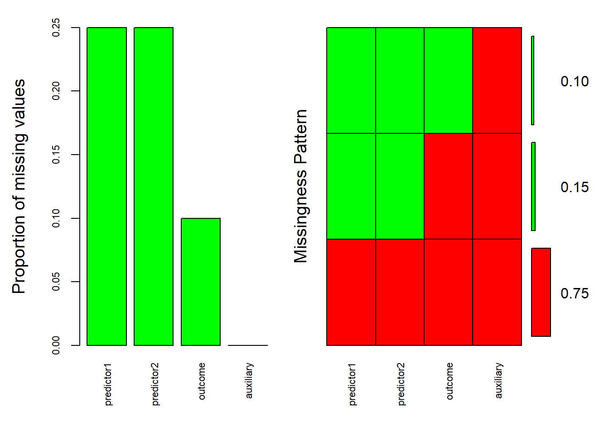
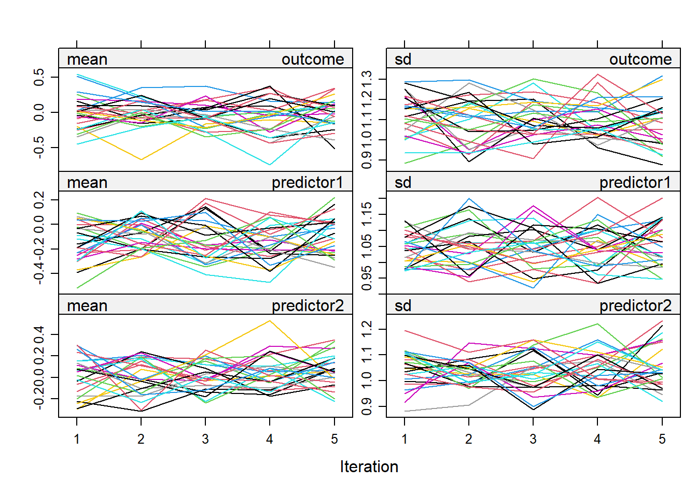
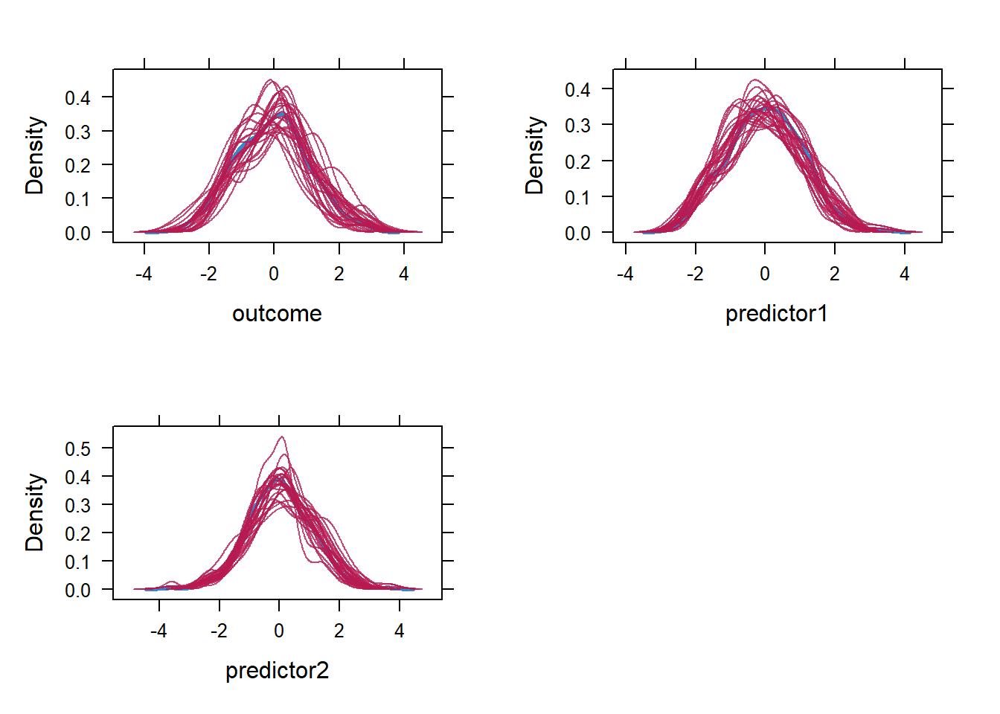

# Missing data and multiple imputation
Most of our datasets so far were a blessing to have. Sure, we sometimes had to clean, transform, and process our data but we were relatively spared of one common inconvenience, missing data. While you could simply ignore that some of your values are missing, this ignorance could potentially introduce some bias in your estimates and lead to reduced statistical power. In this part. 

  1. **I briefly discuss what we could consider when confronted with missing data**.
  2. **I will shortly show how to inspect missing values. Specifically, how much data is missing, what variables may relate to missing values in another variable (plotting these patterns using the [VIM package](https://cran.r-project.org/web/packages/VIM/index.html)), and the patterns of missingness: Missing Completely at Random, Missing at Random, and Missing Not at Random.** 
  3. **Finally, I introduce the multiple imputation procedure and use and demonstrate the** [mice package](https://cran.r-project.org/web/packages/mice/index.html), step-by-step.

## Missing data

### Listwise deletion and single (mean) imputation
Let it be known, the best way to handle missing data is to put efforts into avoiding it in the first place. That being said, perhaps the easiest option to deal with missing values, is to exclude incomplete cases (**listwise deletion**). For example.

```r
mydata = data.frame(x = c(1,2,NA,3,4,5),
                    y = c(NA,2,3,NA,4,5)
                    )

mydata_no_NA = mydata[complete.cases(mydata), ] # To apply listwise deletion
head(mydata_no_NA)
#>   x y
#> 2 2 2
#> 5 4 4
#> 6 5 5
```

**However**, depending on the number of excluded cases, **the statistical power may drop notably**. Moreover, it could create **additional inconveniences** such as **unbalanced designs** (e.g., notably more participants in one group compared to others) and bias in your estimated outcomes including **inflation of standard errors**.

In short, listwise deletion **could be ill-advised sometimes**. Alternatively we can also start thinking about **filling in the empty values** but here we are confronted with two questions. **First**, if we start filling in empty values, what would be the amount of missing data where, if we would consider to do so, becomes *unacceptable*? This is a question of ongoing debate, hence my suggestion would be to look up simulation studies or related work. **Second**, if we impute our data we need to decide with what we fill in our missing values. 

One intuitive candidate would be the variable's mean. **However, if we simply use the mean, we fill in the gaps with something uninformative**. In addition, remember that to compute the variance, we divide differences between values and the mean by the amount of complete cases. Therefore, we end up underestimating to a certain extent our standard errors.   

To deal with this issue, we can **fill in the empty values with multiple plausible values** instead of one and the same. This is where **multiple imputation comes into view**.

## Multiple imputation
In **Multiple imputation**, missing values will be imputed (i.e., filled in) across multiple simulated and complete datasets. From there we can pool the results and inspect the extent of overlap in each simulated dataset. This in itself **sounds straightforward but various aspects should be considered**. I will guide you through step-by-step. Let's assume we have the following data with missing values in two predictors and an outcome. Off note, **missing values in predictor variables will be imputed and these imputed values will be used in later analyses** (see later on) by the mice() function. **Missing values in the outcome will also be imputed by the mice() function but these will not be used in later analyses**. Note that I also created a variable named *auxiliary*, its relevance will become clear later on. 

```r
library(dplyr)
set.seed(902)
# Create the dataset
n = 500
predictor1 = rnorm(n)
predictor2 = rnorm(n)
auxiliary = rnorm(n)
outcome = 0.5 * predictor1 + 0.3 * predictor2 + rnorm(n)
mydata = data.frame(outcome, predictor1, predictor2, auxiliary)

# Now, introduce missing values based on the variable  "auxiliary" (so that the absence of values correlates to this "auxiliary" variable, as explained later on)
# Below I applied my own rule, predictors and outcomes are set NA based on the value of "auxiliary" (based on the quantile of its values)

mydata = mydata %>% mutate(
  across(c("predictor1","predictor2"),
         ~ ifelse(auxiliary < quantile(auxiliary, 0.25), NA, .)  
         ),
  outcome = ifelse(auxiliary < quantile(auxiliary, 0.10), NA, outcome)
)
head(mydata)
#>      outcome predictor1 predictor2   auxiliary
#> 1 -0.4294810   0.305674 -0.2005052  0.68156926
#> 2  0.5090547         NA         NA -0.91705860
#> 3 -0.3250196         NA         NA -1.04904178
#> 4 -1.1898698  -1.394627  0.1331301  0.05551047
#> 5  0.8797796         NA         NA -0.90291118
#> 6  2.7468572   1.362628  0.7923936  0.22223424
```

### before mice: Check missing values
**Alright, before we begin with the mice function()**, it is always a good idea to check how much missing values we have. Here we can ask questions like how many missing values we have per variable of interest and whether missing values in one variable are related to other variables. For my missing value checking needs, I like to use the aggr() function from the **VIM package**.

```r
library(VIM)
aggr(mydata, col = c('red', 'green'), # Colored this way so that red will represent the missing values and green the present ones in the right side of the plot
     numbers = TRUE,
     sortVars = TRUE,
     labels = names(mydata),
     cex.axis = 0.7,
     gap = 3,
     ylab = c("Proportion of missing values", "Missingness Pattern")
)
```



```
#> 
#>  Variables sorted by number of missings: 
#>    Variable Count
#>  predictor1  0.25
#>  predictor2  0.25
#>     outcome  0.10
#>   auxiliary  0.00
```

On the left side of the plot you see the proportion of missing data but I imagine the right side requires more explanation.
The vertical axis shows the frequency of each missing pattern. So we can distinguish three patterns in our case. The most common one (75%) is when all values are present (they are all colored green). The next pattern (15%) is that there is missing values in both predictor1 and predictor2 (they are colored red) but not in the outcome and auxiliary variable. Finally, in 10% of the cases, there are missing values in all but the auxiliary variable. Altogether, the patterns suggests that the occurrence of missing values clusters around the auxiliary variable (it is always present). **If missing values are related to measured ("observed") variables, just like in our case, we can take it as an indication of Missing at Random (MAR).** 

#### before mice: Missing (Not) (Completely) at Random
The MAR pattern we encounter in our plot is one of the three **forms of missingness** and **multiple imputations assumes that the data are missing either completely at random (MCAR) or at least at random (MAR)**. However, if the missing pattern would be **Missing Not at Random**, we may run into trouble. We describe the pattern of missingness as MNAR if missing values are notably related to a variable that we did not measure (unobserved, outside our dataset). If we run mice with MNAR, we may end up with biased outcomes. 

**So you may be wondering, how do we know what type of missingness we have?** Let's start with MCAR, one of the most common ways to test for this type of missingness is to use **Little's MCAR test**. This can be done using the mcar_test() function from the [naniar](https://search.r-project.org/CRAN/refmans/naniar/html/mcar_test.html) package. If the test is **not significant** based on the provided *p* value, it would suggest that the data could be MCAR.

```r
library(naniar)
mcar_test(mydata)
#> # A tibble: 1 × 4
#>   statistic    df p.value missing.patterns
#>       <dbl> <dbl>   <dbl>            <int>
#> 1      294.     3       0                3
```

Since the test is significant, the test suggests either MAR or MNAR. **However**, regardless of the outcome, I would advise some caution when interpreting this test. MCAR is unlikely in most cases because missingness is typically related to variables. Also, like many other tests, Little’s MCAR test can be sensitive to sample size as in larger samples, p values are more likely to drop below 0.05.

Therefore, in most cases, it comes down to either MNAR and MAR. To decide whether the pattern of missingess is MAR or MNAR, we can **visualize and inspect patterns** in missing values like what we before using the VIM package. **In addition**, You could consider to fit logistic regression models in which missing values in a given variable are predicted by another variable. For example, say we want to test whether the occurrence of missing values (yes or no) in predictor1 is predicted by the predictor2.

```r
# For demonstration purpose I temporarily make a binomial variable that indicates whether the value of predictor1 is missing or not
temp_mydata = mydata %>% mutate(missing_predictor1 = ifelse(is.na(predictor1),1,0))

# Fit the logistic regression
options(scipen=999)
summary(
 glm(missing_predictor1 ~ predictor2, family = "binomial", data=temp_mydata) 
)
#> Warning: glm.fit: algorithm did not converge
#> 
#> Call:
#> glm(formula = missing_predictor1 ~ predictor2, family = "binomial", 
#>     data = temp_mydata)
#> 
#> Coefficients:
#>                             Estimate
#> (Intercept)   -26.566068523538149293
#> predictor2     -0.000000000000004675
#>                           Std. Error z value Pr(>|z|)
#> (Intercept) 18390.786054817810509121  -0.001    0.999
#> predictor2  17583.793427717431768542   0.000    1.000
#> 
#> (Dispersion parameter for binomial family taken to be 1)
#> 
#>     Null deviance: 0.0000000000000  on 374  degrees of freedom
#> Residual deviance: 0.0000000021756  on 373  degrees of freedom
#>   (125 observations deleted due to missingness)
#> AIC: 4
#> 
#> Number of Fisher Scoring iterations: 25
```

However, note that you test for a *linear corelation*, so you might miss out on other forms of association. 

### mice decissions: joint modeling versus fully conditional specification
We determined that the *pattern of missingness* is (likely) MAR and that multiple imputation would be deemed an adequate procedure given the number of missing values. 

A next decision is to decide which imputation method to take. In multiple imputation, we have **joint modeling** which assumes a multivariate distribution of all variables to be used to sample the missing values. In practice, missing values are most commonly sampled from a multivariate **normal** distribution. However, since categorical variable do not follow a multivariate normal distribution, you **might consider not to go with joint modeling when your data is a mix of categorical and continuous variables**. **Instead, if you do have a mix, the second option of fully conditional specification (FCS) might be preferred**. In short, FCS specifies a regression model in which missing values are predicted by taking the other variables from your dataset as predictors. This missing value procedure is repeated until convergence. 

**The mice package uses FCS** and you have to resort to other packages such as [Amelia](https://cran.r-project.org/web/packages/Amelia/index.html) (which assumes **multivariate normality**) if you want to perform joint modelling. The focus of this part is on the mice package given its common use and flexibility, and hence I will go with FCS. 

### mice decisions: number of imputations
A final decision before I put everything into practice: the number of imputed datasets. To my knowledge, there are no strict rules regarding this number. What sometimes is considered to take the percentage of missingness in your dataset as the number of imputation. For example, if you would have **across all your variables of interest** a total of 35% missing data, you could consider to use 35 imputations. **However, this does not guarantee that this number will lead to stable results**. My advice is that you can consider this rule to decide the number. After you ran the mice, you could then repeat and check whether the obtained results are similar if you would increase the number of imputations. I will consider this in the practical example. 

### Practical example
The mice() function will ask for a *couple of ingredients*. First we will need to define **a predictor matrix**. In the predictor matrix you want to specify the variables you want to include as predictors for the missing values. With our dataset provided at the start of section, we could use every variable. To set a predictor matrix, we can use the conveniently named **make.predictorMatrix() function** from the mice package

```r
library(mice)
predictor_matrix = make.predictorMatrix(mydata)
```
Of note, if you would have a variable that is not at all useful as a predictor of missing values, we could have done something like: *predictor_matrix[, "the variable you do not want to use as a predictor"] = 0*

Next, mice will ask what imputation method to use per variable in your dataset. This will follow the same order as the variables in the dataset so in our case: *outcome, predictor1, predictor2, and auxiliary*. As imputation method we can choose between various options including **"pmm"** (predictive mean matching for **numerical variables**), **"logreg"** (logistic regression; for **binary variables**), **"polreg"** (polytomous regression for **unordered factor variables having three levels or more**), **"polyr"** ("proportional odds models for **ordered factors having three levels or more**). In addition, you can use **""** for variables that have no missing values. [A full overview is provided here (click here)](https://search.r-project.org/CRAN/refmans/mice/html/mice.html). 

All variables are numerical in our example, and therefore I could use the "pmm" method for each variable

```r
imputation_method = c("pmm", #outcome
                      "pmm", # predictor1
                      "pmm", # predictor2
                      "" # auxiliary which does not have missing values
                      )
```

Next, we have to decide on the number of imputed datasets. As I said before there are no strict rules. **We could start with 25 imputation** as we have 25% of missing values in total (25% in both predictor1 and predictor2, 10% in the outcome, and 0% in the auxiliary variable). Later on, I will inspect whether results change notably when setting a higher number of imputations.

```r
n_imputations = 25
```

Alright, let's run the mice() function using the above ingredients. Note that you could also set a seed.

```r
mice_data = mice(
  data = mydata,
  m = n_imputations,
  seed = 97531,
  predictorMatrix = predictor_matrix
)
```

Our original as well as 25 imputed complete datasets, are now stored in a special type of container so to speaks, a **mids object**. 

Before we conduct further analysis with our imputed datasets, we should check the convergence of the imputation algorithm. Convergence can be visualized in the following way: for each iteration (i.e., times the imputation algorithm created an imputed dataset), you note down the mean and the standard deviation of the imputed variables. For this purpose, we could use something simple like the plot() function

```r
plot(mice_data)
```



To conclude whether or not the imputation algorithm converged, we can focus on the line overlap and whether they show a similar extent of variability. Additionally, I will also look whether the range of the mean and standard deviation of the imputed variables resembles that of the mean/standard deviation of the observed variables. Let's quickly check the observed means and standard deviations.

```r
library(psych)
describe(mydata[,c("outcome", "predictor1", "predictor2")])[c("mean","sd")]
#>             mean   sd
#> outcome    -0.08 1.12
#> predictor1 -0.01 1.06
#> predictor2  0.01 1.05
```

Ok, let us also inspect our plot. the lines show some overlap, the variability (the range in mean and standard deviation) seems not to be "large". The lines "zigzag" as expected and do not appear to follow a pattern (e.g., a strong decrease or increase with increasing number of iteration), which is good. Comparing the observed means/standard deviations with that of imputed values, all look ok except for the mean of the outcome which is  -0.08 while the range in the mean of the imputed values are -0.5 to 0.4. **This is not necessarily a "bad" thing as it could be that the imputations reduced some bias that we would otherwise have in the observed mean (since listwise deletion was applied to get its average)**. 
For now I don't see notable indications for non-convergence. **Later on I will repeat the mice procedure with different seeds to see if results are similar**. **Next to the mean and standard deviations**, we should also zoom in on **the distribution** of the imputed values compared to the observed ones. Here we could the densityplot() function and. Since I want to three distributions (outcome, predictor1, predictor2), I will use the plot_grid() function from the cowplot package to combine the density plots into one. 

```r
library(cowplot)
cowplot::plot_grid( densityplot(mice_data, ~outcome),
                    densityplot(mice_data, ~predictor1),
                    densityplot(mice_data, ~predictor2),
                    ncol=2, nrow=2)
```



Overall, I will deem it "acceptable". The outcome variable shows the least overlap between the observed and imputed distribution, as expected based on mean, but it does not seem problematic based on visual inspection. **Again**, there can be some differences between the imputed and observed variables without providing any problem.

#### Pooling the results 
We are finally ready to run our analysis model. **At least, in our case as we intend to run a general linear regression model.** **However**, if you would use other types of regression models such as logistic regression, you would need to remove any NA in the outcome as the model cannot handle NA's directly.

**If you would intend to run a model that cannot handle missing values in the outcome**, you need to **"open" your mice mids object** to reveal the dataset containing the original and imputed data. Then you would need to **remove instances were the outcome is missing**. Finally you would need to **transform the dataset back to a mids object**. For the purpose of "opening" the original mids object, you can use the **complete() function** from the mice package. For illustration purposes it would look something like this. **Note that I will not run the code below as I intend to use general linear regression.**

```r
library(mice)

# Open the mids object
mice_data_long = complete(mice_data, action = "long", include = TRUE)

# Remove NA in the OUTCOME variable (here "outcome")
library(dplyr)
mice_data_long = mice_data_long %>% filter(!is.na(outcome))

# Transform back to a mids object
mice_data = as.mids(mice_data_long)
```

**Back to our case where we do not need to remove the missing values in the outcomes**. We now have to specify our imputation model and this should be as similar to the analysis model that you had in mind. If you want to add quadratic terms in your analysis model then you also have to include them in your imputation model. Here, I want to fit the following model:

```r
lm(outcome ~ predictor1 * predictor2, data = mydata)
```

**Therefore**,our imputation should have **at least** the main effects of predictor1 and predictor2, and their interaction effect, on the same outcome. **Important to note, the imputation model is allowed to have extra variables and this is the moment where I finally spoil the purpose of my auxiliary variable**. **Auxiliary variables are usually not of interest** for your analysis per se **but these variables may relate to missingness and missing variables.** Therefore they may aid to approximate more the assumption of MAR. You could especially **consider to add auxiliary variables when** your *pattern of missingness* resembles more the **missing not at random state**. Of course, later on, you could always run mice with and without auxiliary variables to check whether results remain similar. **In our example I will add the auxiliary variable to my imputation model**. 

```r
my_mice_model = with(mice_data, 
     lm( outcome ~ predictor1 * predictor2 + auxiliary )) # we have to use "with" since mice_data is a mids object

summary(my_mice_model)
#> # A tibble: 125 × 6
#>    term          estimate std.error statistic  p.value  nobs
#>    <chr>            <dbl>     <dbl>     <dbl>    <dbl> <int>
#>  1 (Intercept)   -0.110      0.0434    -2.53  1.17e- 2   500
#>  2 predictor1     0.404      0.0412     9.82  6.54e-21   500
#>  3 predictor2     0.296      0.0416     7.12  3.89e-12   500
#>  4 auxiliary      0.0397     0.0420     0.945 3.45e- 1   500
#>  5 predictor1:p…  0.0194     0.0422     0.460 6.46e- 1   500
#>  6 (Intercept)   -0.0353     0.0428    -0.824 4.10e- 1   500
#>  7 predictor1     0.446      0.0395    11.3   1.86e-26   500
#>  8 predictor2     0.295      0.0398     7.41  5.69e-13   500
#>  9 auxiliary     -0.0905     0.0413    -2.19  2.90e- 2   500
#> 10 predictor1:p… -0.00667    0.0363    -0.184 8.54e- 1   500
#> # ℹ 115 more rows
```

Now we can pool together the results

```r
pooled_estimates = pool(my_mice_model)
```

To deliver the finishing touches, I will put the above results in a separate dataset and compute the lower and upper bounds of the 95% confidence intervals of the estimated pooled coefficients.

```r
pooled_results = data.frame(
  summary(pooled_estimates)     
                              ) %>%
  mutate(CI_lower =  estimate - 1.96*(sqrt(pooled_estimates$pooled$ubar)),
         CI_upper = estimate + 1.96*(sqrt(pooled_estimates$pooled$ubar)))
```

**Now we can check whether the above pooled results resemble those we would obtain without multiple imputation.**

```r
mymodel_no_mice = lm( outcome ~ predictor1 * predictor2 + auxiliary ) # The model with automatically drop missing values so we do not need to do it ourselves

data.frame(
estimate = mymodel_no_mice$coefficients,
std.error = summary(mymodel_no_mice)$coefficients[, "Std. Error"],
statistic = summary(mymodel_no_mice)$coefficients[, "t value"],
p.value = summary(mymodel_no_mice)$coefficients[, "Pr(>|t|)"],
CI_lower = confint(mymodel_no_mice)[,1],
CI_upper = confint(mymodel_no_mice)[,2]
)
#>                          estimate  std.error  statistic
#> (Intercept)           -0.06612735 0.04308921 -1.5346612
#> predictor1             0.46189195 0.04055634 11.3888965
#> predictor2             0.29761672 0.04110791  7.2398900
#> auxiliary             -0.02627134 0.04159248 -0.6316367
#> predictor1:predictor2 -0.01285578 0.04171811 -0.3081581
#>                                                  p.value
#> (Intercept)           0.12550594727660110971889650954836
#> predictor1            0.00000000000000000000000000754036
#> predictor2            0.00000000000172646655648272597731
#> auxiliary             0.52791587685890761783014113461832
#> predictor1:predictor2 0.75809165072632311854761155700544
#>                          CI_lower   CI_upper
#> (Intercept)           -0.15078765 0.01853296
#> predictor1             0.38220815 0.54157575
#> predictor2             0.21684922 0.37838422
#> auxiliary             -0.10799091 0.05544823
#> predictor1:predictor2 -0.09482219 0.06911064
```

Overall, they look notably similar. If this was not the case, we could have to rethink every decision made up till this point. And there you have it, our outcome, obtained with **our specific seed of 97531.** 

**Now it is best to check whether our outcomes remain relatively robust across different runs of mice**

#### Checking the robustness of the results
Like me, you may start wondering about **at least two questions**. What is **the extend of similarity in our results** if we used different seeds? Also, would we get different results if we would **increase the number of iterations** (here above 25)? Essentially, it falls down to rerunning our mice procedure a given number of times. 

**Concerning the extent of similarity in our results**, we could use a set of different seeds **or** we could remove the seeds altogether. In the example below, I will remove the seed and (for) loop through 100 runs of the mice procedure (in practice, try a higher value such as 500 or more), and store the results (as a data frame object) in a so called list variable.

```r
# To store the results of the imputed datasets and to determine the number of runs
container_results=list()
n_runs = 100 # In practice, try larger values (e.g., above 500)

for(i in 1:n_runs){
  
# Run the mice but without a seed  
mice_data = mice(
  data = mydata,
  m = n_imputations,
  predictorMatrix = predictor_matrix,
)
  

# Fit the imputation models (Again, depending on your model, remove NA in the outcome first!)
my_mice_model = with(mice_data, 
                     lm( outcome ~ predictor1 * predictor2 + auxiliary )
                     )


pooled_estimates = pool(my_mice_model)

# Here instead in "pooled_results" like I did before, I will store the each dataset object to my outcome_container
container_results[[i]] =
       data.frame(
         summary(pooled_estimates)     
       ) %>%
         mutate(CI_lower =  estimate - 1.96*(sqrt(pooled_estimates$pooled$ubar)),
                CI_upper = estimate + 1.96*(sqrt(pooled_estimates$pooled$ubar)))
}
```

Good, now I can retrieve each estimate per dataset, per run, that is stored in my list, and simply plot them. 

```r
# Combine all data frames in the list into one data frame
pooled_estimates_across_runs = bind_rows(container_results, .id = "run")

# Plot the estimates across datasets
library(ggplot2)
library(plotly)

ggplotly(
pooled_estimates_across_runs %>% ggplot(aes(y=estimate, x = term, color=term)) +
  geom_point() + xlab("") +
  theme(axis.text.x  = element_blank() )
)
```


```{=html}
<div class="plotly html-widget html-fill-item-overflow-hidden html-fill-item" id="htmlwidget-68af84c2bab515c16b50" style="width:672px;height:480px;"></div>
<script type="application/json" data-for="htmlwidget-68af84c2bab515c16b50">{"x":{"data":[{"x":[1,1,1,1,1,1,1,1,1,1,1,1,1,1,1,1,1,1,1,1,1,1,1,1,1,1,1,1,1,1,1,1,1,1,1,1,1,1,1,1,1,1,1,1,1,1,1,1,1,1,1,1,1,1,1,1,1,1,1,1,1,1,1,1,1,1,1,1,1,1,1,1,1,1,1,1,1,1,1,1,1,1,1,1,1,1,1,1,1,1,1,1,1,1,1,1,1,1,1,1],"y":[-0.061321548313657194,-0.064045717632166155,-0.068245882744955993,-0.055599019610182786,-0.070335375845812856,-0.055871779105646266,-0.060215195931412946,-0.063590690290385804,-0.063266501069922584,-0.060223488050045265,-0.058994273637220887,-0.063555358219263336,-0.059345256375459232,-0.057320985305418737,-0.059498523137578259,-0.064951153066146877,-0.065288223398516185,-0.071600599731883749,-0.058897767092416668,-0.059352466018774766,-0.065489317315384751,-0.061778574553376861,-0.059579740984404356,-0.063469109936145338,-0.06237208539684292,-0.07244044571603217,-0.059834294990389919,-0.065466246914082246,-0.062307823431118799,-0.06418621764955347,-0.055151138740944544,-0.066586225019347009,-0.059331585481845125,-0.059140579306274893,-0.063653151498205746,-0.055758409879421086,-0.061249380422740328,-0.054956199500193537,-0.05564531746625051,-0.068348111569812284,-0.065316135368171005,-0.060511677334610492,-0.058863309030634081,-0.063380634996198337,-0.060688554643764749,-0.070091143206782391,-0.064407633088756425,-0.058419358928058607,-0.058899791985213334,-0.061182844127966388,-0.070062411165310035,-0.061444840444473667,-0.067066095010733337,-0.06404082597352119,-0.066578038769238179,-0.068767803669253461,-0.068989506593574945,-0.062891727436855366,-0.059308430957555801,-0.065837580091613834,-0.060680742968769803,-0.06276312815329356,-0.064558659768183299,-0.060506260510175443,-0.055038793071558956,-0.063321204185413441,-0.066683853654638553,-0.066729263561324734,-0.073478600173901523,-0.066651429549668587,-0.058735495125936052,-0.060631680113605015,-0.060992058003975745,-0.061059802443056352,-0.057374859861198606,-0.059386004345751482,-0.060373616133599539,-0.053989197792171616,-0.05666528327954147,-0.061501976810864091,-0.066022304482317634,-0.058491575701480038,-0.063627490730955999,-0.067996430674629349,-0.058195209702949648,-0.064741012272838461,-0.056478457939099502,-0.057373839652309633,-0.066799231970897419,-0.055050458805357291,-0.063237819443601503,-0.058895126575397222,-0.057599554188659821,-0.059063837626795353,-0.061130786007283541,-0.059585664248265703,-0.063700327917082022,-0.063060314040890006,-0.062250820619269509,-0.064745378856721894],"text":["term: (Intercept)<br />estimate: -0.06132154831<br />term: (Intercept)","term: (Intercept)<br />estimate: -0.06404571763<br />term: (Intercept)","term: (Intercept)<br />estimate: -0.06824588274<br />term: (Intercept)","term: (Intercept)<br />estimate: -0.05559901961<br />term: (Intercept)","term: (Intercept)<br />estimate: -0.07033537585<br />term: (Intercept)","term: (Intercept)<br />estimate: -0.05587177911<br />term: (Intercept)","term: (Intercept)<br />estimate: -0.06021519593<br />term: (Intercept)","term: (Intercept)<br />estimate: -0.06359069029<br />term: (Intercept)","term: (Intercept)<br />estimate: -0.06326650107<br />term: (Intercept)","term: (Intercept)<br />estimate: -0.06022348805<br />term: (Intercept)","term: (Intercept)<br />estimate: -0.05899427364<br />term: (Intercept)","term: (Intercept)<br />estimate: -0.06355535822<br />term: (Intercept)","term: (Intercept)<br />estimate: -0.05934525638<br />term: (Intercept)","term: (Intercept)<br />estimate: -0.05732098531<br />term: (Intercept)","term: (Intercept)<br />estimate: -0.05949852314<br />term: (Intercept)","term: (Intercept)<br />estimate: -0.06495115307<br />term: (Intercept)","term: (Intercept)<br />estimate: -0.06528822340<br />term: (Intercept)","term: (Intercept)<br />estimate: -0.07160059973<br />term: (Intercept)","term: (Intercept)<br />estimate: -0.05889776709<br />term: (Intercept)","term: (Intercept)<br />estimate: -0.05935246602<br />term: (Intercept)","term: (Intercept)<br />estimate: -0.06548931732<br />term: (Intercept)","term: (Intercept)<br />estimate: -0.06177857455<br />term: (Intercept)","term: (Intercept)<br />estimate: -0.05957974098<br />term: (Intercept)","term: (Intercept)<br />estimate: -0.06346910994<br />term: (Intercept)","term: (Intercept)<br />estimate: -0.06237208540<br />term: (Intercept)","term: (Intercept)<br />estimate: -0.07244044572<br />term: (Intercept)","term: (Intercept)<br />estimate: -0.05983429499<br />term: (Intercept)","term: (Intercept)<br />estimate: -0.06546624691<br />term: (Intercept)","term: (Intercept)<br />estimate: -0.06230782343<br />term: (Intercept)","term: (Intercept)<br />estimate: -0.06418621765<br />term: (Intercept)","term: (Intercept)<br />estimate: -0.05515113874<br />term: (Intercept)","term: (Intercept)<br />estimate: -0.06658622502<br />term: (Intercept)","term: (Intercept)<br />estimate: -0.05933158548<br />term: (Intercept)","term: (Intercept)<br />estimate: -0.05914057931<br />term: (Intercept)","term: (Intercept)<br />estimate: -0.06365315150<br />term: (Intercept)","term: (Intercept)<br />estimate: -0.05575840988<br />term: (Intercept)","term: (Intercept)<br />estimate: -0.06124938042<br />term: (Intercept)","term: (Intercept)<br />estimate: -0.05495619950<br />term: (Intercept)","term: (Intercept)<br />estimate: -0.05564531747<br />term: (Intercept)","term: (Intercept)<br />estimate: -0.06834811157<br />term: (Intercept)","term: (Intercept)<br />estimate: -0.06531613537<br />term: (Intercept)","term: (Intercept)<br />estimate: -0.06051167733<br />term: (Intercept)","term: (Intercept)<br />estimate: -0.05886330903<br />term: (Intercept)","term: (Intercept)<br />estimate: -0.06338063500<br />term: (Intercept)","term: (Intercept)<br />estimate: -0.06068855464<br />term: (Intercept)","term: (Intercept)<br />estimate: -0.07009114321<br />term: (Intercept)","term: (Intercept)<br />estimate: -0.06440763309<br />term: (Intercept)","term: (Intercept)<br />estimate: -0.05841935893<br />term: (Intercept)","term: (Intercept)<br />estimate: -0.05889979199<br />term: (Intercept)","term: (Intercept)<br />estimate: -0.06118284413<br />term: (Intercept)","term: (Intercept)<br />estimate: -0.07006241117<br />term: (Intercept)","term: (Intercept)<br />estimate: -0.06144484044<br />term: (Intercept)","term: (Intercept)<br />estimate: -0.06706609501<br />term: (Intercept)","term: (Intercept)<br />estimate: -0.06404082597<br />term: (Intercept)","term: (Intercept)<br />estimate: -0.06657803877<br />term: (Intercept)","term: (Intercept)<br />estimate: -0.06876780367<br />term: (Intercept)","term: (Intercept)<br />estimate: -0.06898950659<br />term: (Intercept)","term: (Intercept)<br />estimate: -0.06289172744<br />term: (Intercept)","term: (Intercept)<br />estimate: -0.05930843096<br />term: (Intercept)","term: (Intercept)<br />estimate: -0.06583758009<br />term: (Intercept)","term: (Intercept)<br />estimate: -0.06068074297<br />term: (Intercept)","term: (Intercept)<br />estimate: -0.06276312815<br />term: (Intercept)","term: (Intercept)<br />estimate: -0.06455865977<br />term: (Intercept)","term: (Intercept)<br />estimate: -0.06050626051<br />term: (Intercept)","term: (Intercept)<br />estimate: -0.05503879307<br />term: (Intercept)","term: (Intercept)<br />estimate: -0.06332120419<br />term: (Intercept)","term: (Intercept)<br />estimate: -0.06668385365<br />term: (Intercept)","term: (Intercept)<br />estimate: -0.06672926356<br />term: (Intercept)","term: (Intercept)<br />estimate: -0.07347860017<br />term: (Intercept)","term: (Intercept)<br />estimate: -0.06665142955<br />term: (Intercept)","term: (Intercept)<br />estimate: -0.05873549513<br />term: (Intercept)","term: (Intercept)<br />estimate: -0.06063168011<br />term: (Intercept)","term: (Intercept)<br />estimate: -0.06099205800<br />term: (Intercept)","term: (Intercept)<br />estimate: -0.06105980244<br />term: (Intercept)","term: (Intercept)<br />estimate: -0.05737485986<br />term: (Intercept)","term: (Intercept)<br />estimate: -0.05938600435<br />term: (Intercept)","term: (Intercept)<br />estimate: -0.06037361613<br />term: (Intercept)","term: (Intercept)<br />estimate: -0.05398919779<br />term: (Intercept)","term: (Intercept)<br />estimate: -0.05666528328<br />term: (Intercept)","term: (Intercept)<br />estimate: -0.06150197681<br />term: (Intercept)","term: (Intercept)<br />estimate: -0.06602230448<br />term: (Intercept)","term: (Intercept)<br />estimate: -0.05849157570<br />term: (Intercept)","term: (Intercept)<br />estimate: -0.06362749073<br />term: (Intercept)","term: (Intercept)<br />estimate: -0.06799643067<br />term: (Intercept)","term: (Intercept)<br />estimate: -0.05819520970<br />term: (Intercept)","term: (Intercept)<br />estimate: -0.06474101227<br />term: (Intercept)","term: (Intercept)<br />estimate: -0.05647845794<br />term: (Intercept)","term: (Intercept)<br />estimate: -0.05737383965<br />term: (Intercept)","term: (Intercept)<br />estimate: -0.06679923197<br />term: (Intercept)","term: (Intercept)<br />estimate: -0.05505045881<br />term: (Intercept)","term: (Intercept)<br />estimate: -0.06323781944<br />term: (Intercept)","term: (Intercept)<br />estimate: -0.05889512658<br />term: (Intercept)","term: (Intercept)<br />estimate: -0.05759955419<br />term: (Intercept)","term: (Intercept)<br />estimate: -0.05906383763<br />term: (Intercept)","term: (Intercept)<br />estimate: -0.06113078601<br />term: (Intercept)","term: (Intercept)<br />estimate: -0.05958566425<br />term: (Intercept)","term: (Intercept)<br />estimate: -0.06370032792<br />term: (Intercept)","term: (Intercept)<br />estimate: -0.06306031404<br />term: (Intercept)","term: (Intercept)<br />estimate: -0.06225082062<br />term: (Intercept)","term: (Intercept)<br />estimate: -0.06474537886<br />term: (Intercept)"],"type":"scatter","mode":"markers","marker":{"autocolorscale":false,"color":"rgba(248,118,109,1)","opacity":1,"size":5.6692913385826778,"symbol":"circle","line":{"width":1.8897637795275593,"color":"rgba(248,118,109,1)"}},"hoveron":"points","name":"(Intercept)","legendgroup":"(Intercept)","showlegend":true,"xaxis":"x","yaxis":"y","hoverinfo":"text","frame":null},{"x":[2,2,2,2,2,2,2,2,2,2,2,2,2,2,2,2,2,2,2,2,2,2,2,2,2,2,2,2,2,2,2,2,2,2,2,2,2,2,2,2,2,2,2,2,2,2,2,2,2,2,2,2,2,2,2,2,2,2,2,2,2,2,2,2,2,2,2,2,2,2,2,2,2,2,2,2,2,2,2,2,2,2,2,2,2,2,2,2,2,2,2,2,2,2,2,2,2,2,2,2],"y":[0.4314123463713091,0.42383830816072243,0.42668396309845019,0.42123224977572737,0.4305454318230475,0.42590697535959376,0.4224332504414115,0.42330452403554242,0.4195271337528364,0.42358489675353794,0.43059933928196986,0.42608000161708948,0.4236552171845836,0.42036099167515883,0.42492426695953495,0.42708944595430204,0.42065450560297651,0.42697269965250562,0.4214244133770329,0.41945595378594441,0.42681050622243516,0.42474753037195567,0.42878025959124755,0.42343464809773729,0.42385165820780685,0.42257997187362362,0.42524339150976492,0.42197755110345353,0.42719923628124779,0.42193902935090444,0.42500655474168592,0.41812556422720104,0.42697276681350621,0.41786209471557134,0.42431773061372841,0.41981536606295439,0.42056381529876935,0.42674611753101244,0.42147258045044883,0.42940194143384419,0.42506215809546416,0.43028234495786344,0.42380677048140958,0.42333128812984233,0.43350740925876674,0.42311024455780505,0.42899049851051319,0.42325350648753396,0.42789572725013147,0.42020376060157222,0.42446707211660384,0.42755536787492615,0.42305277946514697,0.41937185329417381,0.42727598505338804,0.42487419542614346,0.42282787979206321,0.42968261020528992,0.42887367092637141,0.42236194604960686,0.41751268297148425,0.42538257553623249,0.42079394482275545,0.42469865461113832,0.42401935481393938,0.42563617006875237,0.42388192033161121,0.42628711906864225,0.4283543706254373,0.42012078152445737,0.41959057599236438,0.42827060435341346,0.42205167385944525,0.42980823316148659,0.4229912594654392,0.42435107862255844,0.42560429891385609,0.42478162302840444,0.42709535046309544,0.43333469660052715,0.42394328474001836,0.42278339516773716,0.42684694867182721,0.42430988786504736,0.42377128764707583,0.43286809371001667,0.4339086260611642,0.42733388702791991,0.42713009614248526,0.42219492461914804,0.42318406735262831,0.42745172915848278,0.42713500169199148,0.42798596365538538,0.42968918420552588,0.42020954606750366,0.42491654652351374,0.42585597344451925,0.41936513158104444,0.41440142830143439],"text":["term: predictor1<br />estimate:  0.43141234637<br />term: predictor1","term: predictor1<br />estimate:  0.42383830816<br />term: predictor1","term: predictor1<br />estimate:  0.42668396310<br />term: predictor1","term: predictor1<br />estimate:  0.42123224978<br />term: predictor1","term: predictor1<br />estimate:  0.43054543182<br />term: predictor1","term: predictor1<br />estimate:  0.42590697536<br />term: predictor1","term: predictor1<br />estimate:  0.42243325044<br />term: predictor1","term: predictor1<br />estimate:  0.42330452404<br />term: predictor1","term: predictor1<br />estimate:  0.41952713375<br />term: predictor1","term: predictor1<br />estimate:  0.42358489675<br />term: predictor1","term: predictor1<br />estimate:  0.43059933928<br />term: predictor1","term: predictor1<br />estimate:  0.42608000162<br />term: predictor1","term: predictor1<br />estimate:  0.42365521718<br />term: predictor1","term: predictor1<br />estimate:  0.42036099168<br />term: predictor1","term: predictor1<br />estimate:  0.42492426696<br />term: predictor1","term: predictor1<br />estimate:  0.42708944595<br />term: predictor1","term: predictor1<br />estimate:  0.42065450560<br />term: predictor1","term: predictor1<br />estimate:  0.42697269965<br />term: predictor1","term: predictor1<br />estimate:  0.42142441338<br />term: predictor1","term: predictor1<br />estimate:  0.41945595379<br />term: predictor1","term: predictor1<br />estimate:  0.42681050622<br />term: predictor1","term: predictor1<br />estimate:  0.42474753037<br />term: predictor1","term: predictor1<br />estimate:  0.42878025959<br />term: predictor1","term: predictor1<br />estimate:  0.42343464810<br />term: predictor1","term: predictor1<br />estimate:  0.42385165821<br />term: predictor1","term: predictor1<br />estimate:  0.42257997187<br />term: predictor1","term: predictor1<br />estimate:  0.42524339151<br />term: predictor1","term: predictor1<br />estimate:  0.42197755110<br />term: predictor1","term: predictor1<br />estimate:  0.42719923628<br />term: predictor1","term: predictor1<br />estimate:  0.42193902935<br />term: predictor1","term: predictor1<br />estimate:  0.42500655474<br />term: predictor1","term: predictor1<br />estimate:  0.41812556423<br />term: predictor1","term: predictor1<br />estimate:  0.42697276681<br />term: predictor1","term: predictor1<br />estimate:  0.41786209472<br />term: predictor1","term: predictor1<br />estimate:  0.42431773061<br />term: predictor1","term: predictor1<br />estimate:  0.41981536606<br />term: predictor1","term: predictor1<br />estimate:  0.42056381530<br />term: predictor1","term: predictor1<br />estimate:  0.42674611753<br />term: predictor1","term: predictor1<br />estimate:  0.42147258045<br />term: predictor1","term: predictor1<br />estimate:  0.42940194143<br />term: predictor1","term: predictor1<br />estimate:  0.42506215810<br />term: predictor1","term: predictor1<br />estimate:  0.43028234496<br />term: predictor1","term: predictor1<br />estimate:  0.42380677048<br />term: predictor1","term: predictor1<br />estimate:  0.42333128813<br />term: predictor1","term: predictor1<br />estimate:  0.43350740926<br />term: predictor1","term: predictor1<br />estimate:  0.42311024456<br />term: predictor1","term: predictor1<br />estimate:  0.42899049851<br />term: predictor1","term: predictor1<br />estimate:  0.42325350649<br />term: predictor1","term: predictor1<br />estimate:  0.42789572725<br />term: predictor1","term: predictor1<br />estimate:  0.42020376060<br />term: predictor1","term: predictor1<br />estimate:  0.42446707212<br />term: predictor1","term: predictor1<br />estimate:  0.42755536787<br />term: predictor1","term: predictor1<br />estimate:  0.42305277947<br />term: predictor1","term: predictor1<br />estimate:  0.41937185329<br />term: predictor1","term: predictor1<br />estimate:  0.42727598505<br />term: predictor1","term: predictor1<br />estimate:  0.42487419543<br />term: predictor1","term: predictor1<br />estimate:  0.42282787979<br />term: predictor1","term: predictor1<br />estimate:  0.42968261021<br />term: predictor1","term: predictor1<br />estimate:  0.42887367093<br />term: predictor1","term: predictor1<br />estimate:  0.42236194605<br />term: predictor1","term: predictor1<br />estimate:  0.41751268297<br />term: predictor1","term: predictor1<br />estimate:  0.42538257554<br />term: predictor1","term: predictor1<br />estimate:  0.42079394482<br />term: predictor1","term: predictor1<br />estimate:  0.42469865461<br />term: predictor1","term: predictor1<br />estimate:  0.42401935481<br />term: predictor1","term: predictor1<br />estimate:  0.42563617007<br />term: predictor1","term: predictor1<br />estimate:  0.42388192033<br />term: predictor1","term: predictor1<br />estimate:  0.42628711907<br />term: predictor1","term: predictor1<br />estimate:  0.42835437063<br />term: predictor1","term: predictor1<br />estimate:  0.42012078152<br />term: predictor1","term: predictor1<br />estimate:  0.41959057599<br />term: predictor1","term: predictor1<br />estimate:  0.42827060435<br />term: predictor1","term: predictor1<br />estimate:  0.42205167386<br />term: predictor1","term: predictor1<br />estimate:  0.42980823316<br />term: predictor1","term: predictor1<br />estimate:  0.42299125947<br />term: predictor1","term: predictor1<br />estimate:  0.42435107862<br />term: predictor1","term: predictor1<br />estimate:  0.42560429891<br />term: predictor1","term: predictor1<br />estimate:  0.42478162303<br />term: predictor1","term: predictor1<br />estimate:  0.42709535046<br />term: predictor1","term: predictor1<br />estimate:  0.43333469660<br />term: predictor1","term: predictor1<br />estimate:  0.42394328474<br />term: predictor1","term: predictor1<br />estimate:  0.42278339517<br />term: predictor1","term: predictor1<br />estimate:  0.42684694867<br />term: predictor1","term: predictor1<br />estimate:  0.42430988787<br />term: predictor1","term: predictor1<br />estimate:  0.42377128765<br />term: predictor1","term: predictor1<br />estimate:  0.43286809371<br />term: predictor1","term: predictor1<br />estimate:  0.43390862606<br />term: predictor1","term: predictor1<br />estimate:  0.42733388703<br />term: predictor1","term: predictor1<br />estimate:  0.42713009614<br />term: predictor1","term: predictor1<br />estimate:  0.42219492462<br />term: predictor1","term: predictor1<br />estimate:  0.42318406735<br />term: predictor1","term: predictor1<br />estimate:  0.42745172916<br />term: predictor1","term: predictor1<br />estimate:  0.42713500169<br />term: predictor1","term: predictor1<br />estimate:  0.42798596366<br />term: predictor1","term: predictor1<br />estimate:  0.42968918421<br />term: predictor1","term: predictor1<br />estimate:  0.42020954607<br />term: predictor1","term: predictor1<br />estimate:  0.42491654652<br />term: predictor1","term: predictor1<br />estimate:  0.42585597344<br />term: predictor1","term: predictor1<br />estimate:  0.41936513158<br />term: predictor1","term: predictor1<br />estimate:  0.41440142830<br />term: predictor1"],"type":"scatter","mode":"markers","marker":{"autocolorscale":false,"color":"rgba(163,165,0,1)","opacity":1,"size":5.6692913385826778,"symbol":"circle","line":{"width":1.8897637795275593,"color":"rgba(163,165,0,1)"}},"hoveron":"points","name":"predictor1","legendgroup":"predictor1","showlegend":true,"xaxis":"x","yaxis":"y","hoverinfo":"text","frame":null},{"x":[3,3,3,3,3,3,3,3,3,3,3,3,3,3,3,3,3,3,3,3,3,3,3,3,3,3,3,3,3,3,3,3,3,3,3,3,3,3,3,3,3,3,3,3,3,3,3,3,3,3,3,3,3,3,3,3,3,3,3,3,3,3,3,3,3,3,3,3,3,3,3,3,3,3,3,3,3,3,3,3,3,3,3,3,3,3,3,3,3,3,3,3,3,3,3,3,3,3,3,3],"y":[0.31883681232311301,0.31727596686473269,0.31932157758533852,0.32496725567771656,0.32478228069520615,0.32204776454955425,0.32383311511348623,0.3260415072562956,0.33053611496681395,0.32595582682986773,0.32148168200282368,0.32311145587613854,0.31229832343238956,0.32588496680061629,0.32686242186672138,0.31550107769299407,0.32591698246547207,0.32039624614563833,0.33086251579802572,0.31770347286389072,0.3173310471363277,0.31444462286393277,0.3255669755257633,0.33213578873908889,0.32525868940258423,0.32027341626129341,0.31242200863525826,0.31918287901351894,0.32034030670181607,0.32063411695146005,0.32213276194841156,0.3239949060003473,0.3242150435609456,0.32595707324672657,0.32345132200404231,0.33201052194030911,0.32197728641205214,0.32308295800188302,0.32559545429048098,0.32162023797122485,0.32303639637604364,0.32699056187282688,0.31914734350323948,0.31714752774183769,0.3124707263269037,0.32399720465061577,0.32696058147918933,0.32661805641709102,0.32550693164194611,0.32570873868858535,0.31974125581203422,0.32961430390810043,0.32296776898411766,0.32905579939381974,0.32534442598678298,0.31937136151786627,0.3302852170693592,0.31955223138289157,0.32774688360549381,0.32484932969551256,0.32919039586591237,0.32358948892767991,0.32474847728127965,0.32554122315194728,0.32154812477046246,0.32192795299077709,0.32322130975265023,0.31886235545001634,0.32797752269420694,0.32380009563463419,0.32571993299096169,0.32773922753342327,0.3155615408341555,0.322669123612711,0.32045601672279672,0.32997678328178964,0.32468296067287966,0.32365359461639687,0.3239066645871807,0.3178641674488768,0.31318272075809728,0.32622358995255923,0.32144649076291093,0.31269144516464314,0.3260089697261036,0.32392023519182467,0.32253552458228846,0.32417534325587483,0.32583890767835127,0.31449640954003588,0.31957768660262104,0.32483817414429361,0.32649907727485711,0.31540810575432654,0.32384292384744728,0.33018419873478072,0.32048329211381171,0.33269508359159827,0.32373816622196155,0.32501313977967417],"text":["term: predictor2<br />estimate:  0.31883681232<br />term: predictor2","term: predictor2<br />estimate:  0.31727596686<br />term: predictor2","term: predictor2<br />estimate:  0.31932157759<br />term: predictor2","term: predictor2<br />estimate:  0.32496725568<br />term: predictor2","term: predictor2<br />estimate:  0.32478228070<br />term: predictor2","term: predictor2<br />estimate:  0.32204776455<br />term: predictor2","term: predictor2<br />estimate:  0.32383311511<br />term: predictor2","term: predictor2<br />estimate:  0.32604150726<br />term: predictor2","term: predictor2<br />estimate:  0.33053611497<br />term: predictor2","term: predictor2<br />estimate:  0.32595582683<br />term: predictor2","term: predictor2<br />estimate:  0.32148168200<br />term: predictor2","term: predictor2<br />estimate:  0.32311145588<br />term: predictor2","term: predictor2<br />estimate:  0.31229832343<br />term: predictor2","term: predictor2<br />estimate:  0.32588496680<br />term: predictor2","term: predictor2<br />estimate:  0.32686242187<br />term: predictor2","term: predictor2<br />estimate:  0.31550107769<br />term: predictor2","term: predictor2<br />estimate:  0.32591698247<br />term: predictor2","term: predictor2<br />estimate:  0.32039624615<br />term: predictor2","term: predictor2<br />estimate:  0.33086251580<br />term: predictor2","term: predictor2<br />estimate:  0.31770347286<br />term: predictor2","term: predictor2<br />estimate:  0.31733104714<br />term: predictor2","term: predictor2<br />estimate:  0.31444462286<br />term: predictor2","term: predictor2<br />estimate:  0.32556697553<br />term: predictor2","term: predictor2<br />estimate:  0.33213578874<br />term: predictor2","term: predictor2<br />estimate:  0.32525868940<br />term: predictor2","term: predictor2<br />estimate:  0.32027341626<br />term: predictor2","term: predictor2<br />estimate:  0.31242200864<br />term: predictor2","term: predictor2<br />estimate:  0.31918287901<br />term: predictor2","term: predictor2<br />estimate:  0.32034030670<br />term: predictor2","term: predictor2<br />estimate:  0.32063411695<br />term: predictor2","term: predictor2<br />estimate:  0.32213276195<br />term: predictor2","term: predictor2<br />estimate:  0.32399490600<br />term: predictor2","term: predictor2<br />estimate:  0.32421504356<br />term: predictor2","term: predictor2<br />estimate:  0.32595707325<br />term: predictor2","term: predictor2<br />estimate:  0.32345132200<br />term: predictor2","term: predictor2<br />estimate:  0.33201052194<br />term: predictor2","term: predictor2<br />estimate:  0.32197728641<br />term: predictor2","term: predictor2<br />estimate:  0.32308295800<br />term: predictor2","term: predictor2<br />estimate:  0.32559545429<br />term: predictor2","term: predictor2<br />estimate:  0.32162023797<br />term: predictor2","term: predictor2<br />estimate:  0.32303639638<br />term: predictor2","term: predictor2<br />estimate:  0.32699056187<br />term: predictor2","term: predictor2<br />estimate:  0.31914734350<br />term: predictor2","term: predictor2<br />estimate:  0.31714752774<br />term: predictor2","term: predictor2<br />estimate:  0.31247072633<br />term: predictor2","term: predictor2<br />estimate:  0.32399720465<br />term: predictor2","term: predictor2<br />estimate:  0.32696058148<br />term: predictor2","term: predictor2<br />estimate:  0.32661805642<br />term: predictor2","term: predictor2<br />estimate:  0.32550693164<br />term: predictor2","term: predictor2<br />estimate:  0.32570873869<br />term: predictor2","term: predictor2<br />estimate:  0.31974125581<br />term: predictor2","term: predictor2<br />estimate:  0.32961430391<br />term: predictor2","term: predictor2<br />estimate:  0.32296776898<br />term: predictor2","term: predictor2<br />estimate:  0.32905579939<br />term: predictor2","term: predictor2<br />estimate:  0.32534442599<br />term: predictor2","term: predictor2<br />estimate:  0.31937136152<br />term: predictor2","term: predictor2<br />estimate:  0.33028521707<br />term: predictor2","term: predictor2<br />estimate:  0.31955223138<br />term: predictor2","term: predictor2<br />estimate:  0.32774688361<br />term: predictor2","term: predictor2<br />estimate:  0.32484932970<br />term: predictor2","term: predictor2<br />estimate:  0.32919039587<br />term: predictor2","term: predictor2<br />estimate:  0.32358948893<br />term: predictor2","term: predictor2<br />estimate:  0.32474847728<br />term: predictor2","term: predictor2<br />estimate:  0.32554122315<br />term: predictor2","term: predictor2<br />estimate:  0.32154812477<br />term: predictor2","term: predictor2<br />estimate:  0.32192795299<br />term: predictor2","term: predictor2<br />estimate:  0.32322130975<br />term: predictor2","term: predictor2<br />estimate:  0.31886235545<br />term: predictor2","term: predictor2<br />estimate:  0.32797752269<br />term: predictor2","term: predictor2<br />estimate:  0.32380009563<br />term: predictor2","term: predictor2<br />estimate:  0.32571993299<br />term: predictor2","term: predictor2<br />estimate:  0.32773922753<br />term: predictor2","term: predictor2<br />estimate:  0.31556154083<br />term: predictor2","term: predictor2<br />estimate:  0.32266912361<br />term: predictor2","term: predictor2<br />estimate:  0.32045601672<br />term: predictor2","term: predictor2<br />estimate:  0.32997678328<br />term: predictor2","term: predictor2<br />estimate:  0.32468296067<br />term: predictor2","term: predictor2<br />estimate:  0.32365359462<br />term: predictor2","term: predictor2<br />estimate:  0.32390666459<br />term: predictor2","term: predictor2<br />estimate:  0.31786416745<br />term: predictor2","term: predictor2<br />estimate:  0.31318272076<br />term: predictor2","term: predictor2<br />estimate:  0.32622358995<br />term: predictor2","term: predictor2<br />estimate:  0.32144649076<br />term: predictor2","term: predictor2<br />estimate:  0.31269144516<br />term: predictor2","term: predictor2<br />estimate:  0.32600896973<br />term: predictor2","term: predictor2<br />estimate:  0.32392023519<br />term: predictor2","term: predictor2<br />estimate:  0.32253552458<br />term: predictor2","term: predictor2<br />estimate:  0.32417534326<br />term: predictor2","term: predictor2<br />estimate:  0.32583890768<br />term: predictor2","term: predictor2<br />estimate:  0.31449640954<br />term: predictor2","term: predictor2<br />estimate:  0.31957768660<br />term: predictor2","term: predictor2<br />estimate:  0.32483817414<br />term: predictor2","term: predictor2<br />estimate:  0.32649907727<br />term: predictor2","term: predictor2<br />estimate:  0.31540810575<br />term: predictor2","term: predictor2<br />estimate:  0.32384292385<br />term: predictor2","term: predictor2<br />estimate:  0.33018419873<br />term: predictor2","term: predictor2<br />estimate:  0.32048329211<br />term: predictor2","term: predictor2<br />estimate:  0.33269508359<br />term: predictor2","term: predictor2<br />estimate:  0.32373816622<br />term: predictor2","term: predictor2<br />estimate:  0.32501313978<br />term: predictor2"],"type":"scatter","mode":"markers","marker":{"autocolorscale":false,"color":"rgba(0,191,125,1)","opacity":1,"size":5.6692913385826778,"symbol":"circle","line":{"width":1.8897637795275593,"color":"rgba(0,191,125,1)"}},"hoveron":"points","name":"predictor2","legendgroup":"predictor2","showlegend":true,"xaxis":"x","yaxis":"y","hoverinfo":"text","frame":null},{"x":[4,4,4,4,4,4,4,4,4,4,4,4,4,4,4,4,4,4,4,4,4,4,4,4,4,4,4,4,4,4,4,4,4,4,4,4,4,4,4,4,4,4,4,4,4,4,4,4,4,4,4,4,4,4,4,4,4,4,4,4,4,4,4,4,4,4,4,4,4,4,4,4,4,4,4,4,4,4,4,4,4,4,4,4,4,4,4,4,4,4,4,4,4,4,4,4,4,4,4,4],"y":[-0.038535723188604612,-0.034907902815472715,-0.02534530982472186,-0.04965134469957138,-0.026333908330553917,-0.049160141034526275,-0.040792803440819085,-0.035784566525633811,-0.040732085222923931,-0.042017083637336625,-0.045247876811315202,-0.037827315396375731,-0.043163819738301225,-0.045912803870476249,-0.042450434350221104,-0.029883009310221646,-0.034127197279255665,-0.023810169580794308,-0.042558271549929388,-0.045135146761600665,-0.031963068287972768,-0.035806856692224588,-0.041923078344438931,-0.035155066590338548,-0.04089642413640069,-0.019524098088238115,-0.041062128569548745,-0.03043513133866833,-0.037085390562031806,-0.03364321955703653,-0.049494204720145631,-0.033190474638369855,-0.044970796589661147,-0.042154801862581012,-0.037118844237768955,-0.048657595567250085,-0.040770728201273983,-0.051688973310432734,-0.04724191623623529,-0.030330122433747421,-0.032685006434973816,-0.042936590821486459,-0.04440167082034964,-0.035352727947266849,-0.040096112200964998,-0.023024086220780868,-0.038047651391852136,-0.045491637280428265,-0.045503801694180453,-0.041316834663453976,-0.023232797288471361,-0.036319624860265125,-0.029212016010738619,-0.033098258303905725,-0.031351773768504988,-0.024198965904769963,-0.025898387082560273,-0.035641249514375153,-0.043232555081102471,-0.031902423587396062,-0.040817581767056542,-0.039302679755589529,-0.035599178240625473,-0.040292304241812335,-0.048233090305963081,-0.038131752011331059,-0.034252376649889393,-0.028122794691975959,-0.021341580796758675,-0.028261888837780743,-0.040717598128888838,-0.043580232594638925,-0.039334748170749015,-0.041696170472111035,-0.045556710287963084,-0.043294319074517182,-0.045063732548376423,-0.053735839363699904,-0.044646315777996375,-0.038882182866781724,-0.031976563967264483,-0.049422334985029986,-0.034682648699168643,-0.02745437715880818,-0.045187367942020565,-0.034270896598606312,-0.048262926638343369,-0.046419637648101593,-0.029086140257056824,-0.049890878012556032,-0.034988291573760842,-0.042837767358765426,-0.045241977890386406,-0.041706084808495823,-0.040151632121817563,-0.041859130308214441,-0.034404791673763743,-0.040590992454572795,-0.039077954183668072,-0.036458983966454431],"text":["term: auxiliary<br />estimate: -0.03853572319<br />term: auxiliary","term: auxiliary<br />estimate: -0.03490790282<br />term: auxiliary","term: auxiliary<br />estimate: -0.02534530982<br />term: auxiliary","term: auxiliary<br />estimate: -0.04965134470<br />term: auxiliary","term: auxiliary<br />estimate: -0.02633390833<br />term: auxiliary","term: auxiliary<br />estimate: -0.04916014103<br />term: auxiliary","term: auxiliary<br />estimate: -0.04079280344<br />term: auxiliary","term: auxiliary<br />estimate: -0.03578456653<br />term: auxiliary","term: auxiliary<br />estimate: -0.04073208522<br />term: auxiliary","term: auxiliary<br />estimate: -0.04201708364<br />term: auxiliary","term: auxiliary<br />estimate: -0.04524787681<br />term: auxiliary","term: auxiliary<br />estimate: -0.03782731540<br />term: auxiliary","term: auxiliary<br />estimate: -0.04316381974<br />term: auxiliary","term: auxiliary<br />estimate: -0.04591280387<br />term: auxiliary","term: auxiliary<br />estimate: -0.04245043435<br />term: auxiliary","term: auxiliary<br />estimate: -0.02988300931<br />term: auxiliary","term: auxiliary<br />estimate: -0.03412719728<br />term: auxiliary","term: auxiliary<br />estimate: -0.02381016958<br />term: auxiliary","term: auxiliary<br />estimate: -0.04255827155<br />term: auxiliary","term: auxiliary<br />estimate: -0.04513514676<br />term: auxiliary","term: auxiliary<br />estimate: -0.03196306829<br />term: auxiliary","term: auxiliary<br />estimate: -0.03580685669<br />term: auxiliary","term: auxiliary<br />estimate: -0.04192307834<br />term: auxiliary","term: auxiliary<br />estimate: -0.03515506659<br />term: auxiliary","term: auxiliary<br />estimate: -0.04089642414<br />term: auxiliary","term: auxiliary<br />estimate: -0.01952409809<br />term: auxiliary","term: auxiliary<br />estimate: -0.04106212857<br />term: auxiliary","term: auxiliary<br />estimate: -0.03043513134<br />term: auxiliary","term: auxiliary<br />estimate: -0.03708539056<br />term: auxiliary","term: auxiliary<br />estimate: -0.03364321956<br />term: auxiliary","term: auxiliary<br />estimate: -0.04949420472<br />term: auxiliary","term: auxiliary<br />estimate: -0.03319047464<br />term: auxiliary","term: auxiliary<br />estimate: -0.04497079659<br />term: auxiliary","term: auxiliary<br />estimate: -0.04215480186<br />term: auxiliary","term: auxiliary<br />estimate: -0.03711884424<br />term: auxiliary","term: auxiliary<br />estimate: -0.04865759557<br />term: auxiliary","term: auxiliary<br />estimate: -0.04077072820<br />term: auxiliary","term: auxiliary<br />estimate: -0.05168897331<br />term: auxiliary","term: auxiliary<br />estimate: -0.04724191624<br />term: auxiliary","term: auxiliary<br />estimate: -0.03033012243<br />term: auxiliary","term: auxiliary<br />estimate: -0.03268500643<br />term: auxiliary","term: auxiliary<br />estimate: -0.04293659082<br />term: auxiliary","term: auxiliary<br />estimate: -0.04440167082<br />term: auxiliary","term: auxiliary<br />estimate: -0.03535272795<br />term: auxiliary","term: auxiliary<br />estimate: -0.04009611220<br />term: auxiliary","term: auxiliary<br />estimate: -0.02302408622<br />term: auxiliary","term: auxiliary<br />estimate: -0.03804765139<br />term: auxiliary","term: auxiliary<br />estimate: -0.04549163728<br />term: auxiliary","term: auxiliary<br />estimate: -0.04550380169<br />term: auxiliary","term: auxiliary<br />estimate: -0.04131683466<br />term: auxiliary","term: auxiliary<br />estimate: -0.02323279729<br />term: auxiliary","term: auxiliary<br />estimate: -0.03631962486<br />term: auxiliary","term: auxiliary<br />estimate: -0.02921201601<br />term: auxiliary","term: auxiliary<br />estimate: -0.03309825830<br />term: auxiliary","term: auxiliary<br />estimate: -0.03135177377<br />term: auxiliary","term: auxiliary<br />estimate: -0.02419896590<br />term: auxiliary","term: auxiliary<br />estimate: -0.02589838708<br />term: auxiliary","term: auxiliary<br />estimate: -0.03564124951<br />term: auxiliary","term: auxiliary<br />estimate: -0.04323255508<br />term: auxiliary","term: auxiliary<br />estimate: -0.03190242359<br />term: auxiliary","term: auxiliary<br />estimate: -0.04081758177<br />term: auxiliary","term: auxiliary<br />estimate: -0.03930267976<br />term: auxiliary","term: auxiliary<br />estimate: -0.03559917824<br />term: auxiliary","term: auxiliary<br />estimate: -0.04029230424<br />term: auxiliary","term: auxiliary<br />estimate: -0.04823309031<br />term: auxiliary","term: auxiliary<br />estimate: -0.03813175201<br />term: auxiliary","term: auxiliary<br />estimate: -0.03425237665<br />term: auxiliary","term: auxiliary<br />estimate: -0.02812279469<br />term: auxiliary","term: auxiliary<br />estimate: -0.02134158080<br />term: auxiliary","term: auxiliary<br />estimate: -0.02826188884<br />term: auxiliary","term: auxiliary<br />estimate: -0.04071759813<br />term: auxiliary","term: auxiliary<br />estimate: -0.04358023259<br />term: auxiliary","term: auxiliary<br />estimate: -0.03933474817<br />term: auxiliary","term: auxiliary<br />estimate: -0.04169617047<br />term: auxiliary","term: auxiliary<br />estimate: -0.04555671029<br />term: auxiliary","term: auxiliary<br />estimate: -0.04329431907<br />term: auxiliary","term: auxiliary<br />estimate: -0.04506373255<br />term: auxiliary","term: auxiliary<br />estimate: -0.05373583936<br />term: auxiliary","term: auxiliary<br />estimate: -0.04464631578<br />term: auxiliary","term: auxiliary<br />estimate: -0.03888218287<br />term: auxiliary","term: auxiliary<br />estimate: -0.03197656397<br />term: auxiliary","term: auxiliary<br />estimate: -0.04942233499<br />term: auxiliary","term: auxiliary<br />estimate: -0.03468264870<br />term: auxiliary","term: auxiliary<br />estimate: -0.02745437716<br />term: auxiliary","term: auxiliary<br />estimate: -0.04518736794<br />term: auxiliary","term: auxiliary<br />estimate: -0.03427089660<br />term: auxiliary","term: auxiliary<br />estimate: -0.04826292664<br />term: auxiliary","term: auxiliary<br />estimate: -0.04641963765<br />term: auxiliary","term: auxiliary<br />estimate: -0.02908614026<br />term: auxiliary","term: auxiliary<br />estimate: -0.04989087801<br />term: auxiliary","term: auxiliary<br />estimate: -0.03498829157<br />term: auxiliary","term: auxiliary<br />estimate: -0.04283776736<br />term: auxiliary","term: auxiliary<br />estimate: -0.04524197789<br />term: auxiliary","term: auxiliary<br />estimate: -0.04170608481<br />term: auxiliary","term: auxiliary<br />estimate: -0.04015163212<br />term: auxiliary","term: auxiliary<br />estimate: -0.04185913031<br />term: auxiliary","term: auxiliary<br />estimate: -0.03440479167<br />term: auxiliary","term: auxiliary<br />estimate: -0.04059099245<br />term: auxiliary","term: auxiliary<br />estimate: -0.03907795418<br />term: auxiliary","term: auxiliary<br />estimate: -0.03645898397<br />term: auxiliary"],"type":"scatter","mode":"markers","marker":{"autocolorscale":false,"color":"rgba(0,176,246,1)","opacity":1,"size":5.6692913385826778,"symbol":"circle","line":{"width":1.8897637795275593,"color":"rgba(0,176,246,1)"}},"hoveron":"points","name":"auxiliary","legendgroup":"auxiliary","showlegend":true,"xaxis":"x","yaxis":"y","hoverinfo":"text","frame":null},{"x":[5,5,5,5,5,5,5,5,5,5,5,5,5,5,5,5,5,5,5,5,5,5,5,5,5,5,5,5,5,5,5,5,5,5,5,5,5,5,5,5,5,5,5,5,5,5,5,5,5,5,5,5,5,5,5,5,5,5,5,5,5,5,5,5,5,5,5,5,5,5,5,5,5,5,5,5,5,5,5,5,5,5,5,5,5,5,5,5,5,5,5,5,5,5,5,5,5,5,5,5],"y":[0.007847710185436221,0.0018679902786654882,0.0081174115698160985,0.011922037419043276,0.0064620225839821487,0.0081921908567362395,0.0095626355580824569,0.0099199072445245,0.007235961104368735,0.011126074631055218,0.010801920729396583,0.0071202763839878294,0.013345528477582663,0.0037685317393782065,0.0083964563770800183,0.0011940149883409184,0.0044704897302987314,0.001786273053288528,0.0077443250518401362,0.0079695257912529502,0.0058168613302708779,0.010302064635725409,0.0076730592719469262,0.0095263956337159911,0.012230345860872127,0.010595807079647775,0.0070327288882186438,0.0096416621011986767,0.012222957676667911,0.0053203719938329898,0.006848378156421483,0.011929090747140957,0.0094412021829649532,0.0079256783980107878,0.0054155930189606263,0.0076419336953812656,0.0082025595754913663,0.011941854683482184,-0.0018098617651511586,0.0087547126526224088,0.0075544250682492873,0.009711411400515747,0.0048728047130200906,0.007269723406726371,0.011685594320603046,0.01499946970051543,0.0099863757560640469,0.0029849820332921765,0.0086032941866265276,-0.00064119805381385999,0.0092556202044986949,0.0036412711067215966,-0.0027757667045117868,0.00513853922480406,0.005407745990384091,-6.4820983691504656e-05,0.0069525449132476491,0.010553162537172076,0.0010848234446685107,0.00451635355089811,0.0030623367282372992,0.0068841990040023728,0.0054324166565547401,0.0088564535223462446,0.0033303810928239268,0.0074276931309380009,0.00035568792960845422,0.0022580642989520447,0.0096154522311317943,0.0064617013554042245,0.0081537430896684773,0.0062609454202167923,0.0040442844412485737,0.0026543423061721251,0.0025764995230785326,0.011535020433708899,0.0011177944705215183,-0.0018253262112347746,0.009360023295865395,0.0055414711460626594,0.0096727987820266099,0.0079580718437783551,0.011241623672477543,0.0084225919138375283,0.0059344822844047372,0.0060956850613048241,0.010115007098869398,0.0010309693343071736,0.0026209992465296185,0.0044461526188795328,0.0072149690589532337,0.0093553414717352859,0.0045987627668751694,0.0070757536848657359,0.01262670910907367,0.0029523483932019715,0.0012042532030367991,0.0067413843435863629,0.0034194598804079134,0.0078226185123946822],"text":["term: predictor1:predictor2<br />estimate:  0.00784771019<br />term: predictor1:predictor2","term: predictor1:predictor2<br />estimate:  0.00186799028<br />term: predictor1:predictor2","term: predictor1:predictor2<br />estimate:  0.00811741157<br />term: predictor1:predictor2","term: predictor1:predictor2<br />estimate:  0.01192203742<br />term: predictor1:predictor2","term: predictor1:predictor2<br />estimate:  0.00646202258<br />term: predictor1:predictor2","term: predictor1:predictor2<br />estimate:  0.00819219086<br />term: predictor1:predictor2","term: predictor1:predictor2<br />estimate:  0.00956263556<br />term: predictor1:predictor2","term: predictor1:predictor2<br />estimate:  0.00991990724<br />term: predictor1:predictor2","term: predictor1:predictor2<br />estimate:  0.00723596110<br />term: predictor1:predictor2","term: predictor1:predictor2<br />estimate:  0.01112607463<br />term: predictor1:predictor2","term: predictor1:predictor2<br />estimate:  0.01080192073<br />term: predictor1:predictor2","term: predictor1:predictor2<br />estimate:  0.00712027638<br />term: predictor1:predictor2","term: predictor1:predictor2<br />estimate:  0.01334552848<br />term: predictor1:predictor2","term: predictor1:predictor2<br />estimate:  0.00376853174<br />term: predictor1:predictor2","term: predictor1:predictor2<br />estimate:  0.00839645638<br />term: predictor1:predictor2","term: predictor1:predictor2<br />estimate:  0.00119401499<br />term: predictor1:predictor2","term: predictor1:predictor2<br />estimate:  0.00447048973<br />term: predictor1:predictor2","term: predictor1:predictor2<br />estimate:  0.00178627305<br />term: predictor1:predictor2","term: predictor1:predictor2<br />estimate:  0.00774432505<br />term: predictor1:predictor2","term: predictor1:predictor2<br />estimate:  0.00796952579<br />term: predictor1:predictor2","term: predictor1:predictor2<br />estimate:  0.00581686133<br />term: predictor1:predictor2","term: predictor1:predictor2<br />estimate:  0.01030206464<br />term: predictor1:predictor2","term: predictor1:predictor2<br />estimate:  0.00767305927<br />term: predictor1:predictor2","term: predictor1:predictor2<br />estimate:  0.00952639563<br />term: predictor1:predictor2","term: predictor1:predictor2<br />estimate:  0.01223034586<br />term: predictor1:predictor2","term: predictor1:predictor2<br />estimate:  0.01059580708<br />term: predictor1:predictor2","term: predictor1:predictor2<br />estimate:  0.00703272889<br />term: predictor1:predictor2","term: predictor1:predictor2<br />estimate:  0.00964166210<br />term: predictor1:predictor2","term: predictor1:predictor2<br />estimate:  0.01222295768<br />term: predictor1:predictor2","term: predictor1:predictor2<br />estimate:  0.00532037199<br />term: predictor1:predictor2","term: predictor1:predictor2<br />estimate:  0.00684837816<br />term: predictor1:predictor2","term: predictor1:predictor2<br />estimate:  0.01192909075<br />term: predictor1:predictor2","term: predictor1:predictor2<br />estimate:  0.00944120218<br />term: predictor1:predictor2","term: predictor1:predictor2<br />estimate:  0.00792567840<br />term: predictor1:predictor2","term: predictor1:predictor2<br />estimate:  0.00541559302<br />term: predictor1:predictor2","term: predictor1:predictor2<br />estimate:  0.00764193370<br />term: predictor1:predictor2","term: predictor1:predictor2<br />estimate:  0.00820255958<br />term: predictor1:predictor2","term: predictor1:predictor2<br />estimate:  0.01194185468<br />term: predictor1:predictor2","term: predictor1:predictor2<br />estimate: -0.00180986177<br />term: predictor1:predictor2","term: predictor1:predictor2<br />estimate:  0.00875471265<br />term: predictor1:predictor2","term: predictor1:predictor2<br />estimate:  0.00755442507<br />term: predictor1:predictor2","term: predictor1:predictor2<br />estimate:  0.00971141140<br />term: predictor1:predictor2","term: predictor1:predictor2<br />estimate:  0.00487280471<br />term: predictor1:predictor2","term: predictor1:predictor2<br />estimate:  0.00726972341<br />term: predictor1:predictor2","term: predictor1:predictor2<br />estimate:  0.01168559432<br />term: predictor1:predictor2","term: predictor1:predictor2<br />estimate:  0.01499946970<br />term: predictor1:predictor2","term: predictor1:predictor2<br />estimate:  0.00998637576<br />term: predictor1:predictor2","term: predictor1:predictor2<br />estimate:  0.00298498203<br />term: predictor1:predictor2","term: predictor1:predictor2<br />estimate:  0.00860329419<br />term: predictor1:predictor2","term: predictor1:predictor2<br />estimate: -0.00064119805<br />term: predictor1:predictor2","term: predictor1:predictor2<br />estimate:  0.00925562020<br />term: predictor1:predictor2","term: predictor1:predictor2<br />estimate:  0.00364127111<br />term: predictor1:predictor2","term: predictor1:predictor2<br />estimate: -0.00277576670<br />term: predictor1:predictor2","term: predictor1:predictor2<br />estimate:  0.00513853922<br />term: predictor1:predictor2","term: predictor1:predictor2<br />estimate:  0.00540774599<br />term: predictor1:predictor2","term: predictor1:predictor2<br />estimate: -0.00006482098<br />term: predictor1:predictor2","term: predictor1:predictor2<br />estimate:  0.00695254491<br />term: predictor1:predictor2","term: predictor1:predictor2<br />estimate:  0.01055316254<br />term: predictor1:predictor2","term: predictor1:predictor2<br />estimate:  0.00108482344<br />term: predictor1:predictor2","term: predictor1:predictor2<br />estimate:  0.00451635355<br />term: predictor1:predictor2","term: predictor1:predictor2<br />estimate:  0.00306233673<br />term: predictor1:predictor2","term: predictor1:predictor2<br />estimate:  0.00688419900<br />term: predictor1:predictor2","term: predictor1:predictor2<br />estimate:  0.00543241666<br />term: predictor1:predictor2","term: predictor1:predictor2<br />estimate:  0.00885645352<br />term: predictor1:predictor2","term: predictor1:predictor2<br />estimate:  0.00333038109<br />term: predictor1:predictor2","term: predictor1:predictor2<br />estimate:  0.00742769313<br />term: predictor1:predictor2","term: predictor1:predictor2<br />estimate:  0.00035568793<br />term: predictor1:predictor2","term: predictor1:predictor2<br />estimate:  0.00225806430<br />term: predictor1:predictor2","term: predictor1:predictor2<br />estimate:  0.00961545223<br />term: predictor1:predictor2","term: predictor1:predictor2<br />estimate:  0.00646170136<br />term: predictor1:predictor2","term: predictor1:predictor2<br />estimate:  0.00815374309<br />term: predictor1:predictor2","term: predictor1:predictor2<br />estimate:  0.00626094542<br />term: predictor1:predictor2","term: predictor1:predictor2<br />estimate:  0.00404428444<br />term: predictor1:predictor2","term: predictor1:predictor2<br />estimate:  0.00265434231<br />term: predictor1:predictor2","term: predictor1:predictor2<br />estimate:  0.00257649952<br />term: predictor1:predictor2","term: predictor1:predictor2<br />estimate:  0.01153502043<br />term: predictor1:predictor2","term: predictor1:predictor2<br />estimate:  0.00111779447<br />term: predictor1:predictor2","term: predictor1:predictor2<br />estimate: -0.00182532621<br />term: predictor1:predictor2","term: predictor1:predictor2<br />estimate:  0.00936002330<br />term: predictor1:predictor2","term: predictor1:predictor2<br />estimate:  0.00554147115<br />term: predictor1:predictor2","term: predictor1:predictor2<br />estimate:  0.00967279878<br />term: predictor1:predictor2","term: predictor1:predictor2<br />estimate:  0.00795807184<br />term: predictor1:predictor2","term: predictor1:predictor2<br />estimate:  0.01124162367<br />term: predictor1:predictor2","term: predictor1:predictor2<br />estimate:  0.00842259191<br />term: predictor1:predictor2","term: predictor1:predictor2<br />estimate:  0.00593448228<br />term: predictor1:predictor2","term: predictor1:predictor2<br />estimate:  0.00609568506<br />term: predictor1:predictor2","term: predictor1:predictor2<br />estimate:  0.01011500710<br />term: predictor1:predictor2","term: predictor1:predictor2<br />estimate:  0.00103096933<br />term: predictor1:predictor2","term: predictor1:predictor2<br />estimate:  0.00262099925<br />term: predictor1:predictor2","term: predictor1:predictor2<br />estimate:  0.00444615262<br />term: predictor1:predictor2","term: predictor1:predictor2<br />estimate:  0.00721496906<br />term: predictor1:predictor2","term: predictor1:predictor2<br />estimate:  0.00935534147<br />term: predictor1:predictor2","term: predictor1:predictor2<br />estimate:  0.00459876277<br />term: predictor1:predictor2","term: predictor1:predictor2<br />estimate:  0.00707575368<br />term: predictor1:predictor2","term: predictor1:predictor2<br />estimate:  0.01262670911<br />term: predictor1:predictor2","term: predictor1:predictor2<br />estimate:  0.00295234839<br />term: predictor1:predictor2","term: predictor1:predictor2<br />estimate:  0.00120425320<br />term: predictor1:predictor2","term: predictor1:predictor2<br />estimate:  0.00674138434<br />term: predictor1:predictor2","term: predictor1:predictor2<br />estimate:  0.00341945988<br />term: predictor1:predictor2","term: predictor1:predictor2<br />estimate:  0.00782261851<br />term: predictor1:predictor2"],"type":"scatter","mode":"markers","marker":{"autocolorscale":false,"color":"rgba(231,107,243,1)","opacity":1,"size":5.6692913385826778,"symbol":"circle","line":{"width":1.8897637795275593,"color":"rgba(231,107,243,1)"}},"hoveron":"points","name":"predictor1:predictor2","legendgroup":"predictor1:predictor2","showlegend":true,"xaxis":"x","yaxis":"y","hoverinfo":"text","frame":null}],"layout":{"margin":{"t":26.228310502283104,"r":7.3059360730593621,"b":13.881278538812786,"l":43.105022831050235},"plot_bgcolor":"rgba(235,235,235,1)","paper_bgcolor":"rgba(255,255,255,1)","font":{"color":"rgba(0,0,0,1)","family":"","size":14.611872146118724},"xaxis":{"domain":[0,1],"automargin":true,"type":"linear","autorange":false,"range":[0.40000000000000002,5.5999999999999996],"tickmode":"array","ticktext":["(Intercept)","predictor1","predictor2","auxiliary","predictor1:predictor2"],"tickvals":[1,2,3,4,5],"categoryorder":"array","categoryarray":["(Intercept)","predictor1","predictor2","auxiliary","predictor1:predictor2"],"nticks":null,"ticks":"outside","tickcolor":"rgba(51,51,51,1)","ticklen":3.6529680365296811,"tickwidth":0.66417600664176002,"showticklabels":false,"tickfont":{"color":null,"family":null,"size":0},"tickangle":-0,"showline":false,"linecolor":null,"linewidth":0,"showgrid":true,"gridcolor":"rgba(255,255,255,1)","gridwidth":0.66417600664176002,"zeroline":false,"anchor":"y","title":{"text":"","font":{"color":"rgba(0,0,0,1)","family":"","size":14.611872146118724}},"hoverformat":".2f"},"yaxis":{"domain":[0,1],"automargin":true,"type":"linear","autorange":false,"range":[-0.098847961485654806,0.45927798737291747],"tickmode":"array","ticktext":["0.0","0.1","0.2","0.3","0.4"],"tickvals":[0,0.10000000000000001,0.20000000000000004,0.30000000000000004,0.40000000000000002],"categoryorder":"array","categoryarray":["0.0","0.1","0.2","0.3","0.4"],"nticks":null,"ticks":"outside","tickcolor":"rgba(51,51,51,1)","ticklen":3.6529680365296811,"tickwidth":0.66417600664176002,"showticklabels":true,"tickfont":{"color":"rgba(77,77,77,1)","family":"","size":11.68949771689498},"tickangle":-0,"showline":false,"linecolor":null,"linewidth":0,"showgrid":true,"gridcolor":"rgba(255,255,255,1)","gridwidth":0.66417600664176002,"zeroline":false,"anchor":"x","title":{"text":"estimate","font":{"color":"rgba(0,0,0,1)","family":"","size":14.611872146118724}},"hoverformat":".2f"},"shapes":[{"type":"rect","fillcolor":null,"line":{"color":null,"width":0,"linetype":[]},"yref":"paper","xref":"paper","x0":0,"x1":1,"y0":0,"y1":1}],"showlegend":true,"legend":{"bgcolor":"rgba(255,255,255,1)","bordercolor":"transparent","borderwidth":1.8897637795275593,"font":{"color":"rgba(0,0,0,1)","family":"","size":11.68949771689498},"title":{"text":"term","font":{"color":"rgba(0,0,0,1)","family":"","size":14.611872146118724}}},"hovermode":"closest","barmode":"relative"},"config":{"doubleClick":"reset","modeBarButtonsToAdd":["hoverclosest","hovercompare"],"showSendToCloud":false},"source":"A","attrs":{"6548155d28a5":{"x":{},"y":{},"colour":{},"type":"scatter"}},"cur_data":"6548155d28a5","visdat":{"6548155d28a5":["function (y) ","x"]},"highlight":{"on":"plotly_click","persistent":false,"dynamic":false,"selectize":false,"opacityDim":0.20000000000000001,"selected":{"opacity":1},"debounce":0},"shinyEvents":["plotly_hover","plotly_click","plotly_selected","plotly_relayout","plotly_brushed","plotly_brushing","plotly_clickannotation","plotly_doubleclick","plotly_deselect","plotly_afterplot","plotly_sunburstclick"],"base_url":"https://plot.ly"},"evals":[],"jsHooks":[]}</script>
```


There is a bit of variation in the estimations but all could be deemed robust. Of course, feel free to check other aspects such as the similarity in confidence intervals, and so on.

**Regarding the second question, about the number of iterations**, we started with 25 iterations as as there was on average 25% of missing values in our dataset (a common but not very strict rule). We could increase the amount of iterations.

In the example below, I set the seed back to the original value of 97531 and I will loop through six different numbers of iterations (i.e., the original 25, 30, 35, 40, 45, and 50). As before I will save the results to a list object and plot the estimates across datasets. The code is mostly similar to the one above but note that I now loop across the the numbers of iterations. Additionally, I made a variable *mycount* which will be used within the (for) loop to store each imputed "outcome dataset". 

```r
# To store the results of the imputed datasets and to determine the number of runs
container_results=list()
n_imputations = c(25, 30, 35, 40, 45, 50) 
mycount = 1 # since the for loop does not loop anymore through the values 1,2,3,... this will be used to store the "outcome datasets" at the end of the loop


for(i in seq_along(n_imputations)){
  
# Put the seed back to the original (if you want to report results based on this specific seed)
mice_data = mice(
  data = mydata,
  m = n_imputations[i], # On the first run this will be 25, on the second, 30, and so on.
  seed = 97531,
  predictorMatrix = predictor_matrix,
)
  

# Fit the imputation models (Again, depending on your model, remove NA in the outcome first!)
my_mice_model = with(mice_data, 
                     lm( outcome ~ predictor1 * predictor2 + auxiliary )
                     )


pooled_estimates = pool(my_mice_model)


container_results[[mycount]] =
       data.frame(
         summary(pooled_estimates)     
       ) %>%
         mutate(CI_lower =  estimate - 1.96*(sqrt(pooled_estimates$pooled$ubar)),
                CI_upper = estimate + 1.96*(sqrt(pooled_estimates$pooled$ubar)))

mycount = mycount+1 # To update it so that in the next run, a new outcome dataset is stored to the list

}
```

Plot it like before. 

```r
# Plotting the estimates
library(ggplot2)
library(plotly)

ggplotly(
  pooled_estimates_across_runs %>% ggplot(aes(y=estimate, x = term, color=term)) +
    geom_point() + xlab("") +
    theme(axis.text.x  = element_blank() )
)
```


```{=html}
<div class="plotly html-widget html-fill-item-overflow-hidden html-fill-item" id="htmlwidget-cd8c6b2e5aa02a5e20df" style="width:672px;height:480px;"></div>
<script type="application/json" data-for="htmlwidget-cd8c6b2e5aa02a5e20df">{"x":{"data":[{"x":[1,1,1,1,1,1,1,1,1,1,1,1,1,1,1,1,1,1,1,1,1,1,1,1,1,1,1,1,1,1,1,1,1,1,1,1,1,1,1,1,1,1,1,1,1,1,1,1,1,1,1,1,1,1,1,1,1,1,1,1,1,1,1,1,1,1,1,1,1,1,1,1,1,1,1,1,1,1,1,1,1,1,1,1,1,1,1,1,1,1,1,1,1,1,1,1,1,1,1,1],"y":[-0.061321548313657194,-0.064045717632166155,-0.068245882744955993,-0.055599019610182786,-0.070335375845812856,-0.055871779105646266,-0.060215195931412946,-0.063590690290385804,-0.063266501069922584,-0.060223488050045265,-0.058994273637220887,-0.063555358219263336,-0.059345256375459232,-0.057320985305418737,-0.059498523137578259,-0.064951153066146877,-0.065288223398516185,-0.071600599731883749,-0.058897767092416668,-0.059352466018774766,-0.065489317315384751,-0.061778574553376861,-0.059579740984404356,-0.063469109936145338,-0.06237208539684292,-0.07244044571603217,-0.059834294990389919,-0.065466246914082246,-0.062307823431118799,-0.06418621764955347,-0.055151138740944544,-0.066586225019347009,-0.059331585481845125,-0.059140579306274893,-0.063653151498205746,-0.055758409879421086,-0.061249380422740328,-0.054956199500193537,-0.05564531746625051,-0.068348111569812284,-0.065316135368171005,-0.060511677334610492,-0.058863309030634081,-0.063380634996198337,-0.060688554643764749,-0.070091143206782391,-0.064407633088756425,-0.058419358928058607,-0.058899791985213334,-0.061182844127966388,-0.070062411165310035,-0.061444840444473667,-0.067066095010733337,-0.06404082597352119,-0.066578038769238179,-0.068767803669253461,-0.068989506593574945,-0.062891727436855366,-0.059308430957555801,-0.065837580091613834,-0.060680742968769803,-0.06276312815329356,-0.064558659768183299,-0.060506260510175443,-0.055038793071558956,-0.063321204185413441,-0.066683853654638553,-0.066729263561324734,-0.073478600173901523,-0.066651429549668587,-0.058735495125936052,-0.060631680113605015,-0.060992058003975745,-0.061059802443056352,-0.057374859861198606,-0.059386004345751482,-0.060373616133599539,-0.053989197792171616,-0.05666528327954147,-0.061501976810864091,-0.066022304482317634,-0.058491575701480038,-0.063627490730955999,-0.067996430674629349,-0.058195209702949648,-0.064741012272838461,-0.056478457939099502,-0.057373839652309633,-0.066799231970897419,-0.055050458805357291,-0.063237819443601503,-0.058895126575397222,-0.057599554188659821,-0.059063837626795353,-0.061130786007283541,-0.059585664248265703,-0.063700327917082022,-0.063060314040890006,-0.062250820619269509,-0.064745378856721894],"text":["term: (Intercept)<br />estimate: -0.06132154831<br />term: (Intercept)","term: (Intercept)<br />estimate: -0.06404571763<br />term: (Intercept)","term: (Intercept)<br />estimate: -0.06824588274<br />term: (Intercept)","term: (Intercept)<br />estimate: -0.05559901961<br />term: (Intercept)","term: (Intercept)<br />estimate: -0.07033537585<br />term: (Intercept)","term: (Intercept)<br />estimate: -0.05587177911<br />term: (Intercept)","term: (Intercept)<br />estimate: -0.06021519593<br />term: (Intercept)","term: (Intercept)<br />estimate: -0.06359069029<br />term: (Intercept)","term: (Intercept)<br />estimate: -0.06326650107<br />term: (Intercept)","term: (Intercept)<br />estimate: -0.06022348805<br />term: (Intercept)","term: (Intercept)<br />estimate: -0.05899427364<br />term: (Intercept)","term: (Intercept)<br />estimate: -0.06355535822<br />term: (Intercept)","term: (Intercept)<br />estimate: -0.05934525638<br />term: (Intercept)","term: (Intercept)<br />estimate: -0.05732098531<br />term: (Intercept)","term: (Intercept)<br />estimate: -0.05949852314<br />term: (Intercept)","term: (Intercept)<br />estimate: -0.06495115307<br />term: (Intercept)","term: (Intercept)<br />estimate: -0.06528822340<br />term: (Intercept)","term: (Intercept)<br />estimate: -0.07160059973<br />term: (Intercept)","term: (Intercept)<br />estimate: -0.05889776709<br />term: (Intercept)","term: (Intercept)<br />estimate: -0.05935246602<br />term: (Intercept)","term: (Intercept)<br />estimate: -0.06548931732<br />term: (Intercept)","term: (Intercept)<br />estimate: -0.06177857455<br />term: (Intercept)","term: (Intercept)<br />estimate: -0.05957974098<br />term: (Intercept)","term: (Intercept)<br />estimate: -0.06346910994<br />term: (Intercept)","term: (Intercept)<br />estimate: -0.06237208540<br />term: (Intercept)","term: (Intercept)<br />estimate: -0.07244044572<br />term: (Intercept)","term: (Intercept)<br />estimate: -0.05983429499<br />term: (Intercept)","term: (Intercept)<br />estimate: -0.06546624691<br />term: (Intercept)","term: (Intercept)<br />estimate: -0.06230782343<br />term: (Intercept)","term: (Intercept)<br />estimate: -0.06418621765<br />term: (Intercept)","term: (Intercept)<br />estimate: -0.05515113874<br />term: (Intercept)","term: (Intercept)<br />estimate: -0.06658622502<br />term: (Intercept)","term: (Intercept)<br />estimate: -0.05933158548<br />term: (Intercept)","term: (Intercept)<br />estimate: -0.05914057931<br />term: (Intercept)","term: (Intercept)<br />estimate: -0.06365315150<br />term: (Intercept)","term: (Intercept)<br />estimate: -0.05575840988<br />term: (Intercept)","term: (Intercept)<br />estimate: -0.06124938042<br />term: (Intercept)","term: (Intercept)<br />estimate: -0.05495619950<br />term: (Intercept)","term: (Intercept)<br />estimate: -0.05564531747<br />term: (Intercept)","term: (Intercept)<br />estimate: -0.06834811157<br />term: (Intercept)","term: (Intercept)<br />estimate: -0.06531613537<br />term: (Intercept)","term: (Intercept)<br />estimate: -0.06051167733<br />term: (Intercept)","term: (Intercept)<br />estimate: -0.05886330903<br />term: (Intercept)","term: (Intercept)<br />estimate: -0.06338063500<br />term: (Intercept)","term: (Intercept)<br />estimate: -0.06068855464<br />term: (Intercept)","term: (Intercept)<br />estimate: -0.07009114321<br />term: (Intercept)","term: (Intercept)<br />estimate: -0.06440763309<br />term: (Intercept)","term: (Intercept)<br />estimate: -0.05841935893<br />term: (Intercept)","term: (Intercept)<br />estimate: -0.05889979199<br />term: (Intercept)","term: (Intercept)<br />estimate: -0.06118284413<br />term: (Intercept)","term: (Intercept)<br />estimate: -0.07006241117<br />term: (Intercept)","term: (Intercept)<br />estimate: -0.06144484044<br />term: (Intercept)","term: (Intercept)<br />estimate: -0.06706609501<br />term: (Intercept)","term: (Intercept)<br />estimate: -0.06404082597<br />term: (Intercept)","term: (Intercept)<br />estimate: -0.06657803877<br />term: (Intercept)","term: (Intercept)<br />estimate: -0.06876780367<br />term: (Intercept)","term: (Intercept)<br />estimate: -0.06898950659<br />term: (Intercept)","term: (Intercept)<br />estimate: -0.06289172744<br />term: (Intercept)","term: (Intercept)<br />estimate: -0.05930843096<br />term: (Intercept)","term: (Intercept)<br />estimate: -0.06583758009<br />term: (Intercept)","term: (Intercept)<br />estimate: -0.06068074297<br />term: (Intercept)","term: (Intercept)<br />estimate: -0.06276312815<br />term: (Intercept)","term: (Intercept)<br />estimate: -0.06455865977<br />term: (Intercept)","term: (Intercept)<br />estimate: -0.06050626051<br />term: (Intercept)","term: (Intercept)<br />estimate: -0.05503879307<br />term: (Intercept)","term: (Intercept)<br />estimate: -0.06332120419<br />term: (Intercept)","term: (Intercept)<br />estimate: -0.06668385365<br />term: (Intercept)","term: (Intercept)<br />estimate: -0.06672926356<br />term: (Intercept)","term: (Intercept)<br />estimate: -0.07347860017<br />term: (Intercept)","term: (Intercept)<br />estimate: -0.06665142955<br />term: (Intercept)","term: (Intercept)<br />estimate: -0.05873549513<br />term: (Intercept)","term: (Intercept)<br />estimate: -0.06063168011<br />term: (Intercept)","term: (Intercept)<br />estimate: -0.06099205800<br />term: (Intercept)","term: (Intercept)<br />estimate: -0.06105980244<br />term: (Intercept)","term: (Intercept)<br />estimate: -0.05737485986<br />term: (Intercept)","term: (Intercept)<br />estimate: -0.05938600435<br />term: (Intercept)","term: (Intercept)<br />estimate: -0.06037361613<br />term: (Intercept)","term: (Intercept)<br />estimate: -0.05398919779<br />term: (Intercept)","term: (Intercept)<br />estimate: -0.05666528328<br />term: (Intercept)","term: (Intercept)<br />estimate: -0.06150197681<br />term: (Intercept)","term: (Intercept)<br />estimate: -0.06602230448<br />term: (Intercept)","term: (Intercept)<br />estimate: -0.05849157570<br />term: (Intercept)","term: (Intercept)<br />estimate: -0.06362749073<br />term: (Intercept)","term: (Intercept)<br />estimate: -0.06799643067<br />term: (Intercept)","term: (Intercept)<br />estimate: -0.05819520970<br />term: (Intercept)","term: (Intercept)<br />estimate: -0.06474101227<br />term: (Intercept)","term: (Intercept)<br />estimate: -0.05647845794<br />term: (Intercept)","term: (Intercept)<br />estimate: -0.05737383965<br />term: (Intercept)","term: (Intercept)<br />estimate: -0.06679923197<br />term: (Intercept)","term: (Intercept)<br />estimate: -0.05505045881<br />term: (Intercept)","term: (Intercept)<br />estimate: -0.06323781944<br />term: (Intercept)","term: (Intercept)<br />estimate: -0.05889512658<br />term: (Intercept)","term: (Intercept)<br />estimate: -0.05759955419<br />term: (Intercept)","term: (Intercept)<br />estimate: -0.05906383763<br />term: (Intercept)","term: (Intercept)<br />estimate: -0.06113078601<br />term: (Intercept)","term: (Intercept)<br />estimate: -0.05958566425<br />term: (Intercept)","term: (Intercept)<br />estimate: -0.06370032792<br />term: (Intercept)","term: (Intercept)<br />estimate: -0.06306031404<br />term: (Intercept)","term: (Intercept)<br />estimate: -0.06225082062<br />term: (Intercept)","term: (Intercept)<br />estimate: -0.06474537886<br />term: (Intercept)"],"type":"scatter","mode":"markers","marker":{"autocolorscale":false,"color":"rgba(248,118,109,1)","opacity":1,"size":5.6692913385826778,"symbol":"circle","line":{"width":1.8897637795275593,"color":"rgba(248,118,109,1)"}},"hoveron":"points","name":"(Intercept)","legendgroup":"(Intercept)","showlegend":true,"xaxis":"x","yaxis":"y","hoverinfo":"text","frame":null},{"x":[2,2,2,2,2,2,2,2,2,2,2,2,2,2,2,2,2,2,2,2,2,2,2,2,2,2,2,2,2,2,2,2,2,2,2,2,2,2,2,2,2,2,2,2,2,2,2,2,2,2,2,2,2,2,2,2,2,2,2,2,2,2,2,2,2,2,2,2,2,2,2,2,2,2,2,2,2,2,2,2,2,2,2,2,2,2,2,2,2,2,2,2,2,2,2,2,2,2,2,2],"y":[0.4314123463713091,0.42383830816072243,0.42668396309845019,0.42123224977572737,0.4305454318230475,0.42590697535959376,0.4224332504414115,0.42330452403554242,0.4195271337528364,0.42358489675353794,0.43059933928196986,0.42608000161708948,0.4236552171845836,0.42036099167515883,0.42492426695953495,0.42708944595430204,0.42065450560297651,0.42697269965250562,0.4214244133770329,0.41945595378594441,0.42681050622243516,0.42474753037195567,0.42878025959124755,0.42343464809773729,0.42385165820780685,0.42257997187362362,0.42524339150976492,0.42197755110345353,0.42719923628124779,0.42193902935090444,0.42500655474168592,0.41812556422720104,0.42697276681350621,0.41786209471557134,0.42431773061372841,0.41981536606295439,0.42056381529876935,0.42674611753101244,0.42147258045044883,0.42940194143384419,0.42506215809546416,0.43028234495786344,0.42380677048140958,0.42333128812984233,0.43350740925876674,0.42311024455780505,0.42899049851051319,0.42325350648753396,0.42789572725013147,0.42020376060157222,0.42446707211660384,0.42755536787492615,0.42305277946514697,0.41937185329417381,0.42727598505338804,0.42487419542614346,0.42282787979206321,0.42968261020528992,0.42887367092637141,0.42236194604960686,0.41751268297148425,0.42538257553623249,0.42079394482275545,0.42469865461113832,0.42401935481393938,0.42563617006875237,0.42388192033161121,0.42628711906864225,0.4283543706254373,0.42012078152445737,0.41959057599236438,0.42827060435341346,0.42205167385944525,0.42980823316148659,0.4229912594654392,0.42435107862255844,0.42560429891385609,0.42478162302840444,0.42709535046309544,0.43333469660052715,0.42394328474001836,0.42278339516773716,0.42684694867182721,0.42430988786504736,0.42377128764707583,0.43286809371001667,0.4339086260611642,0.42733388702791991,0.42713009614248526,0.42219492461914804,0.42318406735262831,0.42745172915848278,0.42713500169199148,0.42798596365538538,0.42968918420552588,0.42020954606750366,0.42491654652351374,0.42585597344451925,0.41936513158104444,0.41440142830143439],"text":["term: predictor1<br />estimate:  0.43141234637<br />term: predictor1","term: predictor1<br />estimate:  0.42383830816<br />term: predictor1","term: predictor1<br />estimate:  0.42668396310<br />term: predictor1","term: predictor1<br />estimate:  0.42123224978<br />term: predictor1","term: predictor1<br />estimate:  0.43054543182<br />term: predictor1","term: predictor1<br />estimate:  0.42590697536<br />term: predictor1","term: predictor1<br />estimate:  0.42243325044<br />term: predictor1","term: predictor1<br />estimate:  0.42330452404<br />term: predictor1","term: predictor1<br />estimate:  0.41952713375<br />term: predictor1","term: predictor1<br />estimate:  0.42358489675<br />term: predictor1","term: predictor1<br />estimate:  0.43059933928<br />term: predictor1","term: predictor1<br />estimate:  0.42608000162<br />term: predictor1","term: predictor1<br />estimate:  0.42365521718<br />term: predictor1","term: predictor1<br />estimate:  0.42036099168<br />term: predictor1","term: predictor1<br />estimate:  0.42492426696<br />term: predictor1","term: predictor1<br />estimate:  0.42708944595<br />term: predictor1","term: predictor1<br />estimate:  0.42065450560<br />term: predictor1","term: predictor1<br />estimate:  0.42697269965<br />term: predictor1","term: predictor1<br />estimate:  0.42142441338<br />term: predictor1","term: predictor1<br />estimate:  0.41945595379<br />term: predictor1","term: predictor1<br />estimate:  0.42681050622<br />term: predictor1","term: predictor1<br />estimate:  0.42474753037<br />term: predictor1","term: predictor1<br />estimate:  0.42878025959<br />term: predictor1","term: predictor1<br />estimate:  0.42343464810<br />term: predictor1","term: predictor1<br />estimate:  0.42385165821<br />term: predictor1","term: predictor1<br />estimate:  0.42257997187<br />term: predictor1","term: predictor1<br />estimate:  0.42524339151<br />term: predictor1","term: predictor1<br />estimate:  0.42197755110<br />term: predictor1","term: predictor1<br />estimate:  0.42719923628<br />term: predictor1","term: predictor1<br />estimate:  0.42193902935<br />term: predictor1","term: predictor1<br />estimate:  0.42500655474<br />term: predictor1","term: predictor1<br />estimate:  0.41812556423<br />term: predictor1","term: predictor1<br />estimate:  0.42697276681<br />term: predictor1","term: predictor1<br />estimate:  0.41786209472<br />term: predictor1","term: predictor1<br />estimate:  0.42431773061<br />term: predictor1","term: predictor1<br />estimate:  0.41981536606<br />term: predictor1","term: predictor1<br />estimate:  0.42056381530<br />term: predictor1","term: predictor1<br />estimate:  0.42674611753<br />term: predictor1","term: predictor1<br />estimate:  0.42147258045<br />term: predictor1","term: predictor1<br />estimate:  0.42940194143<br />term: predictor1","term: predictor1<br />estimate:  0.42506215810<br />term: predictor1","term: predictor1<br />estimate:  0.43028234496<br />term: predictor1","term: predictor1<br />estimate:  0.42380677048<br />term: predictor1","term: predictor1<br />estimate:  0.42333128813<br />term: predictor1","term: predictor1<br />estimate:  0.43350740926<br />term: predictor1","term: predictor1<br />estimate:  0.42311024456<br />term: predictor1","term: predictor1<br />estimate:  0.42899049851<br />term: predictor1","term: predictor1<br />estimate:  0.42325350649<br />term: predictor1","term: predictor1<br />estimate:  0.42789572725<br />term: predictor1","term: predictor1<br />estimate:  0.42020376060<br />term: predictor1","term: predictor1<br />estimate:  0.42446707212<br />term: predictor1","term: predictor1<br />estimate:  0.42755536787<br />term: predictor1","term: predictor1<br />estimate:  0.42305277947<br />term: predictor1","term: predictor1<br />estimate:  0.41937185329<br />term: predictor1","term: predictor1<br />estimate:  0.42727598505<br />term: predictor1","term: predictor1<br />estimate:  0.42487419543<br />term: predictor1","term: predictor1<br />estimate:  0.42282787979<br />term: predictor1","term: predictor1<br />estimate:  0.42968261021<br />term: predictor1","term: predictor1<br />estimate:  0.42887367093<br />term: predictor1","term: predictor1<br />estimate:  0.42236194605<br />term: predictor1","term: predictor1<br />estimate:  0.41751268297<br />term: predictor1","term: predictor1<br />estimate:  0.42538257554<br />term: predictor1","term: predictor1<br />estimate:  0.42079394482<br />term: predictor1","term: predictor1<br />estimate:  0.42469865461<br />term: predictor1","term: predictor1<br />estimate:  0.42401935481<br />term: predictor1","term: predictor1<br />estimate:  0.42563617007<br />term: predictor1","term: predictor1<br />estimate:  0.42388192033<br />term: predictor1","term: predictor1<br />estimate:  0.42628711907<br />term: predictor1","term: predictor1<br />estimate:  0.42835437063<br />term: predictor1","term: predictor1<br />estimate:  0.42012078152<br />term: predictor1","term: predictor1<br />estimate:  0.41959057599<br />term: predictor1","term: predictor1<br />estimate:  0.42827060435<br />term: predictor1","term: predictor1<br />estimate:  0.42205167386<br />term: predictor1","term: predictor1<br />estimate:  0.42980823316<br />term: predictor1","term: predictor1<br />estimate:  0.42299125947<br />term: predictor1","term: predictor1<br />estimate:  0.42435107862<br />term: predictor1","term: predictor1<br />estimate:  0.42560429891<br />term: predictor1","term: predictor1<br />estimate:  0.42478162303<br />term: predictor1","term: predictor1<br />estimate:  0.42709535046<br />term: predictor1","term: predictor1<br />estimate:  0.43333469660<br />term: predictor1","term: predictor1<br />estimate:  0.42394328474<br />term: predictor1","term: predictor1<br />estimate:  0.42278339517<br />term: predictor1","term: predictor1<br />estimate:  0.42684694867<br />term: predictor1","term: predictor1<br />estimate:  0.42430988787<br />term: predictor1","term: predictor1<br />estimate:  0.42377128765<br />term: predictor1","term: predictor1<br />estimate:  0.43286809371<br />term: predictor1","term: predictor1<br />estimate:  0.43390862606<br />term: predictor1","term: predictor1<br />estimate:  0.42733388703<br />term: predictor1","term: predictor1<br />estimate:  0.42713009614<br />term: predictor1","term: predictor1<br />estimate:  0.42219492462<br />term: predictor1","term: predictor1<br />estimate:  0.42318406735<br />term: predictor1","term: predictor1<br />estimate:  0.42745172916<br />term: predictor1","term: predictor1<br />estimate:  0.42713500169<br />term: predictor1","term: predictor1<br />estimate:  0.42798596366<br />term: predictor1","term: predictor1<br />estimate:  0.42968918421<br />term: predictor1","term: predictor1<br />estimate:  0.42020954607<br />term: predictor1","term: predictor1<br />estimate:  0.42491654652<br />term: predictor1","term: predictor1<br />estimate:  0.42585597344<br />term: predictor1","term: predictor1<br />estimate:  0.41936513158<br />term: predictor1","term: predictor1<br />estimate:  0.41440142830<br />term: predictor1"],"type":"scatter","mode":"markers","marker":{"autocolorscale":false,"color":"rgba(163,165,0,1)","opacity":1,"size":5.6692913385826778,"symbol":"circle","line":{"width":1.8897637795275593,"color":"rgba(163,165,0,1)"}},"hoveron":"points","name":"predictor1","legendgroup":"predictor1","showlegend":true,"xaxis":"x","yaxis":"y","hoverinfo":"text","frame":null},{"x":[3,3,3,3,3,3,3,3,3,3,3,3,3,3,3,3,3,3,3,3,3,3,3,3,3,3,3,3,3,3,3,3,3,3,3,3,3,3,3,3,3,3,3,3,3,3,3,3,3,3,3,3,3,3,3,3,3,3,3,3,3,3,3,3,3,3,3,3,3,3,3,3,3,3,3,3,3,3,3,3,3,3,3,3,3,3,3,3,3,3,3,3,3,3,3,3,3,3,3,3],"y":[0.31883681232311301,0.31727596686473269,0.31932157758533852,0.32496725567771656,0.32478228069520615,0.32204776454955425,0.32383311511348623,0.3260415072562956,0.33053611496681395,0.32595582682986773,0.32148168200282368,0.32311145587613854,0.31229832343238956,0.32588496680061629,0.32686242186672138,0.31550107769299407,0.32591698246547207,0.32039624614563833,0.33086251579802572,0.31770347286389072,0.3173310471363277,0.31444462286393277,0.3255669755257633,0.33213578873908889,0.32525868940258423,0.32027341626129341,0.31242200863525826,0.31918287901351894,0.32034030670181607,0.32063411695146005,0.32213276194841156,0.3239949060003473,0.3242150435609456,0.32595707324672657,0.32345132200404231,0.33201052194030911,0.32197728641205214,0.32308295800188302,0.32559545429048098,0.32162023797122485,0.32303639637604364,0.32699056187282688,0.31914734350323948,0.31714752774183769,0.3124707263269037,0.32399720465061577,0.32696058147918933,0.32661805641709102,0.32550693164194611,0.32570873868858535,0.31974125581203422,0.32961430390810043,0.32296776898411766,0.32905579939381974,0.32534442598678298,0.31937136151786627,0.3302852170693592,0.31955223138289157,0.32774688360549381,0.32484932969551256,0.32919039586591237,0.32358948892767991,0.32474847728127965,0.32554122315194728,0.32154812477046246,0.32192795299077709,0.32322130975265023,0.31886235545001634,0.32797752269420694,0.32380009563463419,0.32571993299096169,0.32773922753342327,0.3155615408341555,0.322669123612711,0.32045601672279672,0.32997678328178964,0.32468296067287966,0.32365359461639687,0.3239066645871807,0.3178641674488768,0.31318272075809728,0.32622358995255923,0.32144649076291093,0.31269144516464314,0.3260089697261036,0.32392023519182467,0.32253552458228846,0.32417534325587483,0.32583890767835127,0.31449640954003588,0.31957768660262104,0.32483817414429361,0.32649907727485711,0.31540810575432654,0.32384292384744728,0.33018419873478072,0.32048329211381171,0.33269508359159827,0.32373816622196155,0.32501313977967417],"text":["term: predictor2<br />estimate:  0.31883681232<br />term: predictor2","term: predictor2<br />estimate:  0.31727596686<br />term: predictor2","term: predictor2<br />estimate:  0.31932157759<br />term: predictor2","term: predictor2<br />estimate:  0.32496725568<br />term: predictor2","term: predictor2<br />estimate:  0.32478228070<br />term: predictor2","term: predictor2<br />estimate:  0.32204776455<br />term: predictor2","term: predictor2<br />estimate:  0.32383311511<br />term: predictor2","term: predictor2<br />estimate:  0.32604150726<br />term: predictor2","term: predictor2<br />estimate:  0.33053611497<br />term: predictor2","term: predictor2<br />estimate:  0.32595582683<br />term: predictor2","term: predictor2<br />estimate:  0.32148168200<br />term: predictor2","term: predictor2<br />estimate:  0.32311145588<br />term: predictor2","term: predictor2<br />estimate:  0.31229832343<br />term: predictor2","term: predictor2<br />estimate:  0.32588496680<br />term: predictor2","term: predictor2<br />estimate:  0.32686242187<br />term: predictor2","term: predictor2<br />estimate:  0.31550107769<br />term: predictor2","term: predictor2<br />estimate:  0.32591698247<br />term: predictor2","term: predictor2<br />estimate:  0.32039624615<br />term: predictor2","term: predictor2<br />estimate:  0.33086251580<br />term: predictor2","term: predictor2<br />estimate:  0.31770347286<br />term: predictor2","term: predictor2<br />estimate:  0.31733104714<br />term: predictor2","term: predictor2<br />estimate:  0.31444462286<br />term: predictor2","term: predictor2<br />estimate:  0.32556697553<br />term: predictor2","term: predictor2<br />estimate:  0.33213578874<br />term: predictor2","term: predictor2<br />estimate:  0.32525868940<br />term: predictor2","term: predictor2<br />estimate:  0.32027341626<br />term: predictor2","term: predictor2<br />estimate:  0.31242200864<br />term: predictor2","term: predictor2<br />estimate:  0.31918287901<br />term: predictor2","term: predictor2<br />estimate:  0.32034030670<br />term: predictor2","term: predictor2<br />estimate:  0.32063411695<br />term: predictor2","term: predictor2<br />estimate:  0.32213276195<br />term: predictor2","term: predictor2<br />estimate:  0.32399490600<br />term: predictor2","term: predictor2<br />estimate:  0.32421504356<br />term: predictor2","term: predictor2<br />estimate:  0.32595707325<br />term: predictor2","term: predictor2<br />estimate:  0.32345132200<br />term: predictor2","term: predictor2<br />estimate:  0.33201052194<br />term: predictor2","term: predictor2<br />estimate:  0.32197728641<br />term: predictor2","term: predictor2<br />estimate:  0.32308295800<br />term: predictor2","term: predictor2<br />estimate:  0.32559545429<br />term: predictor2","term: predictor2<br />estimate:  0.32162023797<br />term: predictor2","term: predictor2<br />estimate:  0.32303639638<br />term: predictor2","term: predictor2<br />estimate:  0.32699056187<br />term: predictor2","term: predictor2<br />estimate:  0.31914734350<br />term: predictor2","term: predictor2<br />estimate:  0.31714752774<br />term: predictor2","term: predictor2<br />estimate:  0.31247072633<br />term: predictor2","term: predictor2<br />estimate:  0.32399720465<br />term: predictor2","term: predictor2<br />estimate:  0.32696058148<br />term: predictor2","term: predictor2<br />estimate:  0.32661805642<br />term: predictor2","term: predictor2<br />estimate:  0.32550693164<br />term: predictor2","term: predictor2<br />estimate:  0.32570873869<br />term: predictor2","term: predictor2<br />estimate:  0.31974125581<br />term: predictor2","term: predictor2<br />estimate:  0.32961430391<br />term: predictor2","term: predictor2<br />estimate:  0.32296776898<br />term: predictor2","term: predictor2<br />estimate:  0.32905579939<br />term: predictor2","term: predictor2<br />estimate:  0.32534442599<br />term: predictor2","term: predictor2<br />estimate:  0.31937136152<br />term: predictor2","term: predictor2<br />estimate:  0.33028521707<br />term: predictor2","term: predictor2<br />estimate:  0.31955223138<br />term: predictor2","term: predictor2<br />estimate:  0.32774688361<br />term: predictor2","term: predictor2<br />estimate:  0.32484932970<br />term: predictor2","term: predictor2<br />estimate:  0.32919039587<br />term: predictor2","term: predictor2<br />estimate:  0.32358948893<br />term: predictor2","term: predictor2<br />estimate:  0.32474847728<br />term: predictor2","term: predictor2<br />estimate:  0.32554122315<br />term: predictor2","term: predictor2<br />estimate:  0.32154812477<br />term: predictor2","term: predictor2<br />estimate:  0.32192795299<br />term: predictor2","term: predictor2<br />estimate:  0.32322130975<br />term: predictor2","term: predictor2<br />estimate:  0.31886235545<br />term: predictor2","term: predictor2<br />estimate:  0.32797752269<br />term: predictor2","term: predictor2<br />estimate:  0.32380009563<br />term: predictor2","term: predictor2<br />estimate:  0.32571993299<br />term: predictor2","term: predictor2<br />estimate:  0.32773922753<br />term: predictor2","term: predictor2<br />estimate:  0.31556154083<br />term: predictor2","term: predictor2<br />estimate:  0.32266912361<br />term: predictor2","term: predictor2<br />estimate:  0.32045601672<br />term: predictor2","term: predictor2<br />estimate:  0.32997678328<br />term: predictor2","term: predictor2<br />estimate:  0.32468296067<br />term: predictor2","term: predictor2<br />estimate:  0.32365359462<br />term: predictor2","term: predictor2<br />estimate:  0.32390666459<br />term: predictor2","term: predictor2<br />estimate:  0.31786416745<br />term: predictor2","term: predictor2<br />estimate:  0.31318272076<br />term: predictor2","term: predictor2<br />estimate:  0.32622358995<br />term: predictor2","term: predictor2<br />estimate:  0.32144649076<br />term: predictor2","term: predictor2<br />estimate:  0.31269144516<br />term: predictor2","term: predictor2<br />estimate:  0.32600896973<br />term: predictor2","term: predictor2<br />estimate:  0.32392023519<br />term: predictor2","term: predictor2<br />estimate:  0.32253552458<br />term: predictor2","term: predictor2<br />estimate:  0.32417534326<br />term: predictor2","term: predictor2<br />estimate:  0.32583890768<br />term: predictor2","term: predictor2<br />estimate:  0.31449640954<br />term: predictor2","term: predictor2<br />estimate:  0.31957768660<br />term: predictor2","term: predictor2<br />estimate:  0.32483817414<br />term: predictor2","term: predictor2<br />estimate:  0.32649907727<br />term: predictor2","term: predictor2<br />estimate:  0.31540810575<br />term: predictor2","term: predictor2<br />estimate:  0.32384292385<br />term: predictor2","term: predictor2<br />estimate:  0.33018419873<br />term: predictor2","term: predictor2<br />estimate:  0.32048329211<br />term: predictor2","term: predictor2<br />estimate:  0.33269508359<br />term: predictor2","term: predictor2<br />estimate:  0.32373816622<br />term: predictor2","term: predictor2<br />estimate:  0.32501313978<br />term: predictor2"],"type":"scatter","mode":"markers","marker":{"autocolorscale":false,"color":"rgba(0,191,125,1)","opacity":1,"size":5.6692913385826778,"symbol":"circle","line":{"width":1.8897637795275593,"color":"rgba(0,191,125,1)"}},"hoveron":"points","name":"predictor2","legendgroup":"predictor2","showlegend":true,"xaxis":"x","yaxis":"y","hoverinfo":"text","frame":null},{"x":[4,4,4,4,4,4,4,4,4,4,4,4,4,4,4,4,4,4,4,4,4,4,4,4,4,4,4,4,4,4,4,4,4,4,4,4,4,4,4,4,4,4,4,4,4,4,4,4,4,4,4,4,4,4,4,4,4,4,4,4,4,4,4,4,4,4,4,4,4,4,4,4,4,4,4,4,4,4,4,4,4,4,4,4,4,4,4,4,4,4,4,4,4,4,4,4,4,4,4,4],"y":[-0.038535723188604612,-0.034907902815472715,-0.02534530982472186,-0.04965134469957138,-0.026333908330553917,-0.049160141034526275,-0.040792803440819085,-0.035784566525633811,-0.040732085222923931,-0.042017083637336625,-0.045247876811315202,-0.037827315396375731,-0.043163819738301225,-0.045912803870476249,-0.042450434350221104,-0.029883009310221646,-0.034127197279255665,-0.023810169580794308,-0.042558271549929388,-0.045135146761600665,-0.031963068287972768,-0.035806856692224588,-0.041923078344438931,-0.035155066590338548,-0.04089642413640069,-0.019524098088238115,-0.041062128569548745,-0.03043513133866833,-0.037085390562031806,-0.03364321955703653,-0.049494204720145631,-0.033190474638369855,-0.044970796589661147,-0.042154801862581012,-0.037118844237768955,-0.048657595567250085,-0.040770728201273983,-0.051688973310432734,-0.04724191623623529,-0.030330122433747421,-0.032685006434973816,-0.042936590821486459,-0.04440167082034964,-0.035352727947266849,-0.040096112200964998,-0.023024086220780868,-0.038047651391852136,-0.045491637280428265,-0.045503801694180453,-0.041316834663453976,-0.023232797288471361,-0.036319624860265125,-0.029212016010738619,-0.033098258303905725,-0.031351773768504988,-0.024198965904769963,-0.025898387082560273,-0.035641249514375153,-0.043232555081102471,-0.031902423587396062,-0.040817581767056542,-0.039302679755589529,-0.035599178240625473,-0.040292304241812335,-0.048233090305963081,-0.038131752011331059,-0.034252376649889393,-0.028122794691975959,-0.021341580796758675,-0.028261888837780743,-0.040717598128888838,-0.043580232594638925,-0.039334748170749015,-0.041696170472111035,-0.045556710287963084,-0.043294319074517182,-0.045063732548376423,-0.053735839363699904,-0.044646315777996375,-0.038882182866781724,-0.031976563967264483,-0.049422334985029986,-0.034682648699168643,-0.02745437715880818,-0.045187367942020565,-0.034270896598606312,-0.048262926638343369,-0.046419637648101593,-0.029086140257056824,-0.049890878012556032,-0.034988291573760842,-0.042837767358765426,-0.045241977890386406,-0.041706084808495823,-0.040151632121817563,-0.041859130308214441,-0.034404791673763743,-0.040590992454572795,-0.039077954183668072,-0.036458983966454431],"text":["term: auxiliary<br />estimate: -0.03853572319<br />term: auxiliary","term: auxiliary<br />estimate: -0.03490790282<br />term: auxiliary","term: auxiliary<br />estimate: -0.02534530982<br />term: auxiliary","term: auxiliary<br />estimate: -0.04965134470<br />term: auxiliary","term: auxiliary<br />estimate: -0.02633390833<br />term: auxiliary","term: auxiliary<br />estimate: -0.04916014103<br />term: auxiliary","term: auxiliary<br />estimate: -0.04079280344<br />term: auxiliary","term: auxiliary<br />estimate: -0.03578456653<br />term: auxiliary","term: auxiliary<br />estimate: -0.04073208522<br />term: auxiliary","term: auxiliary<br />estimate: -0.04201708364<br />term: auxiliary","term: auxiliary<br />estimate: -0.04524787681<br />term: auxiliary","term: auxiliary<br />estimate: -0.03782731540<br />term: auxiliary","term: auxiliary<br />estimate: -0.04316381974<br />term: auxiliary","term: auxiliary<br />estimate: -0.04591280387<br />term: auxiliary","term: auxiliary<br />estimate: -0.04245043435<br />term: auxiliary","term: auxiliary<br />estimate: -0.02988300931<br />term: auxiliary","term: auxiliary<br />estimate: -0.03412719728<br />term: auxiliary","term: auxiliary<br />estimate: -0.02381016958<br />term: auxiliary","term: auxiliary<br />estimate: -0.04255827155<br />term: auxiliary","term: auxiliary<br />estimate: -0.04513514676<br />term: auxiliary","term: auxiliary<br />estimate: -0.03196306829<br />term: auxiliary","term: auxiliary<br />estimate: -0.03580685669<br />term: auxiliary","term: auxiliary<br />estimate: -0.04192307834<br />term: auxiliary","term: auxiliary<br />estimate: -0.03515506659<br />term: auxiliary","term: auxiliary<br />estimate: -0.04089642414<br />term: auxiliary","term: auxiliary<br />estimate: -0.01952409809<br />term: auxiliary","term: auxiliary<br />estimate: -0.04106212857<br />term: auxiliary","term: auxiliary<br />estimate: -0.03043513134<br />term: auxiliary","term: auxiliary<br />estimate: -0.03708539056<br />term: auxiliary","term: auxiliary<br />estimate: -0.03364321956<br />term: auxiliary","term: auxiliary<br />estimate: -0.04949420472<br />term: auxiliary","term: auxiliary<br />estimate: -0.03319047464<br />term: auxiliary","term: auxiliary<br />estimate: -0.04497079659<br />term: auxiliary","term: auxiliary<br />estimate: -0.04215480186<br />term: auxiliary","term: auxiliary<br />estimate: -0.03711884424<br />term: auxiliary","term: auxiliary<br />estimate: -0.04865759557<br />term: auxiliary","term: auxiliary<br />estimate: -0.04077072820<br />term: auxiliary","term: auxiliary<br />estimate: -0.05168897331<br />term: auxiliary","term: auxiliary<br />estimate: -0.04724191624<br />term: auxiliary","term: auxiliary<br />estimate: -0.03033012243<br />term: auxiliary","term: auxiliary<br />estimate: -0.03268500643<br />term: auxiliary","term: auxiliary<br />estimate: -0.04293659082<br />term: auxiliary","term: auxiliary<br />estimate: -0.04440167082<br />term: auxiliary","term: auxiliary<br />estimate: -0.03535272795<br />term: auxiliary","term: auxiliary<br />estimate: -0.04009611220<br />term: auxiliary","term: auxiliary<br />estimate: -0.02302408622<br />term: auxiliary","term: auxiliary<br />estimate: -0.03804765139<br />term: auxiliary","term: auxiliary<br />estimate: -0.04549163728<br />term: auxiliary","term: auxiliary<br />estimate: -0.04550380169<br />term: auxiliary","term: auxiliary<br />estimate: -0.04131683466<br />term: auxiliary","term: auxiliary<br />estimate: -0.02323279729<br />term: auxiliary","term: auxiliary<br />estimate: -0.03631962486<br />term: auxiliary","term: auxiliary<br />estimate: -0.02921201601<br />term: auxiliary","term: auxiliary<br />estimate: -0.03309825830<br />term: auxiliary","term: auxiliary<br />estimate: -0.03135177377<br />term: auxiliary","term: auxiliary<br />estimate: -0.02419896590<br />term: auxiliary","term: auxiliary<br />estimate: -0.02589838708<br />term: auxiliary","term: auxiliary<br />estimate: -0.03564124951<br />term: auxiliary","term: auxiliary<br />estimate: -0.04323255508<br />term: auxiliary","term: auxiliary<br />estimate: -0.03190242359<br />term: auxiliary","term: auxiliary<br />estimate: -0.04081758177<br />term: auxiliary","term: auxiliary<br />estimate: -0.03930267976<br />term: auxiliary","term: auxiliary<br />estimate: -0.03559917824<br />term: auxiliary","term: auxiliary<br />estimate: -0.04029230424<br />term: auxiliary","term: auxiliary<br />estimate: -0.04823309031<br />term: auxiliary","term: auxiliary<br />estimate: -0.03813175201<br />term: auxiliary","term: auxiliary<br />estimate: -0.03425237665<br />term: auxiliary","term: auxiliary<br />estimate: -0.02812279469<br />term: auxiliary","term: auxiliary<br />estimate: -0.02134158080<br />term: auxiliary","term: auxiliary<br />estimate: -0.02826188884<br />term: auxiliary","term: auxiliary<br />estimate: -0.04071759813<br />term: auxiliary","term: auxiliary<br />estimate: -0.04358023259<br />term: auxiliary","term: auxiliary<br />estimate: -0.03933474817<br />term: auxiliary","term: auxiliary<br />estimate: -0.04169617047<br />term: auxiliary","term: auxiliary<br />estimate: -0.04555671029<br />term: auxiliary","term: auxiliary<br />estimate: -0.04329431907<br />term: auxiliary","term: auxiliary<br />estimate: -0.04506373255<br />term: auxiliary","term: auxiliary<br />estimate: -0.05373583936<br />term: auxiliary","term: auxiliary<br />estimate: -0.04464631578<br />term: auxiliary","term: auxiliary<br />estimate: -0.03888218287<br />term: auxiliary","term: auxiliary<br />estimate: -0.03197656397<br />term: auxiliary","term: auxiliary<br />estimate: -0.04942233499<br />term: auxiliary","term: auxiliary<br />estimate: -0.03468264870<br />term: auxiliary","term: auxiliary<br />estimate: -0.02745437716<br />term: auxiliary","term: auxiliary<br />estimate: -0.04518736794<br />term: auxiliary","term: auxiliary<br />estimate: -0.03427089660<br />term: auxiliary","term: auxiliary<br />estimate: -0.04826292664<br />term: auxiliary","term: auxiliary<br />estimate: -0.04641963765<br />term: auxiliary","term: auxiliary<br />estimate: -0.02908614026<br />term: auxiliary","term: auxiliary<br />estimate: -0.04989087801<br />term: auxiliary","term: auxiliary<br />estimate: -0.03498829157<br />term: auxiliary","term: auxiliary<br />estimate: -0.04283776736<br />term: auxiliary","term: auxiliary<br />estimate: -0.04524197789<br />term: auxiliary","term: auxiliary<br />estimate: -0.04170608481<br />term: auxiliary","term: auxiliary<br />estimate: -0.04015163212<br />term: auxiliary","term: auxiliary<br />estimate: -0.04185913031<br />term: auxiliary","term: auxiliary<br />estimate: -0.03440479167<br />term: auxiliary","term: auxiliary<br />estimate: -0.04059099245<br />term: auxiliary","term: auxiliary<br />estimate: -0.03907795418<br />term: auxiliary","term: auxiliary<br />estimate: -0.03645898397<br />term: auxiliary"],"type":"scatter","mode":"markers","marker":{"autocolorscale":false,"color":"rgba(0,176,246,1)","opacity":1,"size":5.6692913385826778,"symbol":"circle","line":{"width":1.8897637795275593,"color":"rgba(0,176,246,1)"}},"hoveron":"points","name":"auxiliary","legendgroup":"auxiliary","showlegend":true,"xaxis":"x","yaxis":"y","hoverinfo":"text","frame":null},{"x":[5,5,5,5,5,5,5,5,5,5,5,5,5,5,5,5,5,5,5,5,5,5,5,5,5,5,5,5,5,5,5,5,5,5,5,5,5,5,5,5,5,5,5,5,5,5,5,5,5,5,5,5,5,5,5,5,5,5,5,5,5,5,5,5,5,5,5,5,5,5,5,5,5,5,5,5,5,5,5,5,5,5,5,5,5,5,5,5,5,5,5,5,5,5,5,5,5,5,5,5],"y":[0.007847710185436221,0.0018679902786654882,0.0081174115698160985,0.011922037419043276,0.0064620225839821487,0.0081921908567362395,0.0095626355580824569,0.0099199072445245,0.007235961104368735,0.011126074631055218,0.010801920729396583,0.0071202763839878294,0.013345528477582663,0.0037685317393782065,0.0083964563770800183,0.0011940149883409184,0.0044704897302987314,0.001786273053288528,0.0077443250518401362,0.0079695257912529502,0.0058168613302708779,0.010302064635725409,0.0076730592719469262,0.0095263956337159911,0.012230345860872127,0.010595807079647775,0.0070327288882186438,0.0096416621011986767,0.012222957676667911,0.0053203719938329898,0.006848378156421483,0.011929090747140957,0.0094412021829649532,0.0079256783980107878,0.0054155930189606263,0.0076419336953812656,0.0082025595754913663,0.011941854683482184,-0.0018098617651511586,0.0087547126526224088,0.0075544250682492873,0.009711411400515747,0.0048728047130200906,0.007269723406726371,0.011685594320603046,0.01499946970051543,0.0099863757560640469,0.0029849820332921765,0.0086032941866265276,-0.00064119805381385999,0.0092556202044986949,0.0036412711067215966,-0.0027757667045117868,0.00513853922480406,0.005407745990384091,-6.4820983691504656e-05,0.0069525449132476491,0.010553162537172076,0.0010848234446685107,0.00451635355089811,0.0030623367282372992,0.0068841990040023728,0.0054324166565547401,0.0088564535223462446,0.0033303810928239268,0.0074276931309380009,0.00035568792960845422,0.0022580642989520447,0.0096154522311317943,0.0064617013554042245,0.0081537430896684773,0.0062609454202167923,0.0040442844412485737,0.0026543423061721251,0.0025764995230785326,0.011535020433708899,0.0011177944705215183,-0.0018253262112347746,0.009360023295865395,0.0055414711460626594,0.0096727987820266099,0.0079580718437783551,0.011241623672477543,0.0084225919138375283,0.0059344822844047372,0.0060956850613048241,0.010115007098869398,0.0010309693343071736,0.0026209992465296185,0.0044461526188795328,0.0072149690589532337,0.0093553414717352859,0.0045987627668751694,0.0070757536848657359,0.01262670910907367,0.0029523483932019715,0.0012042532030367991,0.0067413843435863629,0.0034194598804079134,0.0078226185123946822],"text":["term: predictor1:predictor2<br />estimate:  0.00784771019<br />term: predictor1:predictor2","term: predictor1:predictor2<br />estimate:  0.00186799028<br />term: predictor1:predictor2","term: predictor1:predictor2<br />estimate:  0.00811741157<br />term: predictor1:predictor2","term: predictor1:predictor2<br />estimate:  0.01192203742<br />term: predictor1:predictor2","term: predictor1:predictor2<br />estimate:  0.00646202258<br />term: predictor1:predictor2","term: predictor1:predictor2<br />estimate:  0.00819219086<br />term: predictor1:predictor2","term: predictor1:predictor2<br />estimate:  0.00956263556<br />term: predictor1:predictor2","term: predictor1:predictor2<br />estimate:  0.00991990724<br />term: predictor1:predictor2","term: predictor1:predictor2<br />estimate:  0.00723596110<br />term: predictor1:predictor2","term: predictor1:predictor2<br />estimate:  0.01112607463<br />term: predictor1:predictor2","term: predictor1:predictor2<br />estimate:  0.01080192073<br />term: predictor1:predictor2","term: predictor1:predictor2<br />estimate:  0.00712027638<br />term: predictor1:predictor2","term: predictor1:predictor2<br />estimate:  0.01334552848<br />term: predictor1:predictor2","term: predictor1:predictor2<br />estimate:  0.00376853174<br />term: predictor1:predictor2","term: predictor1:predictor2<br />estimate:  0.00839645638<br />term: predictor1:predictor2","term: predictor1:predictor2<br />estimate:  0.00119401499<br />term: predictor1:predictor2","term: predictor1:predictor2<br />estimate:  0.00447048973<br />term: predictor1:predictor2","term: predictor1:predictor2<br />estimate:  0.00178627305<br />term: predictor1:predictor2","term: predictor1:predictor2<br />estimate:  0.00774432505<br />term: predictor1:predictor2","term: predictor1:predictor2<br />estimate:  0.00796952579<br />term: predictor1:predictor2","term: predictor1:predictor2<br />estimate:  0.00581686133<br />term: predictor1:predictor2","term: predictor1:predictor2<br />estimate:  0.01030206464<br />term: predictor1:predictor2","term: predictor1:predictor2<br />estimate:  0.00767305927<br />term: predictor1:predictor2","term: predictor1:predictor2<br />estimate:  0.00952639563<br />term: predictor1:predictor2","term: predictor1:predictor2<br />estimate:  0.01223034586<br />term: predictor1:predictor2","term: predictor1:predictor2<br />estimate:  0.01059580708<br />term: predictor1:predictor2","term: predictor1:predictor2<br />estimate:  0.00703272889<br />term: predictor1:predictor2","term: predictor1:predictor2<br />estimate:  0.00964166210<br />term: predictor1:predictor2","term: predictor1:predictor2<br />estimate:  0.01222295768<br />term: predictor1:predictor2","term: predictor1:predictor2<br />estimate:  0.00532037199<br />term: predictor1:predictor2","term: predictor1:predictor2<br />estimate:  0.00684837816<br />term: predictor1:predictor2","term: predictor1:predictor2<br />estimate:  0.01192909075<br />term: predictor1:predictor2","term: predictor1:predictor2<br />estimate:  0.00944120218<br />term: predictor1:predictor2","term: predictor1:predictor2<br />estimate:  0.00792567840<br />term: predictor1:predictor2","term: predictor1:predictor2<br />estimate:  0.00541559302<br />term: predictor1:predictor2","term: predictor1:predictor2<br />estimate:  0.00764193370<br />term: predictor1:predictor2","term: predictor1:predictor2<br />estimate:  0.00820255958<br />term: predictor1:predictor2","term: predictor1:predictor2<br />estimate:  0.01194185468<br />term: predictor1:predictor2","term: predictor1:predictor2<br />estimate: -0.00180986177<br />term: predictor1:predictor2","term: predictor1:predictor2<br />estimate:  0.00875471265<br />term: predictor1:predictor2","term: predictor1:predictor2<br />estimate:  0.00755442507<br />term: predictor1:predictor2","term: predictor1:predictor2<br />estimate:  0.00971141140<br />term: predictor1:predictor2","term: predictor1:predictor2<br />estimate:  0.00487280471<br />term: predictor1:predictor2","term: predictor1:predictor2<br />estimate:  0.00726972341<br />term: predictor1:predictor2","term: predictor1:predictor2<br />estimate:  0.01168559432<br />term: predictor1:predictor2","term: predictor1:predictor2<br />estimate:  0.01499946970<br />term: predictor1:predictor2","term: predictor1:predictor2<br />estimate:  0.00998637576<br />term: predictor1:predictor2","term: predictor1:predictor2<br />estimate:  0.00298498203<br />term: predictor1:predictor2","term: predictor1:predictor2<br />estimate:  0.00860329419<br />term: predictor1:predictor2","term: predictor1:predictor2<br />estimate: -0.00064119805<br />term: predictor1:predictor2","term: predictor1:predictor2<br />estimate:  0.00925562020<br />term: predictor1:predictor2","term: predictor1:predictor2<br />estimate:  0.00364127111<br />term: predictor1:predictor2","term: predictor1:predictor2<br />estimate: -0.00277576670<br />term: predictor1:predictor2","term: predictor1:predictor2<br />estimate:  0.00513853922<br />term: predictor1:predictor2","term: predictor1:predictor2<br />estimate:  0.00540774599<br />term: predictor1:predictor2","term: predictor1:predictor2<br />estimate: -0.00006482098<br />term: predictor1:predictor2","term: predictor1:predictor2<br />estimate:  0.00695254491<br />term: predictor1:predictor2","term: predictor1:predictor2<br />estimate:  0.01055316254<br />term: predictor1:predictor2","term: predictor1:predictor2<br />estimate:  0.00108482344<br />term: predictor1:predictor2","term: predictor1:predictor2<br />estimate:  0.00451635355<br />term: predictor1:predictor2","term: predictor1:predictor2<br />estimate:  0.00306233673<br />term: predictor1:predictor2","term: predictor1:predictor2<br />estimate:  0.00688419900<br />term: predictor1:predictor2","term: predictor1:predictor2<br />estimate:  0.00543241666<br />term: predictor1:predictor2","term: predictor1:predictor2<br />estimate:  0.00885645352<br />term: predictor1:predictor2","term: predictor1:predictor2<br />estimate:  0.00333038109<br />term: predictor1:predictor2","term: predictor1:predictor2<br />estimate:  0.00742769313<br />term: predictor1:predictor2","term: predictor1:predictor2<br />estimate:  0.00035568793<br />term: predictor1:predictor2","term: predictor1:predictor2<br />estimate:  0.00225806430<br />term: predictor1:predictor2","term: predictor1:predictor2<br />estimate:  0.00961545223<br />term: predictor1:predictor2","term: predictor1:predictor2<br />estimate:  0.00646170136<br />term: predictor1:predictor2","term: predictor1:predictor2<br />estimate:  0.00815374309<br />term: predictor1:predictor2","term: predictor1:predictor2<br />estimate:  0.00626094542<br />term: predictor1:predictor2","term: predictor1:predictor2<br />estimate:  0.00404428444<br />term: predictor1:predictor2","term: predictor1:predictor2<br />estimate:  0.00265434231<br />term: predictor1:predictor2","term: predictor1:predictor2<br />estimate:  0.00257649952<br />term: predictor1:predictor2","term: predictor1:predictor2<br />estimate:  0.01153502043<br />term: predictor1:predictor2","term: predictor1:predictor2<br />estimate:  0.00111779447<br />term: predictor1:predictor2","term: predictor1:predictor2<br />estimate: -0.00182532621<br />term: predictor1:predictor2","term: predictor1:predictor2<br />estimate:  0.00936002330<br />term: predictor1:predictor2","term: predictor1:predictor2<br />estimate:  0.00554147115<br />term: predictor1:predictor2","term: predictor1:predictor2<br />estimate:  0.00967279878<br />term: predictor1:predictor2","term: predictor1:predictor2<br />estimate:  0.00795807184<br />term: predictor1:predictor2","term: predictor1:predictor2<br />estimate:  0.01124162367<br />term: predictor1:predictor2","term: predictor1:predictor2<br />estimate:  0.00842259191<br />term: predictor1:predictor2","term: predictor1:predictor2<br />estimate:  0.00593448228<br />term: predictor1:predictor2","term: predictor1:predictor2<br />estimate:  0.00609568506<br />term: predictor1:predictor2","term: predictor1:predictor2<br />estimate:  0.01011500710<br />term: predictor1:predictor2","term: predictor1:predictor2<br />estimate:  0.00103096933<br />term: predictor1:predictor2","term: predictor1:predictor2<br />estimate:  0.00262099925<br />term: predictor1:predictor2","term: predictor1:predictor2<br />estimate:  0.00444615262<br />term: predictor1:predictor2","term: predictor1:predictor2<br />estimate:  0.00721496906<br />term: predictor1:predictor2","term: predictor1:predictor2<br />estimate:  0.00935534147<br />term: predictor1:predictor2","term: predictor1:predictor2<br />estimate:  0.00459876277<br />term: predictor1:predictor2","term: predictor1:predictor2<br />estimate:  0.00707575368<br />term: predictor1:predictor2","term: predictor1:predictor2<br />estimate:  0.01262670911<br />term: predictor1:predictor2","term: predictor1:predictor2<br />estimate:  0.00295234839<br />term: predictor1:predictor2","term: predictor1:predictor2<br />estimate:  0.00120425320<br />term: predictor1:predictor2","term: predictor1:predictor2<br />estimate:  0.00674138434<br />term: predictor1:predictor2","term: predictor1:predictor2<br />estimate:  0.00341945988<br />term: predictor1:predictor2","term: predictor1:predictor2<br />estimate:  0.00782261851<br />term: predictor1:predictor2"],"type":"scatter","mode":"markers","marker":{"autocolorscale":false,"color":"rgba(231,107,243,1)","opacity":1,"size":5.6692913385826778,"symbol":"circle","line":{"width":1.8897637795275593,"color":"rgba(231,107,243,1)"}},"hoveron":"points","name":"predictor1:predictor2","legendgroup":"predictor1:predictor2","showlegend":true,"xaxis":"x","yaxis":"y","hoverinfo":"text","frame":null}],"layout":{"margin":{"t":26.228310502283104,"r":7.3059360730593621,"b":13.881278538812786,"l":43.105022831050235},"plot_bgcolor":"rgba(235,235,235,1)","paper_bgcolor":"rgba(255,255,255,1)","font":{"color":"rgba(0,0,0,1)","family":"","size":14.611872146118724},"xaxis":{"domain":[0,1],"automargin":true,"type":"linear","autorange":false,"range":[0.40000000000000002,5.5999999999999996],"tickmode":"array","ticktext":["(Intercept)","predictor1","predictor2","auxiliary","predictor1:predictor2"],"tickvals":[1,2,3,4,5],"categoryorder":"array","categoryarray":["(Intercept)","predictor1","predictor2","auxiliary","predictor1:predictor2"],"nticks":null,"ticks":"outside","tickcolor":"rgba(51,51,51,1)","ticklen":3.6529680365296811,"tickwidth":0.66417600664176002,"showticklabels":false,"tickfont":{"color":null,"family":null,"size":0},"tickangle":-0,"showline":false,"linecolor":null,"linewidth":0,"showgrid":true,"gridcolor":"rgba(255,255,255,1)","gridwidth":0.66417600664176002,"zeroline":false,"anchor":"y","title":{"text":"","font":{"color":"rgba(0,0,0,1)","family":"","size":14.611872146118724}},"hoverformat":".2f"},"yaxis":{"domain":[0,1],"automargin":true,"type":"linear","autorange":false,"range":[-0.098847961485654806,0.45927798737291747],"tickmode":"array","ticktext":["0.0","0.1","0.2","0.3","0.4"],"tickvals":[0,0.10000000000000001,0.20000000000000004,0.30000000000000004,0.40000000000000002],"categoryorder":"array","categoryarray":["0.0","0.1","0.2","0.3","0.4"],"nticks":null,"ticks":"outside","tickcolor":"rgba(51,51,51,1)","ticklen":3.6529680365296811,"tickwidth":0.66417600664176002,"showticklabels":true,"tickfont":{"color":"rgba(77,77,77,1)","family":"","size":11.68949771689498},"tickangle":-0,"showline":false,"linecolor":null,"linewidth":0,"showgrid":true,"gridcolor":"rgba(255,255,255,1)","gridwidth":0.66417600664176002,"zeroline":false,"anchor":"x","title":{"text":"estimate","font":{"color":"rgba(0,0,0,1)","family":"","size":14.611872146118724}},"hoverformat":".2f"},"shapes":[{"type":"rect","fillcolor":null,"line":{"color":null,"width":0,"linetype":[]},"yref":"paper","xref":"paper","x0":0,"x1":1,"y0":0,"y1":1}],"showlegend":true,"legend":{"bgcolor":"rgba(255,255,255,1)","bordercolor":"transparent","borderwidth":1.8897637795275593,"font":{"color":"rgba(0,0,0,1)","family":"","size":11.68949771689498},"title":{"text":"term","font":{"color":"rgba(0,0,0,1)","family":"","size":14.611872146118724}}},"hovermode":"closest","barmode":"relative"},"config":{"doubleClick":"reset","modeBarButtonsToAdd":["hoverclosest","hovercompare"],"showSendToCloud":false},"source":"A","attrs":{"65481f962120":{"x":{},"y":{},"colour":{},"type":"scatter"}},"cur_data":"65481f962120","visdat":{"65481f962120":["function (y) ","x"]},"highlight":{"on":"plotly_click","persistent":false,"dynamic":false,"selectize":false,"opacityDim":0.20000000000000001,"selected":{"opacity":1},"debounce":0},"shinyEvents":["plotly_hover","plotly_click","plotly_selected","plotly_relayout","plotly_brushed","plotly_brushing","plotly_clickannotation","plotly_doubleclick","plotly_deselect","plotly_afterplot","plotly_sunburstclick"],"base_url":"https://plot.ly"},"evals":[],"jsHooks":[]}</script>
```


And there you have it. 
