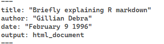

# Communicate with others: a quick glance at R projects and R markdown

## R projects
We finally loaded a data file and, after we got through the next parts, processed and analyzed it. One day someone (likely your colleague) who works on the same or similar project wants to make some corrections to your code. They ask you to share the data file and R code. Inspect the following R code line. What would be inconvenient for your colleague? 

```r
 myfile = read.csv("Users/Gillian/folder/datafile.csv", na.string=c("","NA","NaN"))
```

Unless you're close with that person and they can always use your computer, they likely have a different file location and working directory on their computer. Thus, they will need to **adjust the R code**. Sometime later, they send their version of the R script. On your computer, you will have to **adjust the R code**. Your computer crashes, you get a new one, you will need to **adjust the R code**.

**Not efficient.**

Fortunately, we can create a folder on our computer, let's call it **"My_Project"**, and put a R project in it. Whenever you click on the R project, the working directory will automatically update to the location of this project. You can now move all your data files and scripts to this folder (or subfolders) and send it to your colleague. In turn, they can put this folder **wherever** they want **without having to adjust the R code**. 
 
Open R Studio and click on the blue cube (top right corner). 


<br>
<br>

This will prompt a window to a New or Existing directory. With a "New Directory", you create a new folder with an R project inside. So if I want to have a project in a folder "My_Project" on my desktop (with "etc." = the location of the desktop):


<br>
<br>

With an "Existing Directory", the R project will be placed in the desired location without creating extra (sub)folders. So after I create the folder "My_Project" on my desktop:


<br>
<br>

Navigate to the R project folder. I also made an new R script and put it in the folder


<br>
<br>

Click on the R project and you see the following window. Note the "Files" window that now contains the project and R script. This window will automatically update if you put any new files or folders, and the working directory will always equal the location of the **project**.


<br>
<br>

In the Files window (bottom left corner) click on your R script and add your data files. Instead of calling the data file using "C:/...", you can now simply call its name, provided the file is in the same location as the project.
 
 
<br>
<br>

If you put all your data files in separate folders, you simply need to include them:

 
<br>
<br>

## R Markdown (brief)
You know how to exchange your data files and other materials using R projects. However, often you want share your work without requiring your *audience*  to run your code from scratch. To address this need, R Markdown **makes it easy to create and share reports (pdf, Word, HTML, or Powerpoint format)** that can contain your steps in the analysis, your plots, and so on. Thus, it is a handy tool that promotes **transparency and reproducibility**.

Beyond reports, R Markdown has extra capabilities. For example, this very own guide was created by combining multiple R Markdown documents (using R bookdown). Now, explaining this *file format for making dynamic documents* in full detail would be too much. Instead, I will very briefly go over some basics and give you "a behind the scenes" look.

In R Studio go the empty paper symbol (*New File*) (top right corner) and click on R Markdown. The following window pops up.

 
<br>
<br>

From here you can define a document title, author, and date. This info can be changed later or it can be left empty. Concerning the Output format, you can choose PDF or Word documents but I personally prefer HTML as it supports plots (see the part about data visualization). The following default screen appears. 

 
<br>
<br>

What is all this? Let's start from the top
By default you see something like this:
<br>
<br>
 

I believe this is more or less self-explanatory. My advice would be to change the date to: *"2025-03-21"* so that the date automatically updates to the time you **knit** the document.
Now with HTML documents we can add some extra customization options including a **t**able **o**f **c**ontent, and more. Behold the following example. 
<br>
<br>

 

We introduce a table of contents, we make it "float" so that **it stays present when scrolling down**, and we include up to 4-level headings. Next, you may be wondering why we included something about a yeti and haddock highlights. The "yeti", refers to one of many themes (others include: "darkly", "cerulean", "journal", "spacelab",and more) that **determine the appearance of our HTML document**. Haddock refers to the **highlight style that sets the appearance of the R syntax** (others include:"tango","espresso","zenburn","kate", and more). Next, we have the **figure settings**. Here we say that we want all figures (plots) generated inside the Markdown document to have a height and width of 3 inches. Finally, with *number_section: TRUE*, we want to automatically add numbered sections.

Now, what would any type of R document be without R code. To include R code (or code chunks as they are often referred to), you can use the key combination **Alt + Ctrl + I**.

On to the text, outside of R code chunks, you have already noticed that I can put text in **bold** and in *italics*? I can also include hyper links where you just have to [click on a word or a sentence (click here) to be brought on the web page](https://www.google.com/).

I can also add bullet points

  * bullet point one
    + first sub point
    + second sub point
      - first sub sub point
      - second sub sub point
      - third sub sub point
  
Or I can do something like this

  1. first 
  2. second (and so on)

I can add multiple headings to my document


## A heading (level two) {-}
### Another heading (level three) {-}

I add images like this (see below). This is what I see.
 
<br>
<br>

And there you have it, the above provides a good basis to start creating your R Markdown documents but do realize that I only scratched the surface. If you finish your R Markdown document, the next and potentially final step is to *Knit* the document by pressing the combination: **Ctrl + Shift + K**.
